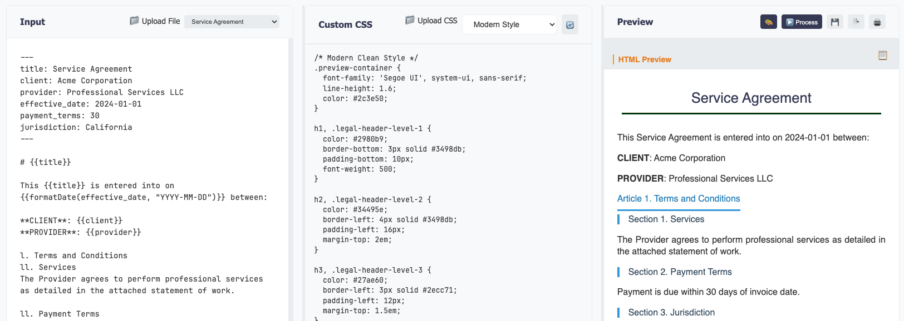

# Legal Markdown JS

> A complete Node.js/TypeScript reimplementation of the original Ruby
> [LegalMarkdown](https://github.com/compleatang/legal-markdown) tool with 100%
> feature parity.

Process markdown with YAML front matter, conditional clauses
`[text]{condition}`, cross-references `|variable|`, imports `@import`, and
generate professional PDFs ready to be shared.



## Table of Contents

- [Goals](#goals)
- [Installation](#installation)
- [Quick Start](#quick-start)
- [Key Features](#key-features)
- [Documentation](#documentation)
- [Testing](#testing)
- [Contributing](#contributing)
- [License](#license)

## Goals

- **Core Parity**: 1:1 compatibility with the original Ruby legal-markdown tool
- **Node.js Extensions**: Additional functionality leveraging the Node.js
  ecosystem
- **Type Safety**: Full TypeScript implementation with comprehensive type
  definitions
- **Modern Tooling**: Built with modern development practices and tooling

## Installation

```bash
npm install legal-markdown-js
```

## 🚀 Try it Online

**[Live Playground](https://petalo.github.io/legal-markdown-js/)** - Try Legal
Markdown JS directly in your browser with live examples and real-time
processing.

## Quick Start

### Command Line Usage

```bash
# Basic document processing
legal-md input.md output.md

# Generate PDF with highlighting
legal-md document.md --pdf --highlight

# Process with custom CSS
legal-md document.md --html --css styles.css
```

### Programmatic Usage

```typescript
import { processLegalMarkdown } from 'legal-markdown-js';

const result = processLegalMarkdown(content, {
  basePath: './documents',
  exportMetadata: true,
  exportFormat: 'json',
});

console.log(result.content);
console.log(result.metadata);
```

## Key Features

### Core Compatibility

All original Legal Markdown features are fully implemented:

- **File Formats**: Markdown, ASCII, reStructuredText, LaTeX
- **YAML Front Matter**: Complete parsing with all standard fields
- **Headers & Numbering**: Full hierarchical numbering system (`l.`, `ll.`,
  `lll.`)
- **Optional Clauses**: Boolean, equality, and logical operations
  (`[text]{condition}`)
- **Cross-References**: All reference types including special date handling
  (`|reference|`)
- **Partial Imports**: File inclusion with path resolution (`@import`)
- **Metadata Export**: YAML and JSON export with custom paths

### Node.js Enhancements

Additional features available only in the Node.js version:

- **Mixins System**: Template substitution with `{{variable}}` syntax
- **PDF Generation**: Professional PDF output with styling and field
  highlighting
- **HTML Generation**: Custom HTML output with CSS support
- **Template Loops**: Array iteration with `[#items]...[/items]` syntax
- **Helper Functions**: Date, number, and string formatting helpers
- **Force Commands**: Document-driven configuration with embedded CLI options
- **Batch Processing**: Multi-file processing with concurrency control

## Documentation

### User Documentation

- **[Getting Started](docs/GETTING-STARTED.md)** - Installation and setup guide
- **[CLI Reference](docs/CLI-REFERENCE.md)** - Complete command-line interface
  documentation
- **[Features Guide](docs/FEATURES-GUIDE.md)** - All features, helpers, and
  advanced usage
- **[Headers & Numbering](docs/HEADERS-NUMBERING.md)** - Hierarchical numbering
  system guide
- **[CSS Classes Reference](docs/CSS-CLASSES.md)** - CSS classes for styling and
  document review
- **[Compatibility](docs/COMPATIBILITY.md)** - Ruby version compatibility
  tracking

### Developer Documentation

- **[Architecture](docs/ARCHITECTURE.md)** - Complete system architecture and
  design patterns
- **[Contributing Guide](docs/CONTRIBUTING.md)** - Development workflow,
  standards, and contribution guidelines
- **[Helper Functions](docs/HELPERS.md)** - Complete reference for template
  helpers and functions
- **[Development Guide](docs/DEVELOPMENT-GUIDE.md)** - Complete developer setup
  and workflow
- **[Release Process](docs/RELEASE-PROCESS.md)** - Versioning and release
  procedures
- **[Scripts Reference](docs/SCRIPTS-REFERENCE.md)** - Available npm scripts and
  commands
- **[API Documentation](docs/api/)** - Auto-generated TypeScript API docs

## Testing

```bash
# Run all tests
npm test

# Run specific test types
npm run test:unit
npm run test:integration
npm run test:e2e

# Run with coverage
npm run test:coverage
```

- **Unit Tests**: Test individual components in isolation
- **Integration Tests**: Test complete workflows and feature combinations
- **E2E Tests**: Test CLI interface and full application behavior
- **Path Validation Tests**: Test environment configuration and error handling

## Configuration

Legal Markdown JS supports environment-based configuration for customizing file
paths and directories.

### Environment Variables

Create a `.env` file in your project root to customize default paths:

```bash
# Copy the example configuration
cp .env.example .env

# Edit the configuration
nano .env
```

### Path Configuration Examples

```bash
# Custom asset organization
IMAGES_DIR=assets/media
STYLES_DIR=assets/css

# Separate project structure
DEFAULT_INPUT_DIR=documents/source
DEFAULT_OUTPUT_DIR=documents/generated

# Absolute paths (useful for CI/CD)
IMAGES_DIR=/var/lib/legal-markdown/images
DEFAULT_OUTPUT_DIR=/var/lib/legal-markdown/output
```

### Using Custom Paths in Code

```typescript
import { PATHS, RESOLVED_PATHS } from 'legal-markdown-js';

// Access configured paths
console.log(PATHS.STYLES_DIR); // Relative path from .env
console.log(RESOLVED_PATHS.STYLES_DIR); // Absolute resolved path
```

## Contributing

We welcome contributions! Please see our
[Contributing Guide](docs/CONTRIBUTING.md) for:

- Development setup and workflow
- Coding standards and best practices
- Testing requirements
- Pull request process

### Quick Start for Contributors

1. Fork the repository
2. Create a feature branch (`git checkout -b feature/amazing-feature`)
3. Follow the development guidelines
4. Run the test suite (`npm test`)
5. Submit a Pull Request

## License

MIT License - see [LICENSE](LICENSE) file for details.

## Acknowledgments

- Original [LegalMarkdown](https://github.com/compleatang/legal-markdown)
  project by Casey Kuhlman
- The legal tech community for inspiration and feedback
