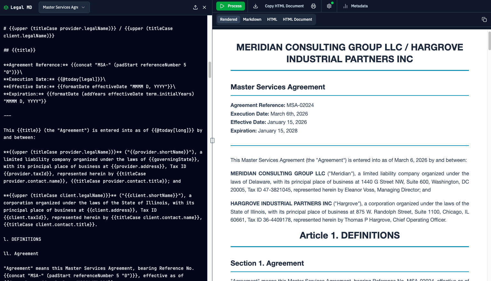

# Legal Markdown JS

TypeScript/Node.js implementation of
[LegalMarkdown](https://github.com/compleatang/legal-markdown)

Try it live in the
**[hosted playground](https://petalo.github.io/legal-markdown-js/)**.

## What It Does

Legal Markdown JS processes legal markdown documents and can generate:

- Processed markdown
- HTML
- PDF
- DOCX

Core syntax supported:

- Variables/helpers (`{{field}}`, helpers, loops)
- Legal headers (`l.`, `ll.`, `lll.`, ...)
- Optional clauses (`[text]{condition}`)
- Cross references between sections (`|reference|`)
- Imports (`@import path/to/file.md`)

Check the [features overview](docs/features/README.md) document for more
details.



## Install

### npm

Run without installing globally:

```bash
npx legal-md contract.md output.md
```

Install the package locally in a project:

```bash
npm install legal-markdown-js
```

Available binaries:

- `legal-md`
- `legal-md-ui`
- `legal-md-playground`

### Homebrew

Install the standalone macOS binary:

```bash
brew tap petalo/legal-markdown
brew install legal-md
```

After installing with Homebrew, you can use:

- `legal-md`
- `legal-md ui`
- `legal-md playground`

### Install script

```bash
curl -fsSL https://github.com/petalo/legal-markdown-js/releases/latest/download/install.sh | sh
```

## Quick Start

Install, then run your first conversion in seconds:

**1. Install**

```bash
# npm
npm install legal-markdown-js

# Homebrew (macOS)
brew tap petalo/legal-markdown && brew install legal-md
```

**2. Process a document**

Convert a Legal Markdown file to processed Markdown:

```bash
legal-md contract.md output.md
```

Generate HTML, PDF, or DOCX:

```bash
legal-md contract.md --html
legal-md contract.md --pdf
legal-md contract.md --docx
```

<table>
<tr>
<th>Input (<code>contract.md</code>)</th>
<th>Output markdown</th>
<th>Output HTML</th>
</tr>
<tr>
<td>
<pre><code class="language-md">---
client: ACME Corp
amount: 5000
include_warranty: true
---

l. Parties

Agreement with **{{client}}**.

l. Services

ll. Payment

Total due: ${{amount}}.

[ll. Warranty

Full warranty included.]{include_warranty} </code></pre>

</td>
<td>
<pre><code class="language-md">
&#35; 1. Parties
Agreement with **ACME Corp**.
&#35; 2. Services
&#35;&#35; 2.1. Payment Total due: $5000.
&#35;&#35; 2.2. Warranty Full warranty included. </code></pre>

</td>
<td>
<pre><code class="language-html">&lt;h1&gt;1. Parties&lt;/h1&gt;
&lt;p&gt;Agreement with
  &lt;strong&gt;ACME Corp&lt;/strong&gt;.
&lt;/p&gt;
&lt;h1&gt;2. Services&lt;/h1&gt;
&lt;h2&gt;2.1. Payment&lt;/h2&gt;
&lt;p&gt;Total due: $5000.&lt;/p&gt;
&lt;h2&gt;2.2. Warranty&lt;/h2&gt;
&lt;p&gt;Full warranty included.&lt;/p&gt;
</code></pre>
</td>
</tr>
</table>

## Playground And UI

### Hosted playground

Use the browser-based playground for a quick interactive test:
[petalo.github.io/legal-markdown-js](https://petalo.github.io/legal-markdown-js/)

### Interactive CLI

Launch the terminal UI:

```bash
legal-md-ui
# or
legal-md ui
```

### Local playground

If you installed from npm or Homebrew:

```bash
legal-md-playground
# or
legal-md playground
```

If you are working from this repository:

```bash
npm run build:web
npm run web:serve
```

Useful variants:

```bash
# Vite dev server for playground development
npm run dev:web

# Serve an existing build on a custom port
npm run web:serve -- --port=3000
```

## CLI Usage

### Basic processing

```bash
# Input -> output markdown
legal-md input.md output.md

# Input -> stdout markdown
legal-md input.md --stdout

# Read from stdin
cat input.md | legal-md --stdin --stdout
```

### Output formats

```bash
# HTML
legal-md input.md output.html --html

# PDF
legal-md input.md output.pdf --pdf

# DOCX
legal-md input.md output.docx --docx

# Highlighted review variants
legal-md input.md output.pdf --pdf --highlight
legal-md input.md output.docx --docx --highlight
```

### PDF connector selection

```bash
# Auto (default)
legal-md input.md output.pdf --pdf

# Force specific backend
legal-md input.md output.pdf --pdf --pdf-connector puppeteer
legal-md input.md output.pdf --pdf --pdf-connector system-chrome
legal-md input.md output.pdf --pdf --pdf-connector weasyprint
```

`auto` resolution order is:

1. `puppeteer`
2. `system-chrome`
3. `weasyprint`

### Metadata export

```bash
legal-md contract.md --export-yaml -o metadata.yaml
legal-md contract.md --export-json -o metadata.json
```

### Useful flags

```bash
legal-md contract.md --title "Master Services Agreement" --html
legal-md contract.md output.html --html --css ./styles/print.css
legal-md contract.md --enable-field-tracking --stdout
```

## Programmatic API

```ts
import {
  processLegalMarkdown,
  generateHtml,
  generatePdf,
  generatePdfVersions,
  generateDocx,
  generateDocxVersions,
} from 'legal-markdown-js';

const source = `---\ntitle: Service Agreement\nclient: ACME\n---\n\nl. Parties\n\nAgreement with {{client}}.`;

const processed = await processLegalMarkdown(source, {
  enableFieldTracking: true,
});

const html = await generateHtml(source, {
  title: 'Service Agreement',
  includeHighlighting: true,
});

const pdf = await generatePdf(source, './output/agreement.pdf', {
  format: 'A4',
  includeHighlighting: false,
  pdfConnector: 'auto', // auto | puppeteer | system-chrome | weasyprint
});

const { normal, highlighted } = await generatePdfVersions(
  source,
  './output/agreement.pdf',
  {
    format: 'Letter',
    pdfConnector: 'weasyprint',
  }
);

const docx = await generateDocx(source, './output/agreement.docx', {
  title: 'Service Agreement',
});

const docxPair = await generateDocxVersions(source, './output/agreement.docx');

console.log(
  processed.content,
  html.length,
  pdf.length,
  normal.length,
  highlighted.length
);
console.log(docx.length, docxPair.normal.length, docxPair.highlighted.length);
```

## PDF Backends

Supported backends:

- `puppeteer`
- `system-chrome`
- `weasyprint`

Installation examples:

```bash
# Puppeteer browser install (if needed)
npx puppeteer browsers install chrome

# macOS
brew install weasyprint

# Ubuntu/Debian
sudo apt-get install -y weasyprint
```

## Configuration

Configuration loading supports:

- `package.json` (`legalmd` key)
- `.legalmdrc`
- `.legalmdrc.yaml`
- `.legalmdrc.json`
- `legalmd.config.js`
- `legalmd.config.ts`

Useful env overrides:

- `LEGAL_MD_PDF_CONNECTOR`
- `LEGAL_MD_VALIDATION_MODE`
- `LOG_LEVEL`
- `DEBUG`
- `IMAGES_DIR`
- `STYLES_DIR`
- `DEFAULT_INPUT_DIR`
- `DEFAULT_OUTPUT_DIR`
- `ARCHIVE_DIR`

Example:

```bash
LEGAL_MD_PDF_CONNECTOR=weasyprint legal-md input.md --pdf
```

## Testing

```bash
# Full local suite
npm test

# CI-like run (includes PDF backend precheck)
npm run test:ci

# Backend availability check only
npm run test:pdf:backends

# Targeted suites
npm run test:unit
npm run test:integration
npm run test:e2e
npm run test:e2e:cli
```

`test:e2e` and `test:ci` require both PDF paths to be available:

- Puppeteer launchable Chrome/Chromium
- WeasyPrint executable

## Documentation

- [Getting Started](docs/getting_started.md)
- [CLI Reference](docs/cli_reference.md)
- [Features Overview](docs/features/README.md)
- [Output Guides](docs/output/README.md)
- [PDF Generation](docs/output/pdf-generation.md)
- [DOCX Generation](docs/output/docx-generation.md)
- [Configuration](docs/advanced/configuration.md)
- [Architecture](docs/ARCHITECTURE.md)
- [Development Guide](docs/development/development-guide.md)
- [Contributing](docs/development/contributing.md)

## Contributing

See [docs/development/contributing.md](docs/development/contributing.md).

## License

MIT. See [LICENSE](LICENSE).

## Acknowledgments

Based on the original
[LegalMarkdown](https://github.com/compleatang/legal-markdown) project by Casey
Kuhlman.
