# Legal Markdown JS - Architecture Documentation

## Overview

Legal Markdown JS is a Node.js implementation of the Legal Markdown document
processing system with full TypeScript support. The system processes legal
documents written in a specialized markdown format, providing features like YAML
front matter parsing, structured headers, optional clauses, cross-references,
and advanced document generation.

## High-Level Architecture

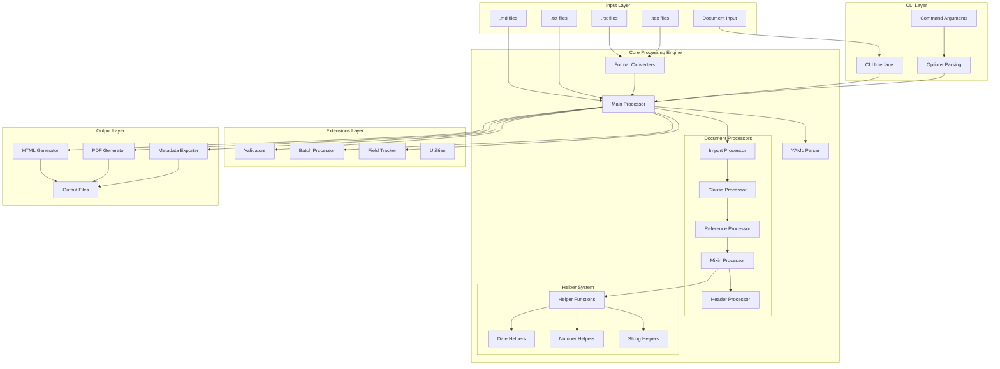
```mermaid
graph TB
    subgraph "Input Layer"
        INPUT[Document Input]
        MD[".md files"]
        RST[".rst files"]
        TEX[".tex files"]
        TXT[".txt files"]
    end

    subgraph "CLI Layer"
        CLI[CLI Interface]
        ARGS[Command Arguments]
        OPTS[Options Parsing]
    end

    subgraph "Core Processing Engine"
        MAIN[Main Processor]
        YAML[YAML Parser]
        CONV[Format Converters]

        subgraph "Document Processors"
            IMP[Import Processor]
            CLS[Clause Processor]
            REF[Reference Processor]
            MIX[Mixin Processor]
            HDR[Header Processor]
        end

        subgraph "Helper System"
            HELPERS[Helper Functions]
            DATE[Date Helpers]
            NUM[Number Helpers]
            STR[String Helpers]
        end
    end

    subgraph "Extensions Layer"
        VALID[Validators]
        BATCH[Batch Processor]
        TRACK[Field Tracker]
        UTIL[Utilities]
    end

    subgraph "Output Layer"
        HTML[HTML Generator]
        PDF[PDF Generator]
        META[Metadata Exporter]
        OUT[Output Files]
    end

    INPUT --> CLI
    MD --> MAIN
    RST --> CONV
    TEX --> CONV
    TXT --> MAIN
    CONV --> MAIN

    CLI --> MAIN
    ARGS --> OPTS
    OPTS --> MAIN

    MAIN --> YAML
    MAIN --> IMP
    IMP --> CLS
    CLS --> REF
    REF --> MIX
    MIX --> HDR

    MIX --> HELPERS
    HELPERS --> DATE
    HELPERS --> NUM
    HELPERS --> STR

    MAIN --> VALID
    MAIN --> BATCH
    MAIN --> TRACK

    MAIN --> HTML
    MAIN --> PDF
    MAIN --> META
    HTML --> OUT
    PDF --> OUT
    META --> OUT
```

## Core Processing Pipeline

The document processing follows a strict pipeline system with AST-based
processing and configurable steps to ensure correct order of operations

### Pipeline Architecture

The pipeline system uses a step-based architecture with dependency management,
performance monitoring, and enhanced error handling:

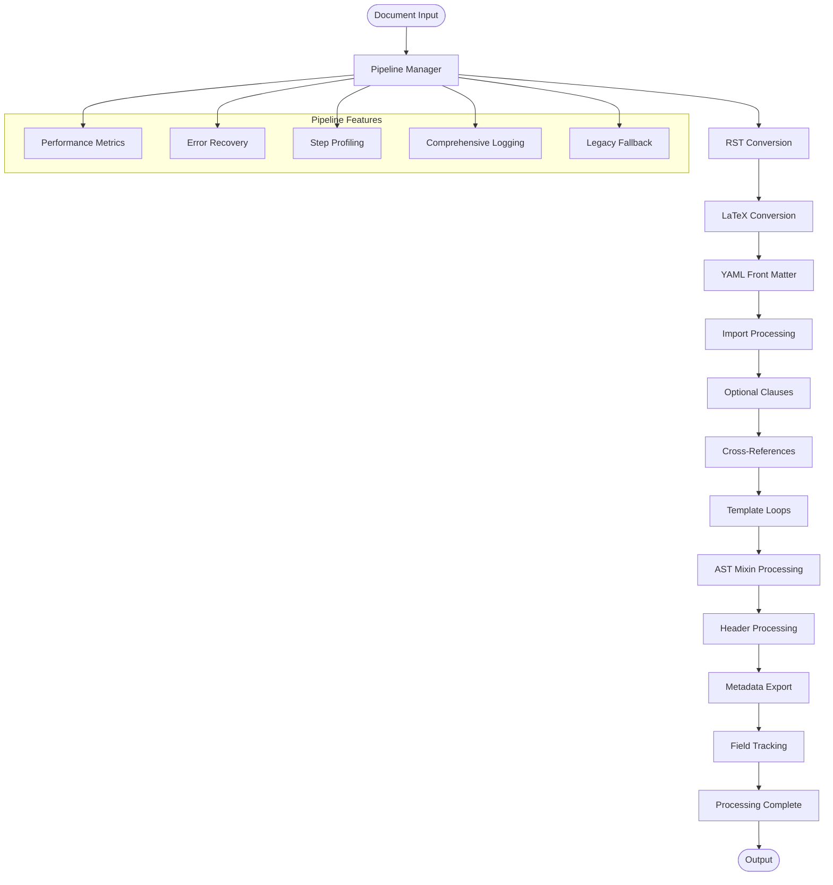
```mermaid
flowchart TD
    START([Document Input]) --> PIPELINE[Pipeline Manager]

    PIPELINE --> RST_STEP[RST Conversion]
    RST_STEP --> LATEX_STEP[LaTeX Conversion]
    LATEX_STEP --> YAML_STEP[YAML Front Matter]
    YAML_STEP --> IMPORT_STEP[Import Processing]
    IMPORT_STEP --> CLAUSE_STEP[Optional Clauses]
    CLAUSE_STEP --> REF_STEP[Cross-References]
    REF_STEP --> TEMPLATE_STEP[Template Loops]
    TEMPLATE_STEP --> MIXIN_STEP[AST Mixin Processing]
    MIXIN_STEP --> HEADER_STEP[Header Processing]
    HEADER_STEP --> META_STEP[Metadata Export]
    META_STEP --> TRACK_STEP[Field Tracking]
    TRACK_STEP --> COMPLETE[Processing Complete]

    COMPLETE --> END([Output])

    subgraph "Pipeline Features"
        METRICS[Performance Metrics]
        ERROR_HANDLING[Error Recovery]
        PROFILING[Step Profiling]
        LOGGING[Comprehensive Logging]
        FALLBACK[Legacy Fallback]
    end

    PIPELINE --> METRICS
    PIPELINE --> ERROR_HANDLING
    PIPELINE --> PROFILING
    PIPELINE --> LOGGING
    PIPELINE --> FALLBACK
```

## Module Architecture

### Core Module (`src/core/`)

The core module maintains parity with the original Ruby Legal Markdown
implementation:

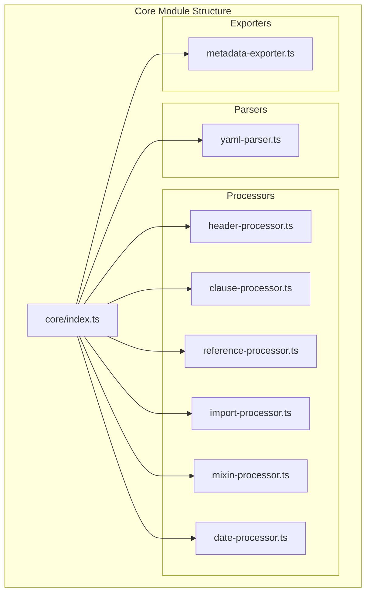
```mermaid
graph TB
    subgraph "Core Module Structure"
        CORE[core/index.ts]

        subgraph "Parsers"
            YAML_P[yaml-parser.ts]
        end

        subgraph "Processors"
            HEADER_P[header-processor.ts]
            CLAUSE_P[clause-processor.ts]
            REF_P[reference-processor.ts]
            IMPORT_P[import-processor.ts]
            MIXIN_P[mixin-processor.ts]
            DATE_P[date-processor.ts]
        end

        subgraph "Exporters"
            META_E[metadata-exporter.ts]
        end
    end

    CORE --> YAML_P
    CORE --> HEADER_P
    CORE --> CLAUSE_P
    CORE --> REF_P
    CORE --> IMPORT_P
    CORE --> MIXIN_P
    CORE --> DATE_P
    CORE --> META_E
```

### Extensions Module (`src/extensions/`)

Node.js specific enhancements and additional functionality:

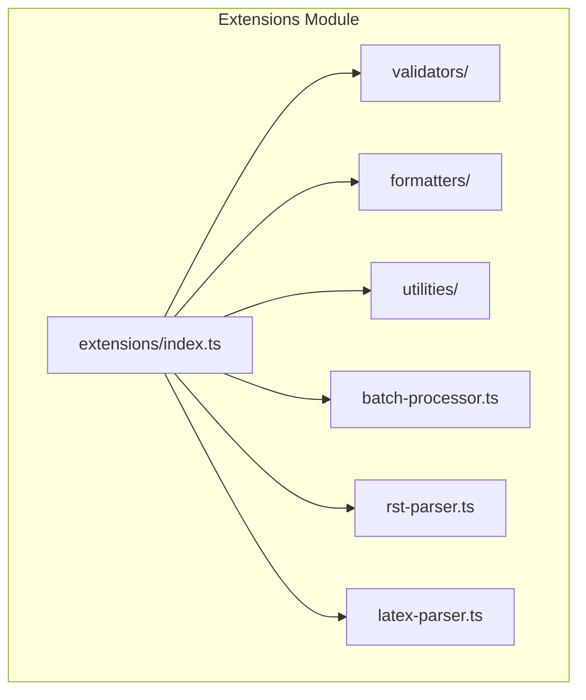
```mermaid
graph TB
    subgraph "Extensions Module"
        EXT[extensions/index.ts]

        VALID[validators/]
        FORMAT[formatters/]
        UTIL[utilities/]
        BATCH[batch-processor.ts]
        RST[rst-parser.ts]
        LATEX[latex-parser.ts]
    end

    EXT --> VALID
    EXT --> FORMAT
    EXT --> UTIL
    EXT --> BATCH
    EXT --> RST
    EXT --> LATEX
```

## Processing Details

### 1. YAML Front Matter Processing

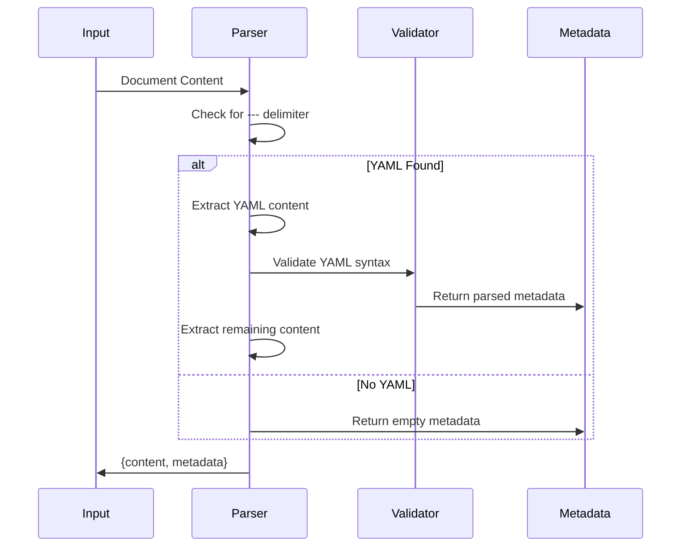
```mermaid
sequenceDiagram
    participant Input
    participant Parser
    participant Validator
    participant Metadata

    Input->>Parser: Document Content
    Parser->>Parser: Check for --- delimiter
    alt YAML Found
        Parser->>Parser: Extract YAML content
        Parser->>Validator: Validate YAML syntax
        Validator->>Metadata: Return parsed metadata
        Parser->>Parser: Extract remaining content
    else No YAML
        Parser->>Metadata: Return empty metadata
    end
    Parser->>Input: {content, metadata}
```

### 2. Header Processing Workflow

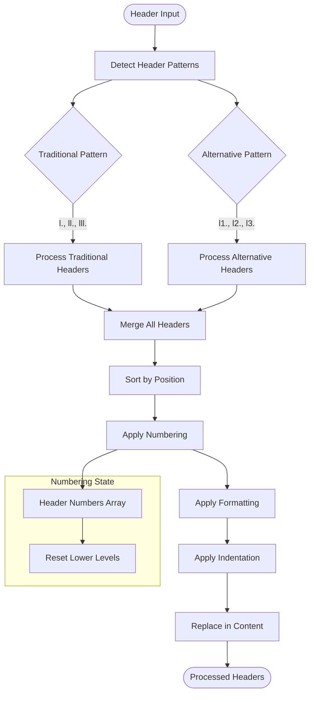
```mermaid
flowchart TD
    START([Header Input]) --> DETECT[Detect Header Patterns]

    DETECT --> TRAD{Traditional Pattern}
    DETECT --> ALT{Alternative Pattern}

    TRAD -->|l., ll., lll.| TRAD_PROC[Process Traditional Headers]
    ALT -->|l1., l2., l3.| ALT_PROC[Process Alternative Headers]

    TRAD_PROC --> MERGE[Merge All Headers]
    ALT_PROC --> MERGE

    MERGE --> SORT[Sort by Position]
    SORT --> NUMBER[Apply Numbering]
    NUMBER --> FORMAT[Apply Formatting]
    FORMAT --> INDENT[Apply Indentation]
    INDENT --> REPLACE[Replace in Content]
    REPLACE --> END([Processed Headers])

    subgraph "Numbering State"
        NUM_TRACK[Header Numbers Array]
        RESET[Reset Lower Levels]
    end

    NUMBER --> NUM_TRACK
    NUM_TRACK --> RESET
```

### 3. Pipeline System

The new pipeline system provides enhanced processing capabilities with
step-based architecture:

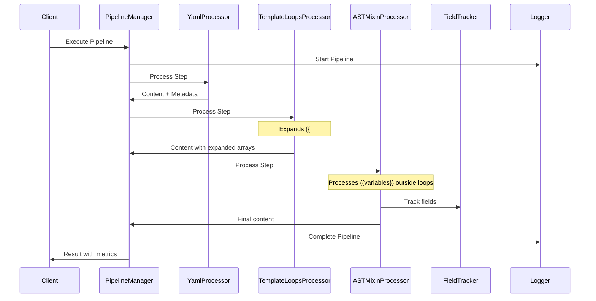
```mermaid
sequenceDiagram
    participant Client
    participant PipelineManager
    participant YamlProcessor
    participant TemplateLoopsProcessor
    participant ASTMixinProcessor
    participant FieldTracker
    participant Logger

    Client->>PipelineManager: Execute Pipeline
    PipelineManager->>Logger: Start Pipeline

    PipelineManager->>YamlProcessor: Process Step
    YamlProcessor->>PipelineManager: Content + Metadata

    PipelineManager->>TemplateLoopsProcessor: Process Step
    Note over TemplateLoopsProcessor: Expands {{#items}}...{{/items}} loops
    TemplateLoopsProcessor->>PipelineManager: Content with expanded arrays

    PipelineManager->>ASTMixinProcessor: Process Step
    Note over ASTMixinProcessor: Processes {{variables}} outside loops
    ASTMixinProcessor->>FieldTracker: Track fields
    ASTMixinProcessor->>PipelineManager: Final content

    PipelineManager->>Logger: Complete Pipeline
    PipelineManager->>Client: Result with metrics
```

#### Pipeline Step Architecture

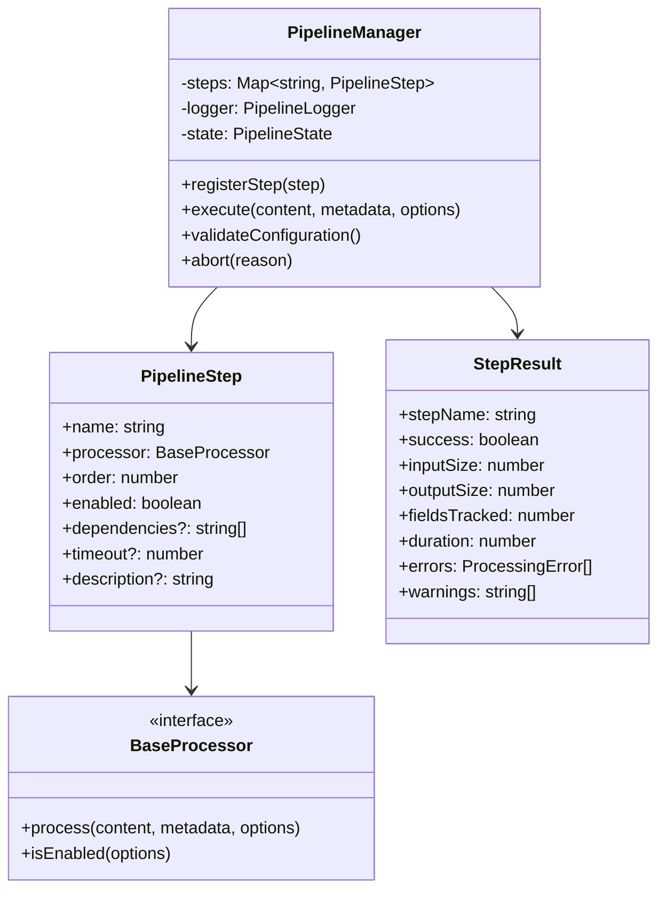
```mermaid
classDiagram
    class PipelineManager {
        -steps: Map~string, PipelineStep~
        -logger: PipelineLogger
        -state: PipelineState
        +registerStep(step)
        +execute(content, metadata, options)
        +validateConfiguration()
        +abort(reason)
    }

    class PipelineStep {
        +name: string
        +processor: BaseProcessor
        +order: number
        +enabled: boolean
        +dependencies?: string[]
        +timeout?: number
        +description?: string
    }

    class BaseProcessor {
        <<interface>>
        +process(content, metadata, options)
        +isEnabled(options)
    }

    class StepResult {
        +stepName: string
        +success: boolean
        +inputSize: number
        +outputSize: number
        +fieldsTracked: number
        +duration: number
        +errors: ProcessingError[]
        +warnings: string[]
    }

    PipelineManager --> PipelineStep
    PipelineStep --> BaseProcessor
    PipelineManager --> StepResult
```

#### Key Pipeline Improvements

1. **Template Loops First**: Template loops (order 7) run before AST mixins
   (order 8) to prevent processing conflicts
2. **AST-based Mixin Processing**: Prevents text contamination by parsing
   content into nodes
3. **Template Loop Exclusion**: AST processor skips content inside
   `{{#loops}}...{{/loops}}` blocks
4. **Enhanced Field Tracking**: Properly categorizes fields as `filled`,
   `empty`, or `logic`
5. **Performance Monitoring**: Each step reports duration, input/output sizes,
   and field counts
6. **Error Recovery**: Pipeline continues processing other steps when
   non-critical errors occur

### 4. Legacy Mixin Processing (v2.3.x and earlier)

The original mixin processing system (still available as fallback):

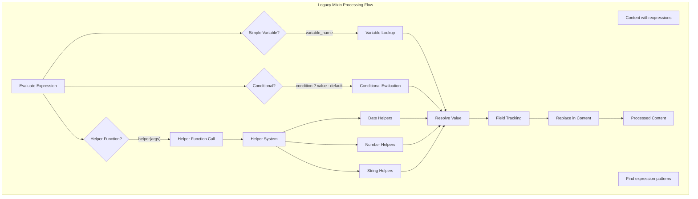
```mermaid
graph TB
    subgraph "Legacy Mixin Processing Flow"
        INPUT["Content with expressions"]
        PATTERN["Find expression patterns"]
        EVAL[Evaluate Expression]

        EVAL --> SIMPLE{Simple Variable?}
        EVAL --> HELPER{Helper Function?}
        EVAL --> COND{Conditional?}

        SIMPLE -->|variable_name| VAR_LOOKUP[Variable Lookup]
        HELPER -->|"helper(args)"| HELPER_CALL[Helper Function Call]
        COND -->|"condition ? value : default"| COND_EVAL[Conditional Evaluation]

        VAR_LOOKUP --> RESOLVE[Resolve Value]
        HELPER_CALL --> HELPER_SYS[Helper System]
        COND_EVAL --> RESOLVE

        HELPER_SYS --> DATE_H[Date Helpers]
        HELPER_SYS --> NUM_H[Number Helpers]
        HELPER_SYS --> STR_H[String Helpers]

        DATE_H --> RESOLVE
        NUM_H --> RESOLVE
        STR_H --> RESOLVE

        RESOLVE --> TRACK[Field Tracking]
        TRACK --> REPLACE[Replace in Content]
        REPLACE --> OUTPUT[Processed Content]
    end
```

### 4. Optional Clause Processing

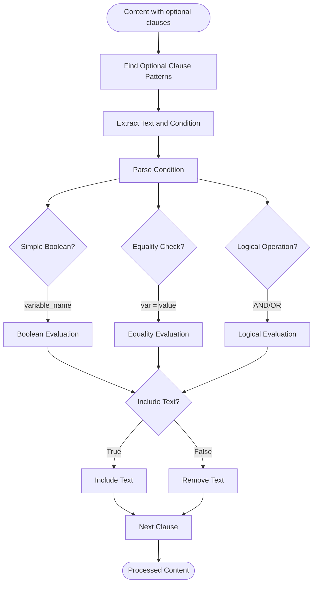
```mermaid
flowchart TD
    START(["Content with optional clauses"]) --> FIND[Find Optional Clause Patterns]

    FIND --> EXTRACT[Extract Text and Condition]
    EXTRACT --> PARSE_COND[Parse Condition]

    PARSE_COND --> SIMPLE{Simple Boolean?}
    PARSE_COND --> EQUALITY{Equality Check?}
    PARSE_COND --> LOGICAL{Logical Operation?}

    SIMPLE -->|variable_name| BOOL_EVAL[Boolean Evaluation]
    EQUALITY -->|"var = value"| EQ_EVAL[Equality Evaluation]
    LOGICAL -->|AND/OR| LOGIC_EVAL[Logical Evaluation]

    BOOL_EVAL --> DECIDE{Include Text?}
    EQ_EVAL --> DECIDE
    LOGIC_EVAL --> DECIDE

    DECIDE -->|True| INCLUDE[Include Text]
    DECIDE -->|False| EXCLUDE[Remove Text]

    INCLUDE --> NEXT[Next Clause]
    EXCLUDE --> NEXT
    NEXT --> END([Processed Content])
```

## Field Tracking System

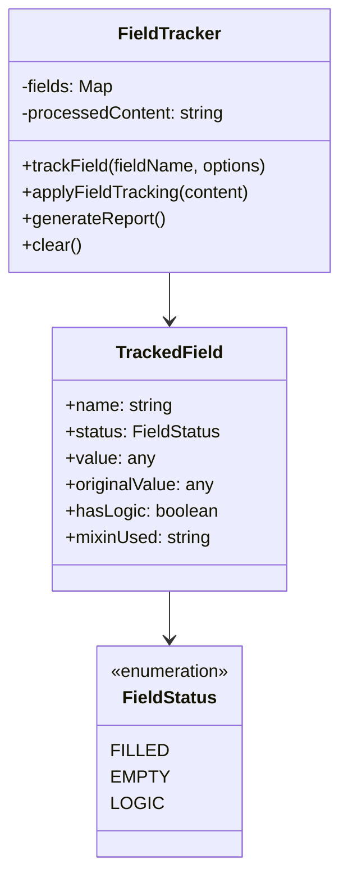
```mermaid
classDiagram
    class FieldTracker {
        -fields: Map<string, TrackedField>
        -processedContent: string
        +trackField(fieldName, options)
        +applyFieldTracking(content)
        +generateReport()
        +clear()
    }

    class TrackedField {
        +name: string
        +status: FieldStatus
        +value: any
        +originalValue: any
        +hasLogic: boolean
        +mixinUsed: string
    }

    class FieldStatus {
        <<enumeration>>
        FILLED
        EMPTY
        LOGIC
    }

    FieldTracker --> TrackedField
    TrackedField --> FieldStatus
```

## Output Generation

### HTML Generation Pipeline

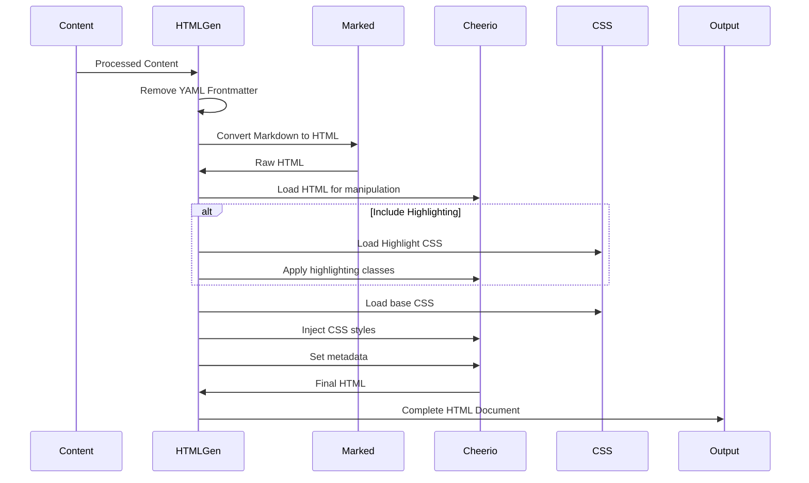
```mermaid
sequenceDiagram
    participant Content
    participant HTMLGen
    participant Marked
    participant Cheerio
    participant CSS
    participant Output

    Content->>HTMLGen: Processed Content
    HTMLGen->>HTMLGen: Remove YAML Frontmatter
    HTMLGen->>Marked: Convert Markdown to HTML
    Marked->>HTMLGen: Raw HTML
    HTMLGen->>Cheerio: Load HTML for manipulation

    alt Include Highlighting
        HTMLGen->>CSS: Load Highlight CSS
        HTMLGen->>Cheerio: Apply highlighting classes
    end

    HTMLGen->>CSS: Load base CSS
    HTMLGen->>Cheerio: Inject CSS styles
    HTMLGen->>Cheerio: Set metadata
    Cheerio->>HTMLGen: Final HTML
    HTMLGen->>Output: Complete HTML Document
```

### PDF Generation Pipeline

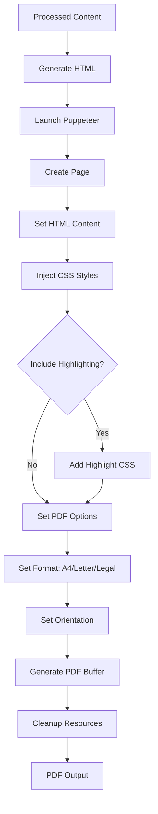
```mermaid
flowchart TD
    CONTENT[Processed Content] --> HTML_GEN[Generate HTML]
    HTML_GEN --> PUPPETEER[Launch Puppeteer]
    PUPPETEER --> PAGE[Create Page]
    PAGE --> SET_CONTENT[Set HTML Content]
    SET_CONTENT --> CSS_INJECT[Inject CSS Styles]

    CSS_INJECT --> HIGHLIGHT{Include Highlighting?}
    HIGHLIGHT -->|Yes| HIGHLIGHT_CSS[Add Highlight CSS]
    HIGHLIGHT -->|No| PDF_OPTS[Set PDF Options]
    HIGHLIGHT_CSS --> PDF_OPTS

    PDF_OPTS --> FORMAT["Set Format: A4/Letter/Legal"]
    FORMAT --> ORIENT[Set Orientation]
    ORIENT --> GENERATE[Generate PDF Buffer]
    GENERATE --> CLEANUP[Cleanup Resources]
    CLEANUP --> OUTPUT[PDF Output]
```

## CLI Architecture

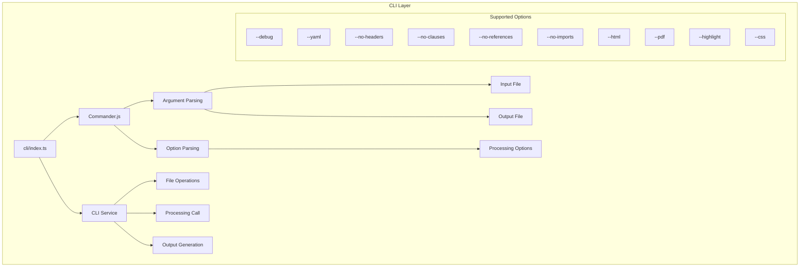
```mermaid
graph TB
    subgraph "CLI Layer"
        ENTRY[cli/index.ts] --> COMMANDER[Commander.js]
        COMMANDER --> ARGS[Argument Parsing]
        COMMANDER --> OPTS[Option Parsing]

        ARGS --> INPUT_FILE[Input File]
        ARGS --> OUTPUT_FILE[Output File]
        OPTS --> PROC_OPTS[Processing Options]

        ENTRY --> SERVICE[CLI Service]
        SERVICE --> FILE_OPS[File Operations]
        SERVICE --> PROC_CALL[Processing Call]
        SERVICE --> OUTPUT_GEN[Output Generation]

        subgraph "Supported Options"
            DEBUG[--debug]
            YAML_ONLY[--yaml]
            NO_HEADERS[--no-headers]
            NO_CLAUSES[--no-clauses]
            NO_REFS[--no-references]
            NO_IMPORTS[--no-imports]
            HTML_OUT[--html]
            PDF_OUT[--pdf]
            HIGHLIGHT[--highlight]
            CSS_PATH[--css]
        end
    end
```

## Type System

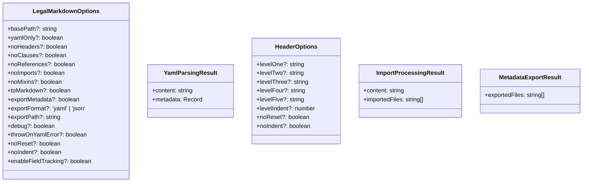
```mermaid
classDiagram
    class LegalMarkdownOptions {
        +basePath?: string
        +yamlOnly?: boolean
        +noHeaders?: boolean
        +noClauses?: boolean
        +noReferences?: boolean
        +noImports?: boolean
        +noMixins?: boolean
        +toMarkdown?: boolean
        +exportMetadata?: boolean
        +exportFormat?: 'yaml' | 'json'
        +exportPath?: string
        +debug?: boolean
        +throwOnYamlError?: boolean
        +noReset?: boolean
        +noIndent?: boolean
        +enableFieldTracking?: boolean
    }

    class YamlParsingResult {
        +content: string
        +metadata: Record<string, any>
    }

    class HeaderOptions {
        +levelOne?: string
        +levelTwo?: string
        +levelThree?: string
        +levelFour?: string
        +levelFive?: string
        +levelIndent?: number
        +noReset?: boolean
        +noIndent?: boolean
    }

    class ImportProcessingResult {
        +content: string
        +importedFiles: string[]
    }

    class MetadataExportResult {
        +exportedFiles: string[]
    }
```

## Error Handling Strategy

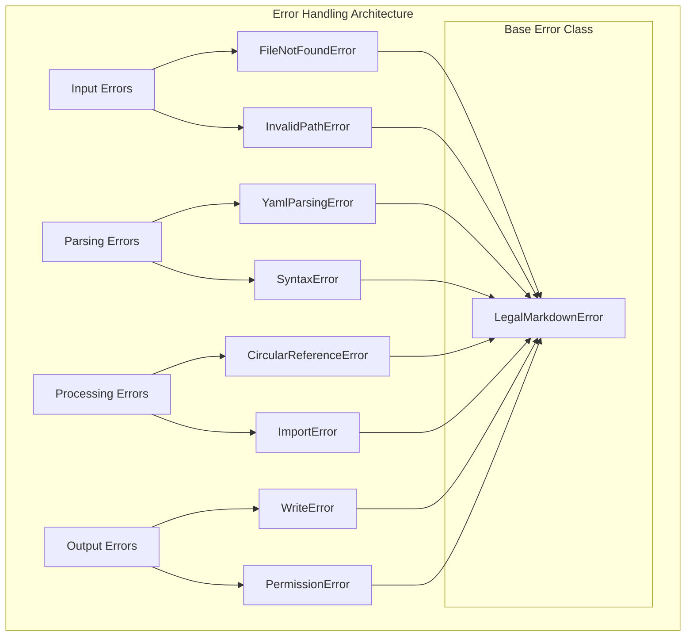
```mermaid
graph TB
    subgraph "Error Handling Architecture"
        INPUT[Input Errors] --> FILE_NOT_FOUND[FileNotFoundError]
        INPUT --> INVALID_PATH[InvalidPathError]

        PARSING[Parsing Errors] --> YAML_ERROR[YamlParsingError]
        PARSING --> SYNTAX_ERROR[SyntaxError]

        PROCESSING[Processing Errors] --> CIRCULAR_REF[CircularReferenceError]
        PROCESSING --> IMPORT_ERROR[ImportError]

        OUTPUT[Output Errors] --> WRITE_ERROR[WriteError]
        OUTPUT --> PERMISSION_ERROR[PermissionError]

        subgraph "Base Error Class"
            BASE[LegalMarkdownError]
        end

        FILE_NOT_FOUND --> BASE
        INVALID_PATH --> BASE
        YAML_ERROR --> BASE
        SYNTAX_ERROR --> BASE
        CIRCULAR_REF --> BASE
        IMPORT_ERROR --> BASE
        WRITE_ERROR --> BASE
        PERMISSION_ERROR --> BASE
    end
```

## Performance Considerations

### Processing Optimization

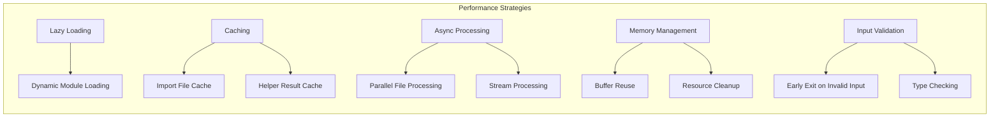
```mermaid
graph LR
    subgraph "Performance Strategies"
        LAZY[Lazy Loading] --> MODULES[Dynamic Module Loading]
        CACHE[Caching] --> IMPORT_CACHE[Import File Cache]
        CACHE --> HELPER_CACHE[Helper Result Cache]

        ASYNC[Async Processing] --> PARALLEL[Parallel File Processing]
        ASYNC --> STREAM[Stream Processing]

        MEMORY[Memory Management] --> BUFFER[Buffer Reuse]
        MEMORY --> CLEANUP[Resource Cleanup]

        VALIDATION[Input Validation] --> EARLY_EXIT[Early Exit on Invalid Input]
        VALIDATION --> TYPE_CHECK[Type Checking]
    end
```

### Batch Processing Architecture

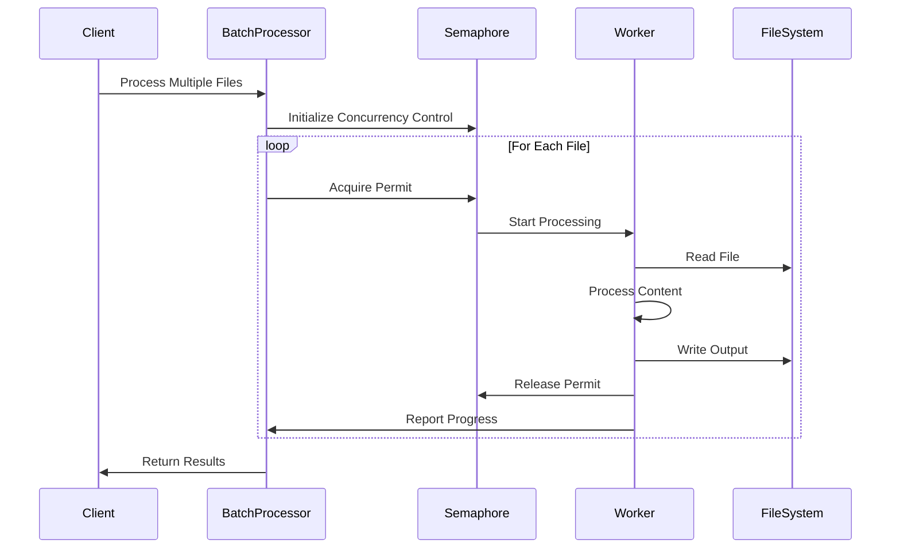
```mermaid
sequenceDiagram
    participant Client
    participant BatchProcessor
    participant Semaphore
    participant Worker
    participant FileSystem

    Client->>BatchProcessor: Process Multiple Files
    BatchProcessor->>Semaphore: Initialize Concurrency Control

    loop For Each File
        BatchProcessor->>Semaphore: Acquire Permit
        Semaphore->>Worker: Start Processing
        Worker->>FileSystem: Read File
        Worker->>Worker: Process Content
        Worker->>FileSystem: Write Output
        Worker->>Semaphore: Release Permit
        Worker->>BatchProcessor: Report Progress
    end

    BatchProcessor->>Client: Return Results
```

## Extension Points

The architecture provides several extension points for custom functionality:

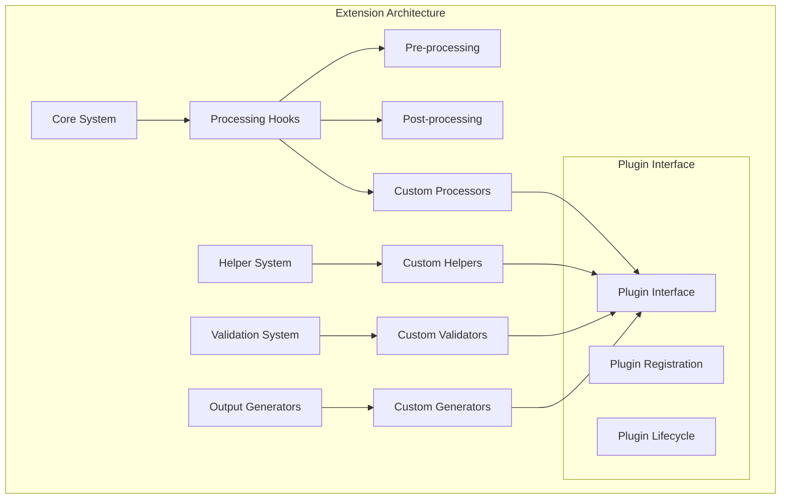
```mermaid
graph TB
    subgraph "Extension Architecture"
        CORE[Core System] --> HOOKS[Processing Hooks]

        HOOKS --> PRE_PROC[Pre-processing]
        HOOKS --> POST_PROC[Post-processing]
        HOOKS --> CUSTOM_PROC[Custom Processors]

        HELPERS[Helper System] --> CUSTOM_HELPERS[Custom Helpers]
        VALIDATORS[Validation System] --> CUSTOM_VALIDATORS[Custom Validators]
        GENERATORS[Output Generators] --> CUSTOM_GENERATORS[Custom Generators]

        subgraph "Plugin Interface"
            PLUGIN[Plugin Interface]
            REGISTER[Plugin Registration]
            LIFECYCLE[Plugin Lifecycle]
        end

        CUSTOM_HELPERS --> PLUGIN
        CUSTOM_VALIDATORS --> PLUGIN
        CUSTOM_GENERATORS --> PLUGIN
        CUSTOM_PROC --> PLUGIN
    end
```

## Testing Architecture

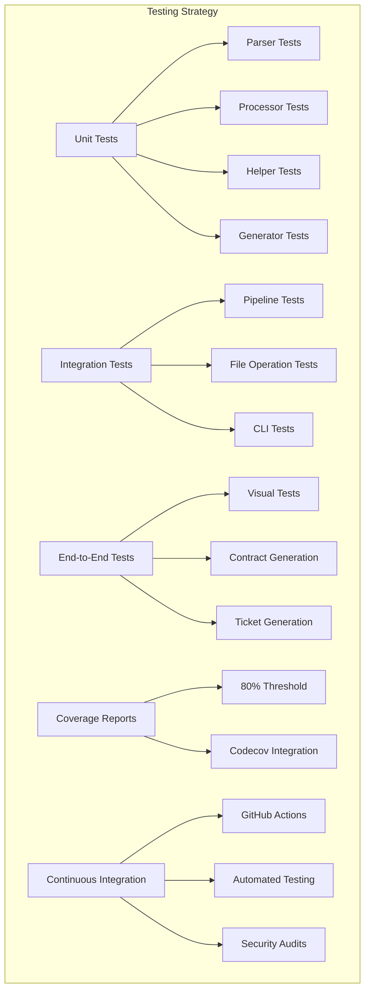
```mermaid
graph TB
    subgraph "Testing Strategy"
        UNIT[Unit Tests] --> PARSERS[Parser Tests]
        UNIT --> PROCESSORS[Processor Tests]
        UNIT --> HELPERS[Helper Tests]
        UNIT --> GENERATORS[Generator Tests]

        INTEGRATION[Integration Tests] --> PIPELINE[Pipeline Tests]
        INTEGRATION --> FILE_OPS[File Operation Tests]
        INTEGRATION --> CLI_TESTS[CLI Tests]

        E2E[End-to-End Tests] --> VISUAL[Visual Tests]
        E2E --> CONTRACT[Contract Generation]
        E2E --> TICKET[Ticket Generation]

        COVERAGE[Coverage Reports] --> THRESHOLD[80% Threshold]
        COVERAGE --> CODECOV[Codecov Integration]

        CI[Continuous Integration] --> GITHUB_ACTIONS[GitHub Actions]
        CI --> AUTOMATED[Automated Testing]
        CI --> SECURITY[Security Audits]
    end
```

## Security Considerations

```mermaid
flowchart TD
    INPUT[User Input] --> VALIDATE[Input Validation]
    VALIDATE --> SANITIZE[Content Sanitization]
    SANITIZE --> PATH_CHECK[Path Traversal Check]
    PATH_CHECK --> PERMISSION[Permission Validation]
    PERMISSION --> SAFE_EXEC[Safe Execution]

    subgraph "Security Measures"
        XSS[XSS Prevention]
        INJECTION[Injection Prevention]
        FILE_ACCESS[Restricted File Access]
        AUDIT[Dependency Auditing]
    end

    SAFE_EXEC --> XSS
    SAFE_EXEC --> INJECTION
    SAFE_EXEC --> FILE_ACCESS
    SAFE_EXEC --> AUDIT
```

## Web Interface Architecture

Legal Markdown JS includes a comprehensive web interface that provides real-time
document editing and preview capabilities through a browser-based application.

```mermaid
graph TB
    subgraph "Web Interface Layer"
        WEB[Web Interface] --> EDITOR[Document Editor]
        WEB --> CSS_EDITOR[CSS Editor]
        WEB --> PREVIEW[Live Preview]

        EDITOR --> RESIZABLE[Resizable Columns]
        CSS_EDITOR --> RESIZABLE
        PREVIEW --> RESIZABLE

        subgraph "Editor Features"
            SYNTAX[Syntax Highlighting]
            REALTIME[Real-time Processing]
            EXAMPLES[Predefined Examples]
            UPLOAD[File Upload]
        end

        subgraph "CSS Editor Features"
            CSS_SYNTAX[CSS Syntax Highlighting]
            AUTO_APPLY[Auto-apply CSS]
            BASE_TOGGLE[Base Styles Toggle]
            CUSTOM_STYLES[Custom Styling]
        end

        subgraph "Preview Features"
            LIVE_RENDER[Live Rendering]
            HIGHLIGHT_FIELDS[Field Highlighting]
            RESPONSIVE[Responsive Design]
            DARK_MODE[Dark Mode]
        end

        EDITOR --> SYNTAX
        EDITOR --> REALTIME
        EDITOR --> EXAMPLES
        EDITOR --> UPLOAD

        CSS_EDITOR --> CSS_SYNTAX
        CSS_EDITOR --> AUTO_APPLY
        CSS_EDITOR --> BASE_TOGGLE
        CSS_EDITOR --> CUSTOM_STYLES

        PREVIEW --> LIVE_RENDER
        PREVIEW --> HIGHLIGHT_FIELDS
        PREVIEW --> RESPONSIVE
        PREVIEW --> DARK_MODE
    end

    WEB --> CORE[Core Processing Engine]
    CORE --> OUTPUT[HTML Output]
```

### Web Interface Processing Flow

```mermaid
sequenceDiagram
    participant User
    participant Editor
    participant CSSEditor
    participant Processor
    participant Preview

    User->>Editor: Input Markdown Content
    Editor->>Processor: Process Document
    Processor->>Preview: Generate HTML
    Preview->>User: Display Result

    User->>CSSEditor: Modify CSS
    CSSEditor->>Preview: Apply Styles
    Preview->>User: Update Display

    User->>Editor: Change Content
    Editor->>Processor: Reprocess
    Processor->>Preview: Update HTML
    Preview->>User: Live Update

    Note over User,Preview: Real-time collaboration between<br/>editor, CSS editor, and preview
```

### Browser Bundle Architecture

```mermaid
graph TB
    subgraph "Browser Distribution"
        BUNDLE[Browser Bundle] --> STANDALONE[Standalone Bundle]
        BUNDLE --> MODULAR[Modular Bundle]

        STANDALONE --> JSDELIVR[jsDelivr CDN]
        MODULAR --> NPM_WEB[NPM Web Package]

        subgraph "Bundle Components"
            CORE_WEB[Core Web Engine]
            UI_COMPONENTS[UI Components]
            WEB_WORKERS[Web Workers]
            CSS_ASSETS[CSS Assets]
        end

        BUNDLE --> CORE_WEB
        BUNDLE --> UI_COMPONENTS
        BUNDLE --> WEB_WORKERS
        BUNDLE --> CSS_ASSETS
    end
```

## Deployment Architecture

```mermaid
graph TB
    subgraph "Distribution Strategy"
        NPM[NPM Package] --> BINARY[Binary Distribution]
        NPM --> LIBRARY[Library Usage]
        NPM --> WEB_BUNDLE[Web Bundle]

        BINARY --> CLI_TOOL[CLI Tool]
        LIBRARY --> PROGRAMMATIC[Programmatic API]
        WEB_BUNDLE --> BROWSER[Browser Usage]
        WEB_BUNDLE --> CDN[CDN Distribution]

        subgraph "Supported Platforms"
            NODE16[Node.js 16+]
            LINUX[Linux]
            MACOS[macOS]
            WINDOWS[Windows]
            BROWSERS[Modern Browsers]
        end

        CLI_TOOL --> NODE16
        PROGRAMMATIC --> NODE16
        BROWSER --> BROWSERS
        CDN --> BROWSERS
    end
```
