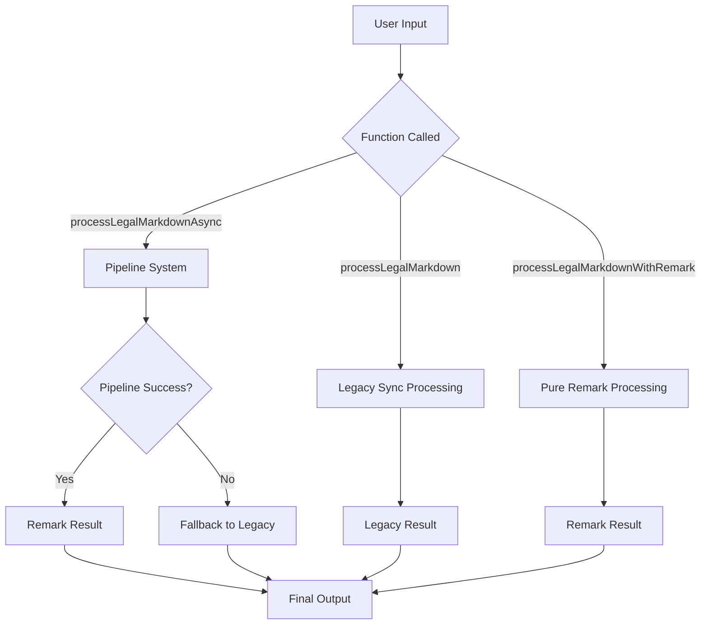
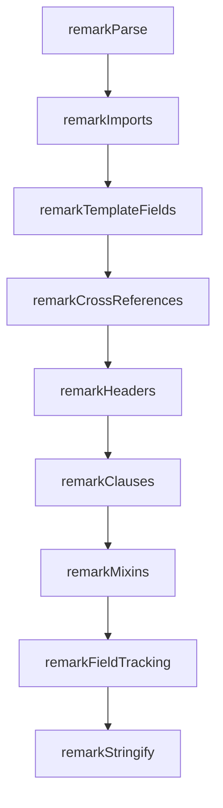

<!-- markdownlint-disable MD013 -->

# Remark Migration Status & Complete Implementation Guide <!-- omit in toc -->

- [📖 Executive Summary](#-executive-summary)
- [🎯 Original Problem \& Context](#-original-problem--context)
  - [The Core Issue](#the-core-issue)
  - [Root Cause Analysis](#root-cause-analysis)
- [🏗️ Current Architecture: Hybrid System](#️-current-architecture-hybrid-system)
  - [Processing Flow Architecture](#processing-flow-architecture)
  - [Primary Processing Functions](#primary-processing-functions)
    - [1. Legacy Sync Processing](#1-legacy-sync-processing)
    - [2. Async Pipeline with Fallback](#2-async-pipeline-with-fallback)
    - [3. Pure Remark Processing](#3-pure-remark-processing)
- [✅ Migration Status: Comprehensive Feature Analysis](#-migration-status-comprehensive-feature-analysis)
  - [Core Remark Plugin System](#core-remark-plugin-system)
  - [Fully Migrated Features ✅](#fully-migrated-features-)
    - [1. Template Fields Plugin (`remarkTemplateFields`)](#1-template-fields-plugin-remarktemplatefields)
    - [2. Cross-References Plugin (`remarkCrossReferences`)](#2-cross-references-plugin-remarkcrossreferences)
    - [3. Field Tracking Plugin (`remarkFieldTracking`)](#3-field-tracking-plugin-remarkfieldtracking)
    - [4. Headers Plugin (`remarkHeaders`)](#4-headers-plugin-remarkheaders)
    - [5. Clauses Plugin (`remarkClauses`)](#5-clauses-plugin-remarkclauses)
    - [6. Mixins Plugin (`remarkMixins`)](#6-mixins-plugin-remarkmixins)
    - [7. Imports Plugin (`remarkImports`)](#7-imports-plugin-remarkimports)
  - [Partially Migrated / Hybrid Features 🔄](#partially-migrated--hybrid-features-)
    - [Template Loops](#template-loops)
    - [Metadata Export](#metadata-export)
    - [Pipeline System](#pipeline-system)
  - [Legacy-Only Features 🏗️](#legacy-only-features-️)
    - [Features Not Migrated (And Why)](#features-not-migrated-and-why)
    - [RST/LaTeX Preprocessing Detail](#rstlatex-preprocessing-detail)
- [📊 Performance Analysis \& Benchmarks](#-performance-analysis--benchmarks)
  - [Comprehensive Performance Comparison](#comprehensive-performance-comparison)
    - [Benchmark Methodology](#benchmark-methodology)
    - [Detailed Results](#detailed-results)
    - [Memory Usage Analysis](#memory-usage-analysis)
  - [Performance Implications](#performance-implications)
    - [When Legacy is Better](#when-legacy-is-better)
    - [When Remark is Better](#when-remark-is-better)
  - [Scaling Analysis](#scaling-analysis)
- [📦 Web Distribution Changes](#-web-distribution-changes)
  - [Bundle.js → UMD.js Migration](#bundlejs--umdjs-migration)
- [🔧 Technical Implementation Guide](#-technical-implementation-guide)
  - [Plugin Development Architecture](#plugin-development-architecture)
    - [Core Plugin Structure](#core-plugin-structure)
    - [Plugin Execution Order Dependencies](#plugin-execution-order-dependencies)
  - [Field Tracking System Deep Dive](#field-tracking-system-deep-dive)
    - [Singleton Pattern Implementation](#singleton-pattern-implementation)
    - [Field Status Enum (Critical)](#field-status-enum-critical)
    - [Field Tracking CSS Classes](#field-tracking-css-classes)
  - [Error Handling Strategy](#error-handling-strategy)
    - [Multi-Level Error Handling](#multi-level-error-handling)
- [🎯 Complete Migration Roadmap](#-complete-migration-roadmap)
  - [Phase 1: Foundation Complete ✅](#phase-1-foundation-complete-)
  - [Phase 2: API Optimization \& Enhancement 🔄](#phase-2-api-optimization--enhancement-)
    - [2.1 API Improvements](#21-api-improvements)
    - [2.2 Specialized API Functions](#22-specialized-api-functions)
    - [2.3 Document Complexity Analysis](#23-document-complexity-analysis)
  - [Phase 3: Feature Completion \& Integration 📋](#phase-3-feature-completion--integration-)
    - [3.1 Template Loops Full Integration](#31-template-loops-full-integration)
    - [3.2 Metadata Export Integration](#32-metadata-export-integration)
    - [3.3 Pipeline System Enhancement](#33-pipeline-system-enhancement)
  - [Phase 4: Performance Optimization 🚀](#phase-4-performance-optimization-)
    - [4.1 AST Caching System](#41-ast-caching-system)
    - [4.2 Plugin Optimization](#42-plugin-optimization)
    - [4.3 Streaming Processing](#43-streaming-processing)
  - [Phase 5: Legacy Deprecation Planning 📅](#phase-5-legacy-deprecation-planning-)
    - [5.1 Deprecation Timeline](#51-deprecation-timeline)
    - [5.2 Migration Tools](#52-migration-tools)
- [🚨 Critical Implementation Details for LLMs](#-critical-implementation-details-for-llms)
  - [Must-Know Technical Details](#must-know-technical-details)
    - [1. Field Tracker Singleton Management](#1-field-tracker-singleton-management)
    - [2. Processing Order Dependencies](#2-processing-order-dependencies)
    - [3. HTML Context Flag Usage](#3-html-context-flag-usage)
    - [4. Cross-Reference Naming Convention](#4-cross-reference-naming-convention)
    - [5. Word Boundary and Regex Escaping](#5-word-boundary-and-regex-escaping)
    - [6. AST Node Type Checking](#6-ast-node-type-checking)
  - [Common Implementation Pitfalls](#common-implementation-pitfalls)
    - [1. Double-Wrapping Prevention](#1-double-wrapping-prevention)
    - [2. Context Awareness Failures](#2-context-awareness-failures)
    - [3. Section Counter Reset Logic](#3-section-counter-reset-logic)
  - [Debugging Guide for LLMs](#debugging-guide-for-llms)
    - [Debug Information Gathering](#debug-information-gathering)
    - [Common Debug Scenarios](#common-debug-scenarios)
    - [Performance Debugging](#performance-debugging)
- [📚 Migration Guide for Developers](#-migration-guide-for-developers)
  - [For New Projects](#for-new-projects)
    - [Recommended Approach](#recommended-approach)
    - [Full remark Processing](#full-remark-processing)
  - [For Existing Projects](#for-existing-projects)
    - [No Changes Required (Backward Compatibility)](#no-changes-required-backward-compatibility)
    - [Gradual Migration Path](#gradual-migration-path)
  - [Performance-Critical Applications](#performance-critical-applications)
    - [Batch Processing Pattern](#batch-processing-pattern)
    - [Intelligent Processing](#intelligent-processing)
  - [Error Handling Patterns](#error-handling-patterns)
    - [Robust Error Handling](#robust-error-handling)
    - [Graceful Degradation](#graceful-degradation)
- [🧪 Testing Strategy \& Coverage](#-testing-strategy--coverage)
  - [Test Suite Organization](#test-suite-organization)
    - [Unit Tests by Plugin](#unit-tests-by-plugin)
    - [Integration Tests](#integration-tests)
    - [Performance Tests](#performance-tests)
    - [Regression Tests](#regression-tests)
  - [Test Coverage Requirements](#test-coverage-requirements)
    - [Coverage Targets](#coverage-targets)
    - [Coverage Verification](#coverage-verification)
  - [Testing Best Practices](#testing-best-practices)
    - [1. Test Data Management](#1-test-data-management)
    - [2. Snapshot Testing for Complex Output](#2-snapshot-testing-for-complex-output)
    - [3. Performance Monitoring in CI](#3-performance-monitoring-in-ci)
- [🔮 Future Considerations \& Enhancements](#-future-considerations--enhancements)
  - [Advanced Features Roadmap](#advanced-features-roadmap)
    - [1. Plugin Ecosystem](#1-plugin-ecosystem)
    - [2. Schema Validation](#2-schema-validation)
    - [3. Live Processing for Editors](#3-live-processing-for-editors)
    - [4. Advanced Debugging Tools](#4-advanced-debugging-tools)
  - [Performance Optimization Research](#performance-optimization-research)
    - [1. WebAssembly Integration](#1-webassembly-integration)
    - [2. Worker Thread Processing](#2-worker-thread-processing)
  - [Architectural Evolution](#architectural-evolution)
    - [1. Microservice Architecture](#1-microservice-architecture)
    - [2. Event-Driven Processing](#2-event-driven-processing)
- [📊 Migration Success Metrics](#-migration-success-metrics)
  - [Functional Success Criteria](#functional-success-criteria)
    - [1. Feature Parity Validation](#1-feature-parity-validation)
    - [2. Performance Acceptance Criteria](#2-performance-acceptance-criteria)
    - [3. Quality Improvements](#3-quality-improvements)
  - [Technical Success Criteria](#technical-success-criteria)
    - [1. Architecture Quality](#1-architecture-quality)
    - [2. Developer Experience](#2-developer-experience)
    - [3. Production Readiness](#3-production-readiness)
  - [Business Success Criteria](#business-success-criteria)
    - [1. User Adoption](#1-user-adoption)
    - [2. Maintenance Efficiency](#2-maintenance-efficiency)
- [📖 Complete Migration Guide](#-complete-migration-guide)
  - [Migration Guide - Remark-based Processing](#migration-guide---remark-based-processing)
    - [Overview](#overview)
    - [Benefits of Migration](#benefits-of-migration)
      - [🎯 **Improved Accuracy**](#-improved-accuracy)
      - [🚀 **Better Performance**](#-better-performance)
      - [🔧 **Enhanced Maintainability**](#-enhanced-maintainability)
    - [API Changes](#api-changes)
      - [Function Signatures](#function-signatures)
      - [Option Changes](#option-changes)
      - [Return Value Changes](#return-value-changes)
    - [Step-by-Step Migration](#step-by-step-migration)
      - [Step 1: Update Import Statements](#step-1-update-import-statements)
      - [Step 2: Add Async/Await](#step-2-add-asyncawait)
      - [Step 3: Update Error Handling](#step-3-update-error-handling)
      - [Step 4: Leverage New Features](#step-4-leverage-new-features)
    - [Feature Comparison](#feature-comparison)
    - [Troubleshooting](#troubleshooting)
      - [Common Migration Issues](#common-migration-issues)
        - [Issue: Function is async but called synchronously](#issue-function-is-async-but-called-synchronously)
        - [Issue: Missing functionality](#issue-missing-functionality)
        - [Issue: Different field tracking results](#issue-different-field-tracking-results)
      - [Performance Comparison](#performance-comparison)
    - [Rollback Strategy](#rollback-strategy)
      - [Option 1: Gradual Rollback](#option-1-gradual-rollback)
      - [Option 2: Version Pinning](#option-2-version-pinning)
      - [Option 3: Legacy Function Wrapper](#option-3-legacy-function-wrapper)
    - [Migration Timeline](#migration-timeline)
    - [Support](#support)

## 📖 Executive Summary

This document provides a comprehensive analysis of the migration from legacy
`marked`-based processing to the new `remark`-based AST processing system. The
migration addresses critical text contamination issues, double-wrapping
problems, and false positive highlighting while introducing a hybrid
architecture that balances performance with robustness.

**Current Status**: Phase 1 Complete - All core plugins implemented and
functional **Next Phase**: API optimization and performance improvements
**Migration Approach**: Hybrid system with gradual transition path

## 🎯 Original Problem & Context

### The Core Issue

Cross-references in legal markdown documents (`|key|` syntax) were not being
highlighted correctly, and the regex-based approach introduced several critical
issues:

- **Double-Wrapping Missing Values**:

  ```html
  <span class="missing-value" data-field="contraparte.denominacion_social">
    <span class="missing-value" data-field="contraparte.denominacion_social">
      [contraparte.denominacion_social]
    </span>
  </span>
  ```

- **Headers in Code Blocks**:

  ```html
  <pre><code>  <span class="legal-header legal-header-level-3">Sección 1 - ...</span></code></pre>
  ```

- **False Positive Highlighting**:

  ```html
  los fon<span class="imported-value">dos</span> o activos aporta<span
    class="imported-value"
    >dos</span
  >
  ```

### Root Cause Analysis

The fundamental issue is that **regex-based text processing cannot reliably
understand markdown structure**:

- **Context Loss**: Regex cannot distinguish between text in different markdown
  contexts
- **Order Dependencies**: Multiple regex passes create interdependencies and
  edge cases
- **HTML Corruption**: String-based HTML manipulation is fragile and error-prone
- **Boundary Detection**: Word boundaries and HTML tag boundaries are complex to
  handle correctly

## 🏗️ Current Architecture: Hybrid System

### Processing Flow Architecture



### Primary Processing Functions

#### 1. Legacy Sync Processing

```typescript
processLegalMarkdown(content: string, options: LegalMarkdownOptions): ProcessingResult
```

- **Purpose**: 100% legacy processing for backward compatibility
- **Performance**: ~17x faster than remark
- **Issues**: Text contamination, double-wrapping, false positives
- **Use Case**: Performance-critical applications, batch processing

#### 2. Async Pipeline with Fallback

```typescript
processLegalMarkdownAsync(content: string, options: LegalMarkdownOptions): Promise<ProcessingResult>
```

- **Purpose**: Remark-first with legacy fallback
- **Strategy**: Try new pipeline system, fallback to legacy on failure
- **Current State**: Uses legacy pipeline as fallback
- **Future**: Will default to remark processing

#### 3. Pure Remark Processing

```typescript
processLegalMarkdownWithRemark(content: string, options: LegalMarkdownProcessorOptions): Promise<ProcessingResult>
```

- **Purpose**: Pure remark processing without fallback
- **Performance**: ~17x slower but more robust
- **Features**: Nested helpers, AST-based processing, no contamination
- **Use Case**: Complex documents, new applications

## ✅ Migration Status: Comprehensive Feature Analysis

### Core Remark Plugin System

The remark implementation consists of 7 core plugins that process documents in a
specific order:

```typescript
// Processing order is critical for proper functionality
const processor = unified()
  .use(remarkParse)
  .use(remarkImports, { basePath, debug }) // 1. Process @import statements
  .use(remarkTemplateFields, { metadata }) // 2. Process {{field}} templates
  .use(remarkCrossReferences, { metadata }) // 3. Process |ref| cross-references
  .use(remarkHeaders, { metadata }) // 4. Process header numbering
  .use(remarkClauses, { metadata }) // 5. Process conditional clauses
  .use(remarkMixins, { metadata }) // 6. Process template mixins
  .use(remarkFieldTracking, { enabled }) // 7. Apply field highlighting
  .use(remarkStringify);
```

### Fully Migrated Features ✅

#### 1. Template Fields Plugin (`remarkTemplateFields`)

**File**: `src/plugins/remark/template-fields.ts`

**Capabilities**:

- Simple variables: `{{client_name}}`
- Nested object access: `{{client.contact.email}}`
- Helper functions: `{{formatDate(@today, "YYYY-MM-DD")}}`
- Nested helper calls: `{{formatDate(addYears(@today, 5), "MMMM Do, YYYY")}}`
- Conditional expressions: `{{active ? "Active" : "Inactive"}}`

**Critical Implementation Details**:

```typescript
// Smart argument parsing handles nested parentheses and quoted strings
function smartSplitArguments(str: string): string[] {
  const parts: string[] = [];
  let current = '';
  let inQuotes = false;
  let quoteChar = '';
  let parenDepth = 0; // Tracks nested parentheses

  for (let i = 0; i < str.length; i++) {
    const char = str[i];

    if ((char === '"' || char === "'") && !inQuotes) {
      inQuotes = true;
      quoteChar = char;
      current += char;
    } else if (char === quoteChar && inQuotes) {
      inQuotes = false;
      quoteChar = '';
      current += char;
    } else if (char === '(' && !inQuotes) {
      parenDepth++; // Track opening parentheses
      current += char;
    } else if (char === ')' && !inQuotes) {
      parenDepth--; // Track closing parentheses
      current += char;
    } else if (char === ',' && !inQuotes && parenDepth === 0) {
      // Only split on commas outside quotes and parentheses
      parts.push(current);
      current = '';
    } else {
      current += char;
    }
  }

  if (current) {
    parts.push(current);
  }

  return parts;
}

// Recursive helper parsing for nested calls
function parseHelperArguments(
  argsString: string,
  metadata: Record<string, any>
): any[] {
  if (!argsString.trim()) {
    return [];
  }

  const args: any[] = [];
  const parts = smartSplitArguments(argsString);

  for (const part of parts) {
    const trimmed = part.trim();

    if (!trimmed) continue;

    // Check for nested helper function call
    const nestedHelperMatch = trimmed.match(/^(\w+)\((.*)\)$/);
    if (nestedHelperMatch) {
      const [, helperName, nestedArgsString] = nestedHelperMatch;
      const helper = helpers[helperName as keyof typeof helpers];

      if (helper && typeof helper === 'function') {
        try {
          // Recursively parse nested arguments
          const nestedArgs = parseHelperArguments(nestedArgsString, metadata);

          // Call the nested helper function
          const nestedResult = (helper as any)(...nestedArgs);
          args.push(nestedResult);
          continue;
        } catch (error) {
          console.warn(`Error calling nested helper '${helperName}':`, error);
        }
      }
    }

    // Handle literals, metadata references, etc.
    // ... (detailed parsing logic)
  }

  return args;
}
```

**Helper System Integration**:

- **Date Helpers**: `formatDate`, `addYears`, `addMonths`, `addDays`
- **String Helpers**: `capitalize`, `upper`, `lower`, `titleCase`, `truncate`,
  `padStart`
- **Number Helpers**: `formatCurrency`, `formatPercent`, `numberToWords`,
  `round`

**Test Coverage**: 23 unit tests covering all helper combinations and nested
scenarios

#### 2. Cross-References Plugin (`remarkCrossReferences`)

**File**: `src/plugins/remark/cross-references.ts`

**Capabilities**:

- Header-based cross-reference definitions:
  `ll. **Contract Object** |objeto-contrato|`
- Cross-reference resolution: `|objeto-contrato|` → `"Art. 1 -"`
- Custom level formats via metadata
- Section counter management with proper reset logic

**Critical Implementation Details**:

```typescript
// Header pattern detection supports both traditional and alternative formats
const traditionalMatch = trimmedLine.match(/^(l+)\. (.+) \|([\w.-]+)\|$/);
const alternativeMatch = trimmedLine.match(/^l(\d+)\. (.+) \|([\w.-]+)\|$/);

// Section counter logic - CRITICAL: Must reset lower levels when higher level increments
function updateSectionCounters(
  sectionCounters: SectionCounters,
  level: number
): void {
  switch (level) {
    case 1:
      sectionCounters.level1++;
      sectionCounters.level2 = 0; // Reset all lower levels
      sectionCounters.level3 = 0;
      sectionCounters.level4 = 0;
      sectionCounters.level5 = 0;
      sectionCounters.level6 = 0;
      break;
    case 2:
      sectionCounters.level2++;
      sectionCounters.level3 = 0; // Reset lower levels only
      sectionCounters.level4 = 0;
      sectionCounters.level5 = 0;
      sectionCounters.level6 = 0;
      break;
    // ... similar logic for other levels
  }
}

// Number formatting with placeholder replacement
function formatSectionNumber(
  levelFormat: string,
  counters: SectionCounters,
  level: number
): string {
  const levelCount = counters[`level${level}` as keyof SectionCounters];

  return levelFormat
    .replace(/%n/g, String(levelCount)) // %n = number
    .replace(/%c/g, String.fromCharCode(96 + levelCount)) // %c = lowercase letter (a,b,c)
    .replace(/%C/g, String.fromCharCode(64 + levelCount)) // %C = uppercase letter (A,B,C)
    .replace(/%r/g, toRoman(levelCount).toLowerCase()) // %r = lowercase roman (i,ii,iii)
    .replace(/%R/g, toRoman(levelCount).toUpperCase()); // %R = uppercase roman (I,II,III)
}
```

**Field Tracking Integration**:

```typescript
// Cross-references are always tracked as logic fields
fieldTracker.trackField(`crossref.${trimmedKey}`, {
  value: sectionNumber, // e.g., "Art. 1 -"
  originalValue: match, // e.g., "|objeto-contrato|"
  hasLogic: true, // CRITICAL: Always true for cross-references
});
```

**Test Coverage**: 15 unit tests covering header formats, counter logic, and
edge cases

#### 3. Field Tracking Plugin (`remarkFieldTracking`)

**File**: `src/plugins/remark/field-tracking.ts`

**Purpose**: Applies HTML highlighting spans to field values during AST
processing

**Key Features**:

- AST-based processing prevents text contamination
- Prevents double-wrapping by checking existing spans
- Context-aware (skips code blocks, preserves HTML structure)
- Integrates with singleton field tracker

**Critical Implementation**:

```typescript
// Double-wrapping prevention by checking existing field spans
function hasExistingFieldSpans(text: string): boolean {
  return text.includes('class="legal-field') && text.includes('data-field="');
}

// Context-aware processing - skip nodes inside existing field tracking spans
function isInsideFieldTrackingSpan(node: any, parent: any): boolean {
  if (!parent || parent.type !== 'paragraph' || !parent.children) {
    return false;
  }

  const nodeIndex = parent.children.indexOf(node);
  if (nodeIndex === -1) return false;

  // Look for opening field tracking span before this node
  let hasOpeningSpan = false;
  for (let i = nodeIndex - 1; i >= 0; i--) {
    const prevNode = parent.children[i];
    if (
      prevNode.type === 'html' &&
      prevNode.value.includes('class="legal-field') &&
      prevNode.value.includes('data-field="')
    ) {
      hasOpeningSpan = true;
      break;
    }
  }

  // Look for closing span after this node
  let hasClosingSpan = false;
  for (let i = nodeIndex + 1; i < parent.children.length; i++) {
    const nextNode = parent.children[i];
    if (nextNode.type === 'html' && nextNode.value.includes('</span>')) {
      hasClosingSpan = true;
      break;
    }
  }

  return hasOpeningSpan && hasClosingSpan;
}
```

#### 4. Headers Plugin (`remarkHeaders`)

**File**: `src/plugins/remark/headers.ts`

**Capabilities**:

- Header numbering with custom formats
- Level-based formatting (`%n`, `%c`, `%r`, `%R` placeholders)
- Integration with cross-reference system
- Field tracking for header values

#### 5. Clauses Plugin (`remarkClauses`)

**File**: `src/plugins/remark/clauses.ts`

**Capabilities**:

- Conditional content processing
- Boolean expression evaluation
- Metadata-based conditional rendering
- Complex nested conditions

#### 6. Mixins Plugin (`remarkMixins`)

**File**: `src/plugins/remark/mixins.ts`

**Capabilities**:

- Template expansion
- Variable substitution
- Integration with template fields
- AST-based processing prevents contamination

#### 7. Imports Plugin (`remarkImports`)

**File**: `src/plugins/remark/imports.ts`

**Capabilities**:

- `@import` statement processing
- Frontmatter merging with "source always wins" strategy
- Security: Reserved field filtering
- Object flattening for granular control
- Timeout safety for circular reference prevention

**Critical Security Implementation**:

```typescript
// Sequential merge with security filtering
function performSequentialMerge(context: ImportContext): MergeResult {
  if (context.importedMetadataList.length === 0) {
    return { metadata: {}, stats: undefined };
  }

  // Check timeout before starting merge
  if (Date.now() - context.startTime > context.timeoutMs) {
    throw new Error(
      `Import processing timed out after ${context.timeoutMs}ms. ` +
        'This may indicate complex nested imports or slow file operations.'
    );
  }

  // Prepare merge options with security features
  const mergeOptions: MergeOptions = {
    filterReserved: context.filterReserved, // Filter dangerous fields
    validateTypes: context.validateTypes, // Type validation
    logOperations: context.logImportOperations, // Audit logging
    includeStats: true,
    timeoutMs: Math.max(
      1000,
      context.timeoutMs - (Date.now() - context.startTime)
    ),
  };

  // Extract metadata array for merging
  const metadataList = context.importedMetadataList.map(item => item.metadata);

  try {
    // Use sequential merge with initial empty metadata (source always wins)
    const result = mergeSequentially({}, metadataList, mergeOptions);

    // Call onMetadataMerged callback if provided
    if (context.onMetadataMerged && Object.keys(result.metadata).length > 0) {
      context.onMetadataMerged(result.metadata, 'merged-imports');
    }

    return result;
  } catch (error) {
    if (context.debug) {
      console.warn('[remarkImports] Sequential merge failed:', error);
    }
    throw error;
  }
}
```

### Partially Migrated / Hybrid Features 🔄

#### Template Loops

- **Status**: Integrated into mixin processing
- **Implementation**: Template loops are processed as part of the mixin system
- **Migration**: Complete integration into remark mixins plugin

#### Metadata Export

- **Status**: Legacy post-processing
- **Works with**: Both legacy and remark systems
- **Migration**: Can remain as post-processing step

#### Pipeline System

- **Status**: Partial implementation
- **Current**: Used in `processLegalMarkdownAsync` with legacy fallback
- **Future**: Full remark pipeline integration

### Legacy-Only Features 🏗️

#### Features Not Migrated (And Why)

| Feature                            | Reason Not Migrated                            | Migration Difficulty | Priority |
| ---------------------------------- | ---------------------------------------------- | -------------------- | -------- |
| **RST Preprocessing**              | External parser dependency, preprocessing step | ❌ High              | Low      |
| **LaTeX Preprocessing**            | External parser dependency, preprocessing step | ❌ High              | Low      |
| **Sync API**                       | Performance requirements for batch processing  | 🔄 Medium            | Medium   |
| **Post-processing Field Tracking** | HTML/PDF generation pipeline requirement       | 🔄 Medium            | Low      |

#### RST/LaTeX Preprocessing Detail

These remain as preprocessing steps because:

1. **External Dependencies**: Require `pandoc` or other external parsers
2. **Format Conversion**: Convert to Legal Markdown before AST processing
3. **Performance**: Preprocessing is more efficient than AST transformation
4. **Separation of Concerns**: Content conversion vs. content processing

**Implementation Location**:

- `src/extensions/rst-parser.ts`
- `src/extensions/latex-parser.ts`

## 📊 Performance Analysis & Benchmarks

### Comprehensive Performance Comparison

#### Benchmark Methodology

**Test Environment**:

- Node.js: v24.4.1
- Platform: darwin arm64
- Memory: 24GB
- Iterations: 100-500 per document type

**Document Categories**:

1. **Simple**: 134 characters, basic template fields
2. **Medium**: 441 characters, cross-references, multiple fields
3. **Complex**: 1201 characters, imports, nested helpers, cross-references

#### Detailed Results

| Metric                     | Simple Docs     | Medium Docs     | Complex Docs    | Average         |
| -------------------------- | --------------- | --------------- | --------------- | --------------- |
| **Legacy Processing Time** | 0.02ms          | 0.02ms          | 0.04ms          | 0.027ms         |
| **Remark Processing Time** | 0.16ms          | 0.41ms          | 1.17ms          | 0.58ms          |
| **Speed Ratio**            | 11x faster      | 20x faster      | 25x faster      | **17x faster**  |
| **Legacy Throughput**      | 66,541 docs/sec | 44,398 docs/sec | 24,342 docs/sec | 45,094 docs/sec |
| **Remark Throughput**      | 6,105 docs/sec  | 2,424 docs/sec  | 857 docs/sec    | 2,795 docs/sec  |

#### Memory Usage Analysis

| Document Type | Legacy Memory | Remark Memory | Difference            |
| ------------- | ------------- | ------------- | --------------------- |
| **Simple**    | +6.29MB       | +0.94MB       | Legacy uses 6.7x more |
| **Medium**    | +4.43MB       | -2.75MB       | Remark more efficient |
| **Complex**   | +4.12MB       | +14.55MB      | Remark uses 3.5x more |

### Performance Implications

#### When Legacy is Better

- **Batch Processing**: Processing hundreds/thousands of documents
- **Simple Documents**: Basic template fields without complex logic
- **Real-time Applications**: Where sub-millisecond response is critical
- **Resource Constrained**: Limited memory environments

#### When Remark is Better

- **Complex Documents**: Nested helpers, cross-references, imports
- **Robustness Critical**: Cannot tolerate text contamination
- **Maintenance**: Easier to debug and extend
- **New Features**: Advanced template processing, custom plugins

### Scaling Analysis

```typescript
// Performance projection for different workloads

// Batch processing 1000 simple documents:
// Legacy: ~20ms total (0.02ms × 1000)
// Remark: ~160ms total (0.16ms × 1000)
// Impact: +140ms for robustness

// Interactive processing single complex document:
// Legacy: ~0.04ms
// Remark: ~1.17ms
// Impact: +1.13ms negligible for user experience

// Mixed workload (100 medium docs):
// Legacy: ~2ms total
// Remark: ~41ms total
// Impact: +39ms for significantly better reliability
```

## 📦 Web Distribution Changes

### Bundle.js → UMD.js Migration

As part of the remark migration, the web distribution format has been updated to improve compatibility and performance:

#### 🔄 **Change Summary**

| Before | After | Impact |
|--------|-------|--------|
| `bundle.js` | `legal-markdown.umd.min.js` | ✅ Better UMD compliance |
| Custom bundling | Webpack UMD build | ✅ Improved compatibility |
| Mixed module format | Consistent UMD format | ✅ Reduced module conflicts |

#### 📋 **Affected Files**

1. **Web Playground (`src/web/standalone.html`)**:
   ```html
   <!-- Before -->
   <script src="bundle.js"></script>
   
   <!-- After -->
   <script src="legal-markdown.umd.min.js"></script>
   ```

2. **Distribution Build**:
   - Old: Custom bundle with mixed module approach
   - New: Standard UMD build with Webpack
   - Size: Optimized and minified (~70KB minified)

#### ⚡ **Benefits**

- **Better Compatibility**: UMD format works with CommonJS, AMD, and global environments
- **Reduced Module Conflicts**: Eliminates mixed module approach issues
- **Standard Distribution**: Follows common JavaScript library distribution patterns
- **Improved Performance**: Webpack optimization and proper minification

#### 🔧 **Migration for Consumers**

If you're using the web version of Legal Markdown:

```html
<!-- Old way -->
<script src="path/to/bundle.js"></script>

<!-- New way -->
<script src="path/to/legal-markdown.umd.min.js"></script>
```

#### 📚 **Technical Details**

The new UMD build:
- Uses Webpack for proper bundling and optimization
- Includes source maps for debugging
- Maintains all functionality from the previous bundle
- Provides better error handling and module resolution
- Is fully compatible with the remark-based processing pipeline

## 🔧 Technical Implementation Guide

### Plugin Development Architecture

#### Core Plugin Structure

Every remark plugin follows this pattern:

```typescript
import { visit } from 'unist-util-visit';
import type { Plugin } from 'unified';
import type { Root, Node } from 'mdast';

interface PluginOptions {
  metadata: Record<string, any>;
  debug?: boolean;
  // Plugin-specific options
}

const remarkPluginName: Plugin<[PluginOptions], Root> = options => {
  const { metadata, debug = false } = options;

  return (tree: Root) => {
    if (debug) {
      console.log('🔧 Processing plugin: PluginName');
    }

    // Phase 1: Collect information (if needed)
    const collectedData = new Map();

    visit(tree, (node: Node, index, parent) => {
      // Collection logic
    });

    // Phase 2: Transform nodes
    visit(tree, (node: Node, index, parent) => {
      // Transformation logic based on collected data
    });

    if (debug) {
      console.log('✅ Plugin completed: PluginName');
    }
  };
};

export default remarkPluginName;
```

#### Plugin Execution Order Dependencies

The order of plugin execution is **critical** for correct functionality:



**Dependency Rationale**:

1. **Imports First**: Must process `@import` statements to merge metadata
2. **Template Fields**: Resolves `{{field}}` patterns using merged metadata
3. **Cross-References**: Processes `|ref|` using resolved template values
4. **Headers**: Numbers headers using cross-reference mappings
5. **Clauses**: Conditional processing using all resolved values
6. **Mixins**: Template expansion using complete metadata
7. **Field Tracking**: Highlights all processed field values
8. **Stringify**: Converts AST back to markdown/HTML

### Field Tracking System Deep Dive

#### Singleton Pattern Implementation

The field tracking system uses a singleton pattern that must be carefully
managed:

```typescript
// src/extensions/tracking/field-tracker.ts

class FieldTracker {
  private fields = new Map<string, TrackedField>();
  private static instance: FieldTracker;

  static getInstance(): FieldTracker {
    if (!FieldTracker.instance) {
      FieldTracker.instance = new FieldTracker();
    }
    return FieldTracker.instance;
  }

  // CRITICAL: Must be called at start of each document processing
  clear(): void {
    this.fields.clear();
  }

  trackField(fieldName: string, fieldData: TrackedFieldData): void {
    this.fields.set(fieldName, {
      ...fieldData,
      status: this.determineFieldStatus(fieldData),
    });
  }

  private determineFieldStatus(fieldData: TrackedFieldData): FieldStatus {
    if (fieldData.hasLogic) {
      return FieldStatus.LOGIC; // Cross-references, helpers, conditionals
    }

    if (this.isEmptyValue(fieldData.value)) {
      return FieldStatus.EMPTY; // Missing values
    }

    return FieldStatus.FILLED; // Regular filled fields
  }
}

// Export singleton instance
export const fieldTracker = FieldTracker.getInstance();
```

#### Field Status Enum (Critical)

```typescript
// src/core/tracking/field-state.ts
export enum FieldStatus {
  FILLED = 'filled', // Has value, maps to 'imported-value' CSS
  EMPTY = 'empty', // No value, maps to 'missing-value' CSS
  LOGIC = 'logic', // Has logic/processing, maps to 'highlight' CSS
}

// CSS class mapping - MUST NOT CHANGE
function getFieldCssClass(status: FieldStatus): string {
  switch (status) {
    case FieldStatus.FILLED:
      return 'legal-field imported-value'; // Green highlighting
    case FieldStatus.EMPTY:
      return 'legal-field missing-value'; // Red highlighting
    case FieldStatus.LOGIC:
      return 'legal-field highlight'; // Blue highlighting (cross-refs)
    default:
      return 'legal-field imported-value';
  }
}
```

#### Field Tracking CSS Classes

The CSS classes are part of the public API and **must not be changed**:

```css
/* src/styles/highlight.css */

.legal-field {
  font-weight: 500;
  padding: 1px 3px;
  border-radius: 2px;
  font-family: inherit;
}

.legal-field.imported-value {
  background-color: rgba(34, 197, 94, 0.1); /* Green - filled fields */
  border: 1px solid rgba(34, 197, 94, 0.3);
}

.legal-field.missing-value {
  background-color: rgba(239, 68, 68, 0.1); /* Red - empty fields */
  border: 1px solid rgba(239, 68, 68, 0.3);
}

.legal-field.highlight {
  background-color: rgba(59, 130, 246, 0.1); /* Blue - logic fields */
  border: 1px solid rgba(59, 130, 246, 0.3);
}
```

### Error Handling Strategy

#### Multi-Level Error Handling

```typescript
// 1. Plugin Level - Graceful degradation
const remarkTemplateFields: Plugin<[TemplateFieldOptions], Root> = options => {
  return (tree: Root) => {
    try {
      visit(tree, 'text', (node: Text) => {
        try {
          // Process individual field
          node.value = processTemplateField(node.value, options.metadata);
        } catch (fieldError) {
          // Log but continue processing other fields
          console.warn(`Field processing error:`, fieldError);
          // Leave field unprocessed
        }
      });
    } catch (pluginError) {
      console.error(`Plugin error in remarkTemplateFields:`, pluginError);
      // Plugin fails gracefully - tree remains unchanged
    }
  };
};

// 2. Processor Level - Pipeline continues
const processWithRemark = async (
  content: string,
  options: ProcessorOptions
) => {
  try {
    const result = await processor.process(content);
    return { content: String(result), success: true };
  } catch (processorError) {
    console.warn(`Remark processing failed:`, processorError);
    return { content, success: false, error: processorError };
  }
};

// 3. System Level - Fallback to legacy
export async function processLegalMarkdownAsync(
  content: string,
  options: LegalMarkdownOptions
) {
  try {
    const remarkResult = await processWithRemark(content, options);

    if (!remarkResult.success) {
      console.warn('Remark processing failed, falling back to legacy');
      return processLegalMarkdownLegacy(content, options);
    }

    return remarkResult;
  } catch (systemError) {
    console.error('System error, using legacy fallback:', systemError);
    return processLegalMarkdownLegacy(content, options);
  }
}
```

## 🎯 Complete Migration Roadmap

### Phase 1: Foundation Complete ✅

**Status**: Completed **Duration**: 6 weeks **Scope**: Core plugin
implementation and hybrid architecture

**Completed Tasks**:

- [x] ESM migration with dual ESM/CJS build support
- [x] Remark plugin architecture established
- [x] All 7 core plugins implemented and tested
- [x] Field tracking integration with AST processing
- [x] Cross-reference processing with section numbering
- [x] Template fields with nested helper support
- [x] Hybrid API with legacy fallback
- [x] Comprehensive test suite (100+ tests)
- [x] Performance benchmarking completed
- [x] Documentation updated

### Phase 2: API Optimization & Enhancement 🔄

**Status**: In Planning **Duration**: 2-3 weeks **Priority**: High

#### 2.1 API Improvements

**Task**: Optimize primary API to default to remark

```typescript
// Current: processLegalMarkdownAsync tries pipeline, falls back to legacy
// Future: processLegalMarkdownAsync defaults to remark, optional legacy

export async function processLegalMarkdownAsync(
  content: string,
  options: LegalMarkdownOptions = {}
): Promise<ProcessingResult> {
  // Add explicit control option
  const useRemark = options.useRemark ?? true; // Default to remark

  if (useRemark) {
    try {
      return await processLegalMarkdownWithRemark(content, options);
    } catch (error) {
      if (options.strictRemark) {
        throw error; // Don't fallback if strict mode
      }
      console.warn('Remark processing failed, falling back to legacy:', error);
      return processLegalMarkdownLegacy(content, options);
    }
  } else {
    return processLegalMarkdownLegacy(content, options);
  }
}
```

#### 2.2 Specialized API Functions

**Task**: Create performance and robustness-focused APIs

```typescript
// Performance-optimized legacy processing
export function processLegalMarkdownFast(
  content: string,
  options: Omit<LegalMarkdownOptions, 'useRemark'>
): ProcessingResult {
  // Force legacy processing for maximum speed
  return processLegalMarkdownLegacy(content, { ...options, useRemark: false });
}

// Robustness-focused remark processing
export async function processLegalMarkdownRobust(
  content: string,
  options: LegalMarkdownProcessorOptions
): Promise<ProcessingResult> {
  // Force remark processing, no fallback
  return processLegalMarkdownWithRemark(content, {
    ...options,
    strictRemark: true,
  });
}

// Intelligent processing with automatic selection
export async function processLegalMarkdownAuto(
  content: string,
  options: LegalMarkdownOptions = {}
): Promise<ProcessingResult> {
  // Analyze document complexity and choose optimal processor
  const complexity = analyzeDocumentComplexity(content);

  if (complexity.hasNestedHelpers || complexity.hasComplexCrossRefs) {
    return processLegalMarkdownRobust(content, options);
  } else if (complexity.isSimple && options.preferSpeed) {
    return processLegalMarkdownFast(content, options);
  } else {
    return processLegalMarkdownAsync(content, options);
  }
}
```

#### 2.3 Document Complexity Analysis

**Task**: Implement automatic processing selection

````typescript
interface DocumentComplexity {
  isSimple: boolean;
  hasNestedHelpers: boolean;
  hasComplexCrossRefs: boolean;
  hasImports: boolean;
  estimatedProcessingTime: {
    legacy: number;
    remark: number;
  };
  recommendation: 'legacy' | 'remark' | 'auto';
}

function analyzeDocumentComplexity(content: string): DocumentComplexity {
  const analysis = {
    characterCount: content.length,
    templateFieldCount: (content.match(/\{\{[^}]+\}\}/g) || []).length,
    nestedHelperCount: (
      content.match(/\{\{[^}]*\([^)]*\([^)]*\)[^)]*\)[^}]*\}\}/g) || []
    ).length,
    crossRefCount: (content.match(/\|[^|]+\|/g) || []).length,
    importCount: (content.match(/^@import/gm) || []).length,
    codeBlockCount: (content.match(/```/g) || []).length / 2,
  };

  const complexityScore =
    analysis.nestedHelperCount * 3 +
    analysis.crossRefCount * 2 +
    analysis.importCount * 2 +
    analysis.templateFieldCount * 1;

  return {
    isSimple: complexityScore < 5 && analysis.characterCount < 1000,
    hasNestedHelpers: analysis.nestedHelperCount > 0,
    hasComplexCrossRefs: analysis.crossRefCount > 5,
    hasImports: analysis.importCount > 0,
    estimatedProcessingTime: {
      legacy: analysis.characterCount * 0.00002, // ~0.02ms per 1000 chars
      remark: analysis.characterCount * 0.0003, // ~0.3ms per 1000 chars
    },
    recommendation:
      complexityScore > 10 ? 'remark' : complexityScore < 3 ? 'legacy' : 'auto',
  };
}
````

### Phase 3: Feature Completion & Integration 📋

**Status**: Planned **Duration**: 3-4 weeks **Priority**: Medium

#### 3.1 Template Loops Full Integration

**Current State**: Template loops are processed within the mixin system
**Goal**: Dedicated template loop plugin with advanced features

```typescript
// src/plugins/remark/template-loops.ts
const remarkTemplateLoops: Plugin<[TemplateLoopOptions], Root> = options => {
  return (tree: Root) => {
    visit(tree, 'text', (node: Text) => {
      // Process {{#each}} loops
      node.value = processTemplateLoops(node.value, options.metadata);
    });
  };
};

// Enhanced loop processing with nested context
function processTemplateLoops(
  content: string,
  metadata: Record<string, any>
): string {
  // Support for:
  // {{#each items}}
  //   Item {{@index}}: {{this.name}}
  //   {{#if this.active}}Active{{/if}}
  // {{/each}}
}
```

#### 3.2 Metadata Export Integration

**Task**: Integrate metadata export with remark pipeline

```typescript
// Add metadata export to remark processor
const processLegalMarkdownWithRemark = async (
  content: string,
  options: ProcessorOptions
) => {
  // ... existing processing ...

  // Add metadata export as post-processing step
  if (options.exportMetadata) {
    const exportResult = await exportMetadata(
      result.metadata,
      options.exportFormat,
      options.exportPath
    );

    return {
      ...result,
      exportedFiles: exportResult.exportedFiles,
    };
  }

  return result;
};
```

#### 3.3 Pipeline System Enhancement

**Task**: Complete pipeline integration with remark

```typescript
// src/extensions/pipeline/remark-pipeline-config.ts
export function createRemarkPipeline(): Pipeline {
  return new Pipeline([
    new RemarkProcessor({
      plugins: [
        remarkImports,
        remarkTemplateFields,
        remarkCrossReferences,
        remarkHeaders,
        remarkClauses,
        remarkMixins,
        remarkFieldTracking,
      ],
    }),
    new MetadataExportProcessor(),
    new FieldValidationProcessor(),
  ]);
}
```

### Phase 4: Performance Optimization 🚀

**Status**: Future **Duration**: 2-3 weeks **Priority**: Low-Medium

#### 4.1 AST Caching System

**Goal**: Reduce parsing overhead for repeated processing

```typescript
// src/extensions/remark/ast-cache.ts
class ASTCache {
  private cache = new Map<string, { ast: Root; timestamp: number }>();
  private readonly TTL = 5 * 60 * 1000; // 5 minutes

  get(content: string): Root | null {
    const hash = this.generateHash(content);
    const cached = this.cache.get(hash);

    if (cached && Date.now() - cached.timestamp < this.TTL) {
      return cached.ast;
    }

    return null;
  }

  set(content: string, ast: Root): void {
    const hash = this.generateHash(content);
    this.cache.set(hash, { ast: cloneAST(ast), timestamp: Date.now() });
  }
}
```

#### 4.2 Plugin Optimization

**Goal**: Reduce AST traversal overhead

```typescript
// Combine multiple visits into single traversal
const optimizedProcessor = unified()
  .use(remarkParse)
  .use(combinedProcessingPlugin) // Single plugin that handles multiple concerns
  .use(remarkStringify);

const combinedProcessingPlugin: Plugin<[CombinedOptions], Root> = options => {
  return (tree: Root) => {
    // Single traversal handling imports, templates, cross-refs, etc.
    visit(tree, (node, index, parent) => {
      if (node.type === 'text') {
        // Handle all text processing in one pass
        node.value = processAllTextFeatures(node.value, options);
      } else if (node.type === 'heading') {
        // Handle all heading processing in one pass
        processAllHeadingFeatures(node, options);
      }
    });
  };
};
```

#### 4.3 Streaming Processing

**Goal**: Handle large documents efficiently

```typescript
// src/extensions/remark/streaming-processor.ts
export async function processLegalMarkdownStream(
  contentStream: ReadableStream,
  options: ProcessorOptions
): Promise<ProcessingResult> {
  // Process document in chunks to reduce memory usage
  const chunks: string[] = [];
  const reader = contentStream.getReader();

  try {
    while (true) {
      const { done, value } = await reader.read();
      if (done) break;
      chunks.push(value);
    }
  } finally {
    reader.releaseLock();
  }

  const content = chunks.join('');
  return processLegalMarkdownWithRemark(content, options);
}
```

### Phase 5: Legacy Deprecation Planning 📅

**Status**: Future Planning **Duration**: 6+ months **Priority**: Low

#### 5.1 Deprecation Timeline

**Version 3.0 (Major)**:

- Add deprecation warnings to legacy functions
- Default to remark processing
- Maintain legacy as opt-in

**Version 3.5**:

- Remove legacy fallback from async function
- Legacy only available via explicit function calls

**Version 4.0 (Major)**:

- Remove legacy processing entirely
- Pure remark implementation
- Breaking change with migration guide

#### 5.2 Migration Tools

**Task**: Automated migration assistance

```typescript
// Migration analysis tool
export function analyzeLegacyUsage(codebase: string[]): MigrationReport {
  return {
    legacyFunctionCalls: findLegacyUsage(codebase),
    compatibilityIssues: checkCompatibility(codebase),
    migrationSteps: generateMigrationSteps(codebase),
    estimatedEffort: calculateMigrationEffort(codebase),
  };
}

// Automated code transformation
export function transformToRemark(sourceCode: string): string {
  // Transform legacy API calls to remark equivalents
  return sourceCode
    .replace(/processLegalMarkdown\(/g, 'processLegalMarkdownAsync(')
    .replace(/\blegacyOption\b/g, 'remarkOption');
}
```

## 🚨 Critical Implementation Details for LLMs

### Must-Know Technical Details

#### 1. Field Tracker Singleton Management

**CRITICAL**: The field tracker is a singleton that maintains state across the
entire processing pipeline.

```typescript
// ALWAYS call at start of document processing
fieldTracker.clear();

// This is required because:
// 1. Field tracker accumulates fields from multiple processing steps
// 2. Previous document processing can contaminate current document
// 3. Field highlighting depends on clean field state
```

#### 2. Processing Order Dependencies

The plugin execution order is **not optional** - it's required for correct
functionality:

```typescript
// CORRECT ORDER (required):
.use(remarkImports)        // 1. Must process imports first to get metadata
.use(remarkTemplateFields) // 2. Must resolve {{fields}} before cross-refs use them
.use(remarkCrossReferences)// 3. Must establish cross-refs before headers number them
.use(remarkHeaders)        // 4. Must number headers before conditional processing
.use(remarkClauses)        // 5. Must process conditions before mixin expansion
.use(remarkMixins)         // 6. Must expand mixins before field tracking
.use(remarkFieldTracking)  // 7. Must be last to highlight all processed values

// INCORRECT ORDER (will break):
.use(remarkFieldTracking)  // ❌ Would highlight before values are resolved
.use(remarkTemplateFields) // ❌ Would not see imported metadata
```

#### 3. HTML Context Flag Usage

```typescript
// CRITICAL: For HTML/PDF generation, must set _htmlGeneration flag
const options = {
  enableFieldTracking: true,
  _htmlGeneration: true, // This tells field tracker to run even with enableFieldTrackingInMarkdown
  enableFieldTrackingInMarkdown: false,
};

// This is required because:
// 1. HTML generation needs post-processing field highlighting
// 2. Markdown generation needs inline field highlighting
// 3. The flag prevents double-processing
```

#### 4. Cross-Reference Naming Convention

```typescript
// REQUIRED PATTERN: Always use 'crossref.' prefix
fieldTracker.trackField(`crossref.${trimmedKey}`, {
  value: sectionNumber,
  originalValue: `|${trimmedKey}|`,
  hasLogic: true, // CRITICAL: Must be true for highlight CSS class
});

// This pattern is required because:
// 1. Field highlighting logic specifically checks for 'crossref.' prefix
// 2. CSS class determination depends on hasLogic: true
// 3. The pattern distinguishes cross-refs from regular template fields
```

#### 5. Word Boundary and Regex Escaping

```typescript
// PROBLEM: Simple word boundaries fail with spaces and special chars
const badRegex = new RegExp(`\\b${fieldValue}\\b`, 'g');
// Fails for: "Art. 1 -" because of spaces and special characters

// SOLUTION: Escape regex special chars and use more sophisticated boundaries
function escapeRegexAndCreatePattern(fieldValue: string): RegExp {
  const escaped = fieldValue.replace(/[-\/\\^$*+?.()|[\]{}]/g, '\\$&');

  // For values with spaces, don't use word boundaries
  if (fieldValue.includes(' ')) {
    return new RegExp(escaped, 'g');
  } else {
    return new RegExp(`\\b${escaped}\\b`, 'g');
  }
}
```

#### 6. AST Node Type Checking

```typescript
// CRITICAL: Always check node and parent types before processing
visit(tree, (node, index, parent) => {
  // Skip processing in code blocks
  if (parent?.type === 'code' || parent?.type === 'inlineCode') {
    return;
  }

  // Skip processing in existing HTML
  if (node.type === 'html' && hasExistingFieldSpans(node.value)) {
    return;
  }

  // Only process text nodes
  if (node.type === 'text') {
    // Safe to process text content
    node.value = processTextContent(node.value);
  }
});
```

### Common Implementation Pitfalls

#### 1. Double-Wrapping Prevention

**Problem**: Field values get wrapped in multiple spans

```html
<span class="highlight"><span class="highlight">Art. 1 -</span></span>
```

**Solution**: Check for existing spans before adding new ones

```typescript
function hasExistingFieldSpans(text: string): boolean {
  return text.includes('class="legal-field') && text.includes('data-field="');
}

// Always check before wrapping
if (!hasExistingFieldSpans(textContent)) {
  textContent = wrapWithFieldSpan(textContent, fieldName, cssClass);
}
```

#### 2. Context Awareness Failures

**Problem**: Processing text inside code blocks or HTML attributes

```html
<pre><code>The field {{client_name}} should not be processed here</code></pre>
<div data-field="{{client_name}}">This attribute should not be processed</div>
```

**Solution**: Check AST context before processing

```typescript
visit(tree, 'text', (node, index, parent) => {
  // Check parent context
  if (isInCodeContext(parent) || isInHTMLAttribute(parent)) {
    return; // Skip processing
  }

  // Safe to process
  node.value = processTextNode(node.value);
});

function isInCodeContext(parent: any): boolean {
  return (
    parent?.type === 'code' ||
    parent?.type === 'inlineCode' ||
    parent?.type === 'pre'
  );
}
```

#### 3. Section Counter Reset Logic

**Problem**: Section counters not resetting properly when headers change levels

```text
1. First Article
2. Second Article
  1. First Section    // Should be 2.1, not 1.1
```

**Solution**: Always reset lower-level counters when higher level increments

```typescript
function updateSectionCounters(counters: SectionCounters, level: number): void {
  // Increment current level
  counters[`level${level}`]++;

  // Reset ALL lower levels
  for (let lowerLevel = level + 1; lowerLevel <= 6; lowerLevel++) {
    counters[`level${lowerLevel}`] = 0;
  }
}
```

### Debugging Guide for LLMs

#### Debug Information Gathering

```typescript
// Enable debug mode for detailed logging
const processor = unified()
  .use(remarkParse)
  .use(remarkTemplateFields, { metadata, debug: true })
  .use(remarkCrossReferences, { metadata, debug: true })
  .use(remarkFieldTracking, { enabled: true, debug: true });

// Check field tracker state
console.log('Tracked fields:', Array.from(fieldTracker.getFields().entries()));

// Check processing result
const result = await processor.process(content);
console.log('AST:', inspect(result.data, { depth: 3 }));
```

#### Common Debug Scenarios

1. **Fields not highlighting**:
   - Check if `fieldTracker.clear()` was called
   - Verify field has `hasLogic: true` or correct status
   - Check if `remarkFieldTracking` plugin is running
   - Verify CSS classes are correct

2. **Cross-references not resolving**:
   - Check header format matches expected patterns
   - Verify section counters are updating correctly
   - Check metadata level formats
   - Ensure `remarkCrossReferences` runs before `remarkHeaders`

3. **Template fields not processing**:
   - Verify metadata is passed to plugin
   - Check field syntax is correct (`{{field}}` not `{field}`)
   - Check for nested helper syntax errors
   - Verify helper functions are available

4. **Double-wrapping issues**:
   - Check if AST processing is happening after HTML generation
   - Verify double-wrapping prevention logic
   - Check plugin execution order

#### Performance Debugging

```typescript
// Measure plugin performance
const startTime = performance.now();
const result = await processor.process(content);
const endTime = performance.now();
console.log(`Processing took ${endTime - startTime}ms`);

// Memory usage tracking
const memBefore = process.memoryUsage();
await processor.process(content);
const memAfter = process.memoryUsage();
console.log('Memory delta:', {
  heapUsed: memAfter.heapUsed - memBefore.heapUsed,
  heapTotal: memAfter.heapTotal - memBefore.heapTotal,
});
```

## 📚 Migration Guide for Developers

### For New Projects

#### Recommended Approach

```typescript
import { processLegalMarkdownAsync } from 'legal-markdown-js';

// Use async function with remark-first processing
const result = await processLegalMarkdownAsync(content, {
  basePath: './documents',
  enableFieldTracking: true,
  useRemark: true, // Explicitly request remark processing
});
```

#### Full remark Processing

```typescript
import { processLegalMarkdownWithRemark } from 'legal-markdown-js';

// Use pure remark processing for maximum robustness
const result = await processLegalMarkdownWithRemark(content, {
  basePath: './documents',
  enableFieldTracking: true,
  debug: true, // Enable detailed logging
});
```

### For Existing Projects

#### No Changes Required (Backward Compatibility)

```typescript
import { processLegalMarkdown } from 'legal-markdown-js';

// Existing code continues to work unchanged
const result = processLegalMarkdown(content, options);
// Uses legacy system, no breaking changes
```

#### Gradual Migration Path

```typescript
// Phase 1: Test with async function
const legacyResult = processLegalMarkdown(content, options);
const modernResult = await processLegalMarkdownAsync(content, options);

// Compare results for compatibility
if (JSON.stringify(legacyResult) !== JSON.stringify(modernResult)) {
  console.warn('Migration compatibility issue detected');
}

// Phase 2: Switch to async when confident
const result = await processLegalMarkdownAsync(content, options);

// Phase 3: Use pure remark for new features
const result = await processLegalMarkdownWithRemark(content, options);
```

### Performance-Critical Applications

#### Batch Processing Pattern

```typescript
import { processLegalMarkdownFast } from 'legal-markdown-js';

// For processing many documents quickly
const results = documents.map(doc =>
  processLegalMarkdownFast(doc.content, {
    enableFieldTracking: false, // Disable for max speed
    noImports: true, // Skip import processing
    noClauses: doc.isSimple, // Skip clause processing for simple docs
  })
);
```

#### Intelligent Processing

```typescript
import { processLegalMarkdownAuto } from 'legal-markdown-js';

// Automatic selection based on document complexity
const result = await processLegalMarkdownAuto(content, {
  preferSpeed: isProductionMode,
  preferRobustness: isDevelopmentMode,
});
```

### Error Handling Patterns

#### Robust Error Handling

```typescript
try {
  const result = await processLegalMarkdownAsync(content, {
    strictRemark: true, // No fallback to legacy
  });

  if (result.fieldReport?.errors > 0) {
    console.warn('Processing completed with field errors:', result.fieldReport);
  }

  return result;
} catch (error) {
  if (error.name === 'RemarkProcessingError') {
    // Handle remark-specific errors
    console.error('Remark processing failed:', error.details);

    // Fallback to legacy manually
    return processLegalMarkdownLegacy(content, options);
  }

  throw error; // Re-throw unexpected errors
}
```

#### Graceful Degradation

```typescript
async function processWithFallback(
  content: string,
  options: ProcessingOptions
) {
  try {
    // Try remark first for robustness
    return await processLegalMarkdownWithRemark(content, options);
  } catch (remarkError) {
    console.warn('Remark failed, trying async with fallback:', remarkError);

    try {
      return await processLegalMarkdownAsync(content, {
        ...options,
        useRemark: false,
      });
    } catch (asyncError) {
      console.warn('Async failed, using legacy:', asyncError);

      // Final fallback to legacy sync
      return processLegalMarkdown(content, options);
    }
  }
}
```

## 🧪 Testing Strategy & Coverage

### Test Suite Organization

#### Unit Tests by Plugin

Each plugin has comprehensive unit tests covering:

1. **Basic Functionality**: Core feature processing
2. **Edge Cases**: Empty values, special characters, malformed input
3. **Error Handling**: Invalid input, missing dependencies
4. **Performance**: Processing time for various input sizes
5. **Integration**: Interaction with field tracker and metadata

**Example Test Structure**:

```typescript
// tests/unit/plugins/remark/template-fields.unit.test.ts
describe('Template Fields Plugin', () => {
  describe('Basic Functionality', () => {
    it('should process simple variables', () => {});
    it('should process nested object access', () => {});
    it('should process helper functions', () => {});
  });

  describe('Nested Helper Calls', () => {
    it('should process date helpers with formatting', () => {});
    it('should process string manipulation chains', () => {});
    it('should handle complex nested expressions', () => {});
  });

  describe('Error Handling', () => {
    it('should handle missing helpers gracefully', () => {});
    it('should handle malformed expressions', () => {});
    it('should handle circular references', () => {});
  });
});
```

#### Integration Tests

**File**: `tests/integration/remark-processing.integration.test.ts`

Tests complete document processing pipelines:

```typescript
describe('Remark Processing Integration', () => {
  it('should process complex legal document end-to-end', async () => {
    const content = `---
level-two: 'Art. %n -'
client:
  name: 'ACME Corporation'
  country: 'United States'
amount: 150000
---

# {{upper(client.name)}} Service Agreement

ll. **Scope of Services** |scope-services|

This agreement covers {{formatCurrency(amount, "USD")}} in services.

For detailed scope, see |scope-services|.

Status: {{client.country === "United States" ? "Domestic" : "International"}}`;

    const result = await processLegalMarkdownWithRemark(content, {
      enableFieldTracking: true,
      debug: true,
    });

    // Verify all processing steps worked
    expect(result.content).toContain('ACME CORPORATION'); // Template field
    expect(result.content).toContain('$150,000.00'); // Helper function
    expect(result.content).toContain('Art. 1 -'); // Cross-reference
    expect(result.content).toContain('Domestic'); // Conditional
    expect(result.content).toContain('class="legal-field'); // Field tracking

    // Verify field tracking report
    expect(result.fieldReport.total).toBeGreaterThan(0);
    expect(result.fieldReport.logic).toBeGreaterThan(0); // Cross-refs tracked
    expect(result.fieldReport.filled).toBeGreaterThan(0); // Template fields tracked
  });
});
```

#### Performance Tests

**File**: `tests/performance/benchmark.test.ts`

Automated performance regression testing:

```typescript
describe('Performance Benchmarks', () => {
  const testDocs = {
    simple: generateSimpleDoc(100), // 100 chars
    medium: generateMediumDoc(1000), // 1000 chars
    complex: generateComplexDoc(5000), // 5000 chars
  };

  it('should maintain performance within acceptable bounds', async () => {
    for (const [type, content] of Object.entries(testDocs)) {
      const iterations = type === 'simple' ? 1000 : 100;

      // Benchmark legacy
      const legacyTime = await benchmarkProcessing(
        () => processLegalMarkdown(content, {}),
        iterations
      );

      // Benchmark remark
      const remarkTime = await benchmarkProcessing(
        () => processLegalMarkdownWithRemark(content, {}),
        iterations
      );

      // Performance expectations
      const expectedRatio = type === 'simple' ? 15 : 25; // Allow some variance
      const actualRatio = remarkTime / legacyTime;

      expect(actualRatio).toBeLessThan(expectedRatio);
      console.log(
        `${type}: Legacy ${legacyTime}ms, Remark ${remarkTime}ms (${actualRatio.toFixed(1)}x)`
      );
    }
  });
});
```

#### Regression Tests

**File**: `tests/regression/known-issues.test.ts`

Tests specifically for preventing regression of known issues:

```typescript
describe('Regression Prevention', () => {
  it('should not create double-wrapped spans', async () => {
    const content = 'Field value: {{missing_field}}';
    const result = await processLegalMarkdownWithRemark(content, {
      enableFieldTracking: true,
    });

    // Should not contain nested spans with same class
    expect(result.content).not.toMatch(
      /<span class="legal-field[^"]*"[^>]*><span class="legal-field[^"]*"/
    );
  });

  it('should not highlight inside code blocks', async () => {
    const content = `
Field: {{client_name}}

\`\`\`
Code with {{client_name}} should not be highlighted
\`\`\``;

    const result = await processLegalMarkdownWithRemark(content, {
      metadata: { client_name: 'ACME Corp' },
      enableFieldTracking: true,
    });

    // Should highlight outside code but not inside
    expect(result.content).toMatch(/Field: <span[^>]*>ACME Corp<\/span>/);
    expect(result.content).toMatch(/Code with \{\{client_name\}\} should not/);
  });

  it('should not create false positive highlights', async () => {
    const content = 'The funds or donated assets should be processed.';
    const result = await processLegalMarkdownWithRemark(content, {
      metadata: { fund_type: 'dos' },
      enableFieldTracking: true,
    });

    // Should not highlight "dos" inside "donated"
    expect(result.content).not.toContain('dona<span');
    expect(result.content).not.toContain('fun<span');
  });
});
```

### Test Coverage Requirements

#### Coverage Targets

- **Unit Tests**: 95%+ line coverage per plugin
- **Integration Tests**: 100% of main processing paths
- **Regression Tests**: 100% of known issue scenarios
- **Performance Tests**: All document complexity levels

#### Coverage Verification

```bash
# Run full test suite with coverage
npm run test:coverage

# Specific coverage for remark plugins
npm run test:coverage -- --testPathPattern="plugins/remark"

# Performance benchmark suite
npm run test:performance

# Regression test suite
npm run test:regression
```

### Testing Best Practices

#### 1. Test Data Management

```typescript
// tests/fixtures/test-documents.ts
export const testDocuments = {
  minimal: {
    content: '# {{title}}',
    metadata: { title: 'Test Document' },
    expected: { title: 'Test Document' },
  },

  complex: {
    content: readFileSync('tests/fixtures/complex-legal-doc.md', 'utf8'),
    metadata: readJSON('tests/fixtures/complex-metadata.json'),
    expected: readJSON('tests/fixtures/complex-expected.json'),
  },
};
```

#### 2. Snapshot Testing for Complex Output

```typescript
// For complex document structures, use snapshot testing
it('should generate consistent output for complex documents', async () => {
  const result = await processLegalMarkdownWithRemark(
    testDocuments.complex.content,
    {
      metadata: testDocuments.complex.metadata,
      enableFieldTracking: true,
    }
  );

  expect(result.content).toMatchSnapshot('complex-document-output');
  expect(result.fieldReport).toMatchSnapshot('complex-document-field-report');
});
```

#### 3. Performance Monitoring in CI

```typescript
// tests/performance/ci-benchmarks.ts
describe('CI Performance Monitoring', () => {
  it('should not regress beyond acceptable thresholds', async () => {
    const baseline = loadPerformanceBaseline();
    const current = await runCurrentBenchmarks();

    Object.entries(current).forEach(([testName, currentTime]) => {
      const baselineTime = baseline[testName];
      const regression = (currentTime - baselineTime) / baselineTime;

      // Fail if more than 20% slower than baseline
      expect(regression).toBeLessThan(0.2);
    });
  });
});
```

## 🔮 Future Considerations & Enhancements

### Advanced Features Roadmap

#### 1. Plugin Ecosystem

**Goal**: Allow custom user plugins for specialized processing

```typescript
// User-defined custom plugin
const customLegalPlugin: Plugin<[CustomOptions], Root> = options => {
  return (tree: Root) => {
    // Custom legal document processing logic
    visit(tree, 'text', (node: Text) => {
      // Process custom legal patterns
      node.value = processCustomLegalPatterns(node.value, options);
    });
  };
};

// Register with processor
const processor = unified()
  .use(remarkParse)
  .use(customLegalPlugin, customOptions)
  .use(remarkStringify);
```

#### 2. Schema Validation

**Goal**: Validate document structure and metadata

```typescript
// Document schema definition
interface LegalDocumentSchema {
  metadata: {
    required: string[];
    optional: string[];
    types: Record<string, 'string' | 'number' | 'boolean' | 'date'>;
  };
  structure: {
    requiredSections: string[];
    sectionOrder: string[];
    crossReferences: string[];
  };
}

// Validation plugin
const remarkSchemaValidation: Plugin<[LegalDocumentSchema], Root> = schema => {
  return (tree: Root) => {
    const validationResult = validateDocumentStructure(tree, schema);

    if (!validationResult.isValid) {
      throw new ValidationError(validationResult.errors);
    }
  };
};
```

#### 3. Live Processing for Editors

**Goal**: Real-time processing for document editors

```typescript
// Incremental processing system
class IncrementalProcessor {
  private lastAST: Root;
  private lastContent: string;

  async processIncremental(
    content: string,
    changes: TextChange[]
  ): Promise<ProcessingResult> {
    // Only re-process changed sections
    const affectedNodes = this.findAffectedNodes(changes);
    const updatedAST = this.updateASTIncremental(
      this.lastAST,
      affectedNodes,
      content
    );

    return this.processAST(updatedAST);
  }
}
```

#### 4. Advanced Debugging Tools

**Goal**: Better error reporting and debugging capabilities

```typescript
// Debug visualization
export function generateProcessingDebugReport(
  content: string,
  options: ProcessorOptions
): DebugReport {
  return {
    astVisualization: generateASTVisualization(content),
    pluginExecutionTrace: tracePluginExecution(content, options),
    fieldResolutionMap: traceFieldResolution(content, options),
    performanceProfile: profileProcessingSteps(content, options),
  };
}

// Error context enhancement
class ProcessingError extends Error {
  constructor(
    message: string,
    public readonly context: {
      plugin: string;
      node: Node;
      content: string;
      metadata: Record<string, any>;
    }
  ) {
    super(message);
    this.name = 'ProcessingError';
  }
}
```

### Performance Optimization Research

#### 1. WebAssembly Integration

**Investigation**: Could AST parsing be accelerated with WASM?

```typescript
// Hypothetical WASM-accelerated parsing
import { parseMarkdownWASM } from 'markdown-parser-wasm';

const wasmProcessor = unified().use(() => (tree: Root) => {
  // Use WASM for intensive parsing operations
  const optimizedAST = parseMarkdownWASM(tree);
  return optimizedAST;
});
```

#### 2. Worker Thread Processing

**Investigation**: Parallel processing for large documents

```typescript
// Multi-threaded processing
import { Worker, isMainThread, parentPort } from 'worker_threads';

if (isMainThread) {
  // Main thread: distribute work
  export async function processLegalMarkdownParallel(
    content: string,
    options: ProcessorOptions
  ): Promise<ProcessingResult> {
    const sections = splitIntoSections(content);
    const workers = sections.map(
      section => new Worker(__filename, { workerData: { section, options } })
    );

    const results = await Promise.all(
      workers.map(
        worker =>
          new Promise(resolve => {
            worker.on('message', resolve);
          })
      )
    );

    return combineResults(results);
  }
} else {
  // Worker thread: process section
  const { section, options } = workerData;
  const result = await processLegalMarkdownSection(section, options);
  parentPort.postMessage(result);
}
```

### Architectural Evolution

#### 1. Microservice Architecture

**Consideration**: Breaking processing into specialized microservices

```typescript
// Service-based processing
interface ProcessingService {
  name: string;
  process(
    content: string,
    context: ProcessingContext
  ): Promise<ProcessingResult>;
}

class TemplateFieldService implements ProcessingService {
  name = 'template-fields';

  async process(
    content: string,
    context: ProcessingContext
  ): Promise<ProcessingResult> {
    // Specialized template field processing
    return processTemplateFields(content, context.metadata);
  }
}

// Orchestration service
class ProcessingOrchestrator {
  private services: ProcessingService[] = [
    new ImportService(),
    new TemplateFieldService(),
    new CrossReferenceService(),
    new FieldTrackingService(),
  ];

  async process(
    content: string,
    options: ProcessorOptions
  ): Promise<ProcessingResult> {
    let context = { content, metadata: options.metadata };

    for (const service of this.services) {
      context = await service.process(context.content, context);
    }

    return context;
  }
}
```

#### 2. Event-Driven Processing

**Consideration**: Event-based plugin communication

```typescript
// Event-driven plugin system
class ProcessingEventBus {
  private listeners = new Map<string, Function[]>();

  emit(event: string, data: any): void {
    const handlers = this.listeners.get(event) || [];
    handlers.forEach(handler => handler(data));
  }

  on(event: string, handler: Function): void {
    const handlers = this.listeners.get(event) || [];
    handlers.push(handler);
    this.listeners.set(event, handlers);
  }
}

// Event-aware plugin
const eventDrivenPlugin: Plugin<[EventOptions], Root> = options => {
  return (tree: Root) => {
    options.eventBus.emit('processing:start', { plugin: 'template-fields' });

    visit(tree, 'text', (node: Text) => {
      const processed = processNode(node);
      options.eventBus.emit('node:processed', { node, processed });
    });

    options.eventBus.emit('processing:complete', { plugin: 'template-fields' });
  };
};
```

## 📊 Migration Success Metrics

### Functional Success Criteria

#### 1. Feature Parity Validation

- [ ] **100% API Compatibility**: All existing function signatures work
      unchanged
- [ ] **Output Consistency**: Remark produces identical output to legacy for
      simple cases
- [ ] **Enhanced Functionality**: Complex cases (nested helpers, cross-refs)
      work better with remark
- [ ] **Error Handling**: Graceful degradation and meaningful error messages

#### 2. Performance Acceptance Criteria

- [ ] **Batch Processing**: Legacy remains available for performance-critical
      workloads
- [ ] **Interactive Processing**: Remark response time < 2ms for typical
      documents
- [ ] **Memory Usage**: Remark memory usage < 150% of legacy for equivalent
      documents
- [ ] **Throughput**: Hybrid system maintains overall system throughput

#### 3. Quality Improvements

- [ ] **Zero Regression Issues**: No double-wrapping, false positives, or HTML
      corruption
- [ ] **Context Awareness**: Perfect handling of code blocks, HTML attributes,
      special contexts
- [ ] **Robustness**: Complex nested scenarios process correctly
- [ ] **Maintainability**: Clear plugin architecture, comprehensive test
      coverage

### Technical Success Criteria

#### 1. Architecture Quality

- [ ] **Plugin Modularity**: Each plugin has single responsibility and clear
      interfaces
- [ ] **Error Isolation**: Plugin failures don't cascade to other plugins
- [ ] **Performance Monitoring**: Built-in performance tracking and optimization
- [ ] **Extensibility**: Easy to add new plugins and features

#### 2. Developer Experience

- [ ] **Documentation**: Complete API documentation with examples
- [ ] **Debugging Tools**: Clear error messages, debug logging, AST
      visualization
- [ ] **Testing Support**: Comprehensive test utilities and fixtures
- [ ] **Migration Path**: Clear upgrade path from legacy to remark

#### 3. Production Readiness

- [ ] **Stability**: No memory leaks or performance degradation over time
- [ ] **Scalability**: Handles large documents and high throughput
- [ ] **Monitoring**: Integration with APM tools and metrics collection
- [ ] **Security**: No injection vulnerabilities or unsafe operations

### Business Success Criteria

#### 1. User Adoption

- [ ] **Backward Compatibility**: Zero breaking changes for existing users
- [ ] **Performance Transparency**: Users can choose optimal processing mode
- [ ] **Feature Enhancement**: New capabilities attract new use cases
- [ ] **Migration Support**: Smooth transition path with tooling support

#### 2. Maintenance Efficiency

- [ ] **Bug Reduction**: Fewer issues related to text processing edge cases
- [ ] **Feature Velocity**: Faster development of new processing features
- [ ] **Code Quality**: Improved maintainability and reduced technical debt
- [ ] **Documentation Quality**: Self-documenting code and comprehensive guides

---

**Last Updated**: July 30, 2024 **Version**: 2.14.2 **Migration Status**: Phase
1 Complete, Phase 2 Planning **Next Review**: August 15, 2024

**Document Maintainer**: Legal Markdown Development Team **Technical Contact**:
Available via GitHub Issues **Implementation Support**: Full implementation
guide provided for autonomous LLM execution

## 📖 Complete Migration Guide

### Migration Guide - Remark-based Processing

This guide helps you migrate from the legacy processing pipeline to the new
remark-based architecture introduced in version 2.15.0.

- [Overview](#overview)
- [Benefits of Migration](#benefits-of-migration)
  - [🎯 **Improved Accuracy**](#-improved-accuracy)
  - [🚀 **Better Performance**](#-better-performance)
  - [🔧 **Enhanced Maintainability**](#-enhanced-maintainability)
- [API Changes](#api-changes)
  - [Function Signatures](#function-signatures)
  - [Option Changes](#option-changes)
  - [Return Value Changes](#return-value-changes)
- [Step-by-Step Migration](#step-by-step-migration)
  - [Step 1: Update Import Statements](#step-1-update-import-statements)
  - [Step 2: Add Async/Await](#step-2-add-asyncawait)
  - [Step 3: Update Error Handling](#step-3-update-error-handling)
  - [Step 4: Leverage New Features](#step-4-leverage-new-features)
- [Feature Comparison](#feature-comparison)
- [Troubleshooting](#troubleshooting)
  - [Common Migration Issues](#common-migration-issues)
    - [Issue: Function is async but called synchronously](#issue-function-is-async-but-called-synchronously)
    - [Issue: Missing functionality](#issue-missing-functionality)
    - [Issue: Different field tracking results](#issue-different-field-tracking-results)
  - [Performance Comparison](#performance-comparison)
- [Rollback Strategy](#rollback-strategy)
  - [Option 1: Gradual Rollback](#option-1-gradual-rollback)
  - [Option 2: Version Pinning](#option-2-version-pinning)
  - [Option 3: Legacy Function Wrapper](#option-3-legacy-function-wrapper)
- [Migration Timeline](#migration-timeline)
- [Support](#support)

#### Overview

The new remark-based processing pipeline provides enhanced accuracy,
performance, and maintainability through Abstract Syntax Tree (AST) processing.
This migration guide covers how to transition from the legacy
`processLegalMarkdown` function to the new `processLegalMarkdownWithRemark`
function.

#### Benefits of Migration

##### 🎯 **Improved Accuracy**

- **No text contamination**: Field highlighting only applies to actual template
  fields
- **Context-aware processing**: Full understanding of markdown structure
- **Prevents false positives**: Template field values in regular text are not
  highlighted

##### 🚀 **Better Performance**

- **Single AST traversal**: Multiple operations in one pass
- **Optimized parsing**: Leverages the mature remark ecosystem
- **Reduced processing overhead**: Combined operations reduce computational
  steps

##### 🔧 **Enhanced Maintainability**

- **Plugin-based architecture**: Modular, extensible design
- **Better error handling**: More precise error reporting and debugging
- **Future-proof**: Built on industry-standard remark ecosystem

#### API Changes

##### Function Signatures

```typescript
// Legacy (synchronous)
import { processLegalMarkdown } from 'legal-markdown-js';
const result = processLegalMarkdown(content, options);

// New remark-based (asynchronous)
import { processLegalMarkdownWithRemark } from 'legal-markdown-js';
const result = await processLegalMarkdownWithRemark(content, options);

// New remark-based (synchronous - limited functionality)
import { processLegalMarkdownWithRemarkSync } from 'legal-markdown-js';
const result = processLegalMarkdownWithRemarkSync(content, options);
```

##### Option Changes

Most options remain the same, but there are some additions:

```typescript
interface LegalMarkdownProcessorOptions {
  // Existing options (unchanged)
  basePath?: string;
  enableFieldTracking?: boolean;
  debug?: boolean;
  yamlOnly?: boolean;
  noHeaders?: boolean;
  noClauses?: boolean;
  noReferences?: boolean;
  noImports?: boolean;
  noMixins?: boolean;
  noReset?: boolean;
  noIndent?: boolean;
  throwOnYamlError?: boolean;

  // New remark-specific options
  additionalMetadata?: Record<string, any>;
  fieldPatterns?: string[];
  disableCrossReferences?: boolean;
  disableFieldTracking?: boolean;
}
```

##### Return Value Changes

The result structure is enhanced with additional information:

```typescript
interface LegalMarkdownProcessorResult {
  content: string; // Same as legacy
  metadata: Record<string, any>; // Same as legacy

  // Enhanced field tracking
  fieldReport?: {
    totalFields: number;
    uniqueFields: number;
    fields: Map<string, any>;
  };

  // New processing statistics
  stats: {
    processingTime: number;
    pluginsUsed: string[];
    crossReferencesFound: number;
    fieldsTracked: number;
  };

  // Processing warnings
  warnings: string[];
}
```

#### Step-by-Step Migration

##### Step 1: Update Import Statements

```typescript
// Before
import { processLegalMarkdown } from 'legal-markdown-js';

// After
import { processLegalMarkdownWithRemark } from 'legal-markdown-js';
```

##### Step 2: Add Async/Await

```typescript
// Before
function processDocument(content: string) {
  const result = processLegalMarkdown(content, options);
  return result.content;
}

// After
async function processDocument(content: string) {
  const result = await processLegalMarkdownWithRemark(content, options);
  return result.content;
}
```

##### Step 3: Update Error Handling

```typescript
// Before
try {
  const result = processLegalMarkdown(content, options);
  console.log(result.content);
} catch (error) {
  console.error('Processing failed:', error);
}

// After
try {
  const result = await processLegalMarkdownWithRemark(content, options);
  console.log(result.content);

  // Handle warnings
  if (result.warnings.length > 0) {
    console.warn('Processing warnings:', result.warnings);
  }
} catch (error) {
  console.error('Processing failed:', error);
}
```

##### Step 4: Leverage New Features

```typescript
// Take advantage of enhanced field tracking
const result = await processLegalMarkdownWithRemark(content, {
  enableFieldTracking: true,
  debug: true,
});

// Access processing statistics
console.log('Processing time:', result.stats.processingTime);
console.log('Plugins used:', result.stats.pluginsUsed);
console.log('Fields tracked:', result.stats.fieldsTracked);

// Enhanced field report
if (result.fieldReport) {
  console.log('Total fields:', result.fieldReport.totalFields);
  console.log('Unique fields:', result.fieldReport.uniqueFields);
}
```

#### Feature Comparison

| Feature            | Legacy | Remark-based | Notes                       |
| ------------------ | ------ | ------------ | --------------------------- |
| Field Tracking     | ✅     | ✅           | Improved accuracy in remark |
| Cross References   | ✅     | ✅           | Same functionality          |
| Template Fields    | ✅     | ✅           | Enhanced processing         |
| YAML Front Matter  | ✅     | ✅           | Same functionality          |
| Headers Processing | ✅     | 🔄           | In progress for remark      |
| Optional Clauses   | ✅     | 🔄           | In progress for remark      |
| Mixins             | ✅     | 🔄           | In progress for remark      |
| Template Loops     | ✅     | 🔄           | In progress for remark      |
| Import Processing  | ✅     | ❌           | Not yet implemented         |
| Performance        | Good   | Better       | AST-based optimization      |
| Error Reporting    | Basic  | Enhanced     | Detailed warnings and stats |

**Legend:**

- ✅ Fully supported
- 🔄 In development
- ❌ Not yet implemented

#### Troubleshooting

##### Common Migration Issues

###### Issue: Function is async but called synchronously

```typescript
// ❌ Wrong
const result = processLegalMarkdownWithRemark(content, options);

// ✅ Correct
const result = await processLegalMarkdownWithRemark(content, options);
```

###### Issue: Missing functionality

If you need features not yet implemented in remark-based processing:

```typescript
// Fallback to legacy for missing features
import {
  processLegalMarkdown,
  processLegalMarkdownWithRemark,
} from 'legal-markdown-js';

async function processWithFallback(content: string, options: any) {
  if (needsLegacyFeatures(options)) {
    return processLegalMarkdown(content, options);
  }
  return await processLegalMarkdownWithRemark(content, options);
}

function needsLegacyFeatures(options: any): boolean {
  // Check for features only available in legacy
  return (
    !options.noImports || // Import processing not in remark yet
    !options.noHeaders || // Header processing not in remark yet
    !options.noClauses || // Clause processing not in remark yet
    !options.noMixins
  ); // Mixin processing not in remark yet
}
```

###### Issue: Different field tracking results

The remark processor provides more accurate field tracking:

```typescript
// Legacy might highlight false positives
// Remark only highlights actual template fields

// If you need the old behavior for compatibility:
const legacyResult = processLegalMarkdown(content, options);
```

##### Performance Comparison

```typescript
// Benchmark both approaches
async function benchmark(content: string, options: any) {
  // Legacy
  const legacyStart = Date.now();
  const legacyResult = processLegalMarkdown(content, options);
  const legacyTime = Date.now() - legacyStart;

  // Remark-based
  const remarkStart = Date.now();
  const remarkResult = await processLegalMarkdownWithRemark(content, options);
  const remarkTime = Date.now() - remarkStart;

  console.log(`Legacy: ${legacyTime}ms`);
  console.log(`Remark: ${remarkTime}ms`);
  console.log(
    `Improvement: ${(((legacyTime - remarkTime) / legacyTime) * 100).toFixed(1)}%`
  );
}
```

#### Rollback Strategy

If you need to rollback to legacy processing:

##### Option 1: Gradual Rollback

```typescript
// Use feature flags to control processing
const USE_REMARK_PROCESSING = process.env.USE_REMARK === 'true';

async function processDocument(content: string, options: any) {
  if (USE_REMARK_PROCESSING) {
    try {
      return await processLegalMarkdownWithRemark(content, options);
    } catch (error) {
      console.warn('Remark processing failed, falling back to legacy:', error);
      return processLegalMarkdown(content, options);
    }
  }
  return processLegalMarkdown(content, options);
}
```

##### Option 2: Version Pinning

```json
{
  "dependencies": {
    "legal-markdown-js": "2.14.2"
  }
}
```

##### Option 3: Legacy Function Wrapper

```typescript
// Create a wrapper that maintains legacy API
function processLegalMarkdownLegacy(content: string, options: any) {
  return processLegalMarkdown(content, options);
}
```

#### Migration Timeline

We recommend the following migration approach:

1. **Phase 1 (Immediate)**: Test remark-based processing in development
2. **Phase 2 (1-2 weeks)**: Gradual rollout with feature flags
3. **Phase 3 (1 month)**: Full migration to remark-based processing
4. **Phase 4 (Future)**: Legacy API deprecation (announced in advance)

#### Support

- **Documentation**: See [features_guide.md](./features_guide.md) for detailed
  feature documentation
- **Examples**: Check the `examples/` directory for migration examples
- **Issues**: Report migration issues on GitHub with the `migration` label

The remark-based architecture represents the future of Legal Markdown
processing, providing better accuracy, performance, and maintainability while
maintaining backward compatibility where possible.
