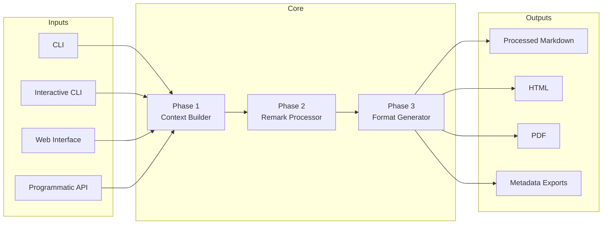

# Core System Architecture

- [High-Level System View](#high-level-system-view)
- [Pipeline Modules](#pipeline-modules)
- [Remark Plugin Layer](#remark-plugin-layer)
- [Helper & Legacy Processors](#helper--legacy-processors)
- [Shared Utilities](#shared-utilities)

## High-Level System View

The core system orchestrates input sources (CLI, web, API) through the shared
three-phase pipeline and remark stack.

Each entry point builds a `ProcessingContext`, executes the remark pipeline
once, then hands the cached AST to format generators. This design keeps
behaviour consistent and avoids repeated AST work.

## Pipeline Modules

Located in `src/core/pipeline/`:

- `context-builder.ts` - Phase 1 implementation (`buildProcessingContext`,
  `mergeMetadata`, `validateProcessingContext`)
- `format-generator.ts` - Phase 3 helpers (`generateAllFormats`,
  `processAndGenerateFormats`) plus HTML/PDF/Markdown/metadata orchestration
- `index.ts` - Re-exports pipeline primitives for `src/cli`, integrations and
  future API wrappers

The pipeline depends on:

- `src/core/parsers/*` for YAML and force-command parsing
- `src/extensions/remark/legal-markdown-processor.ts` for Phase 2 execution
- `src/extensions/generators/*` for HTML/PDF rendering
- `src/utils/*` for file operations, logging and archive helpers

## Remark Plugin Layer

Remark functionality resides under `src/plugins/remark/` and is documented in
`docs/architecture/04_remark_integration.md`. Key elements:

- Plugin implementations (`imports.ts`, `mixins.ts`, `template-fields.ts`,
  `headers.ts`, `legal-headers-parser.ts`, `field-tracking.ts`, `clauses.ts`,
  `dates.ts`, etc.) operate on the mdast tree
- `plugin-metadata-registry.ts` and `plugin-order-validator.ts` define and
  enforce execution order constraints
- `types.ts` exposes metadata and validator interfaces used by both the remark
  processor and tests

Phase 2 (`processLegalMarkdownWithRemark`) wires these pieces together and emits
`LegalMarkdownProcessorResult` objects consumed by Phase 3.

## Helper & Legacy Processors

The repo still ships helper modules originally designed for Ruby parity:

- `src/core/helpers/*` - Date, number and string helpers accessible from
  template fields
- `src/core/processors/*` - Legacy processors kept for migration compatibility;
  the three-phase pipeline now supersedes them but selected utilities remain
  reusable (e.g. clause evaluation logic shared by the remark plugin)
- `src/core/exporters/metadata-exporter.ts` - Utility for metadata serialization

A full inventory and retirement plan lives in `docs/legacy-deprecation-plan.md`.

## Shared Utilities

Supporting modules include:

- `src/utils/logger.ts`, `src/utils/archive-manager.ts`, `src/utils/index.ts`
  for logging, archiving and file helpers
- `src/constants/index.ts` for resolved paths shared by CLI/web builds
- `src/types/index.ts` defining `LegalMarkdownOptions`, `ProcessingResult` and
  related interfaces consumed across the stack

These utilities are imported by both CLI services and the pipeline to keep
behaviour uniform regardless of hosting environment.
