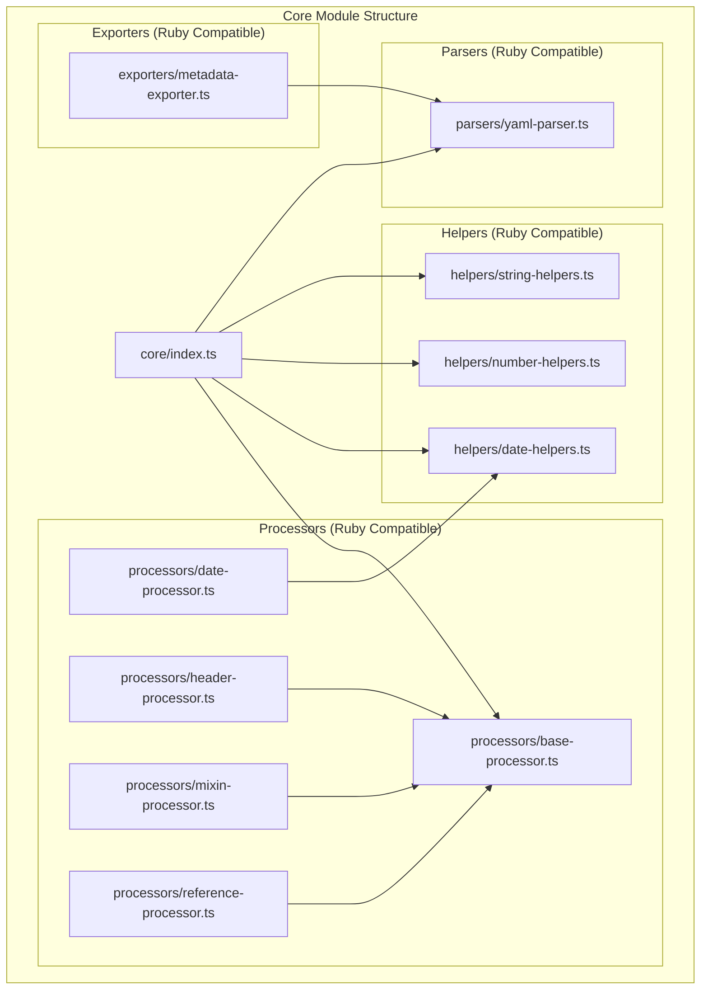
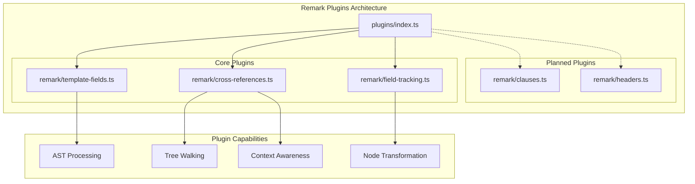
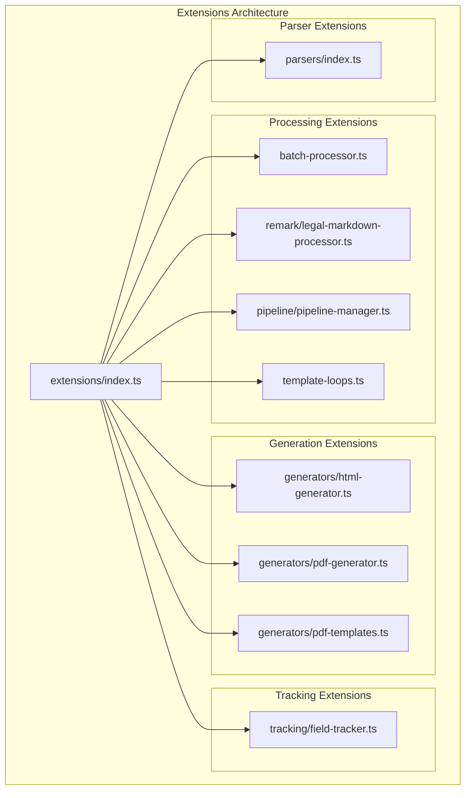
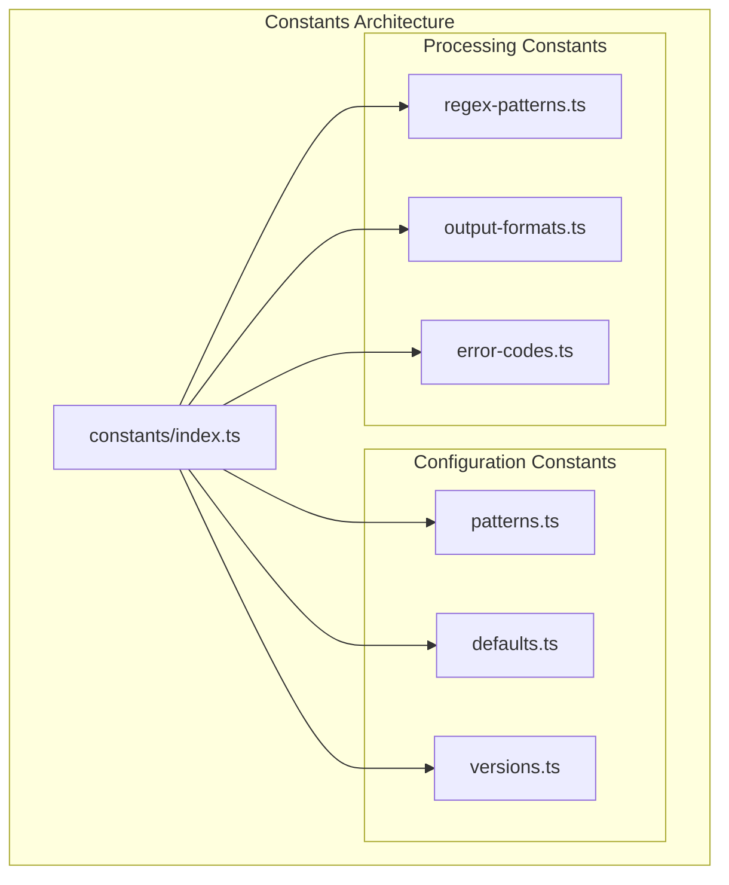
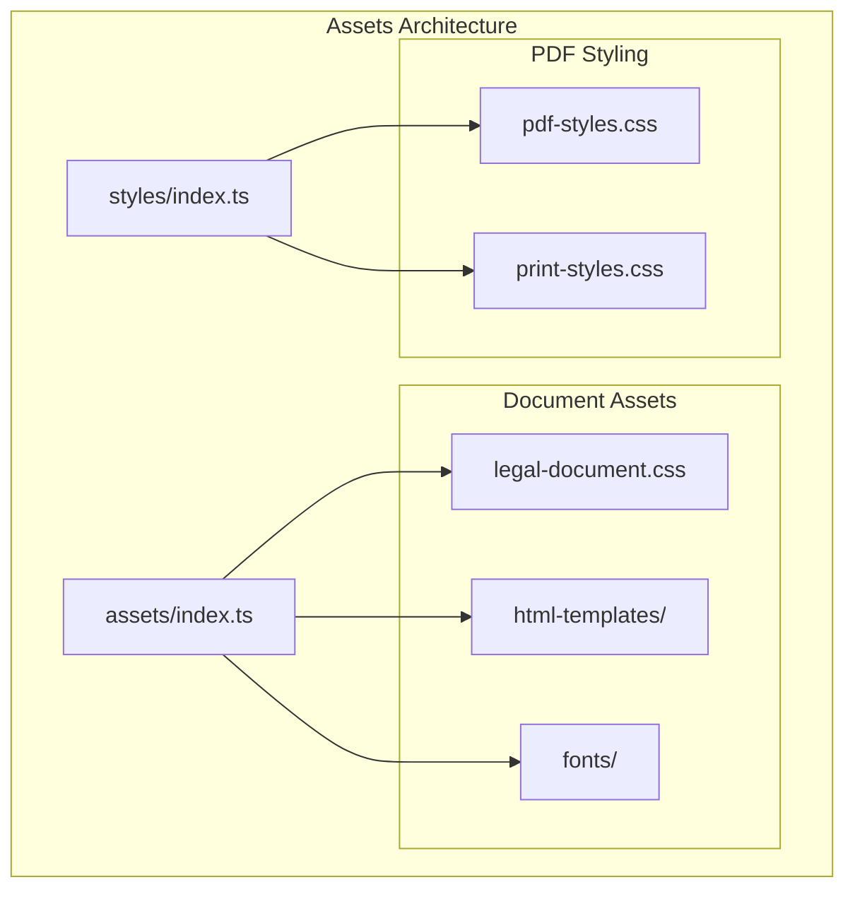
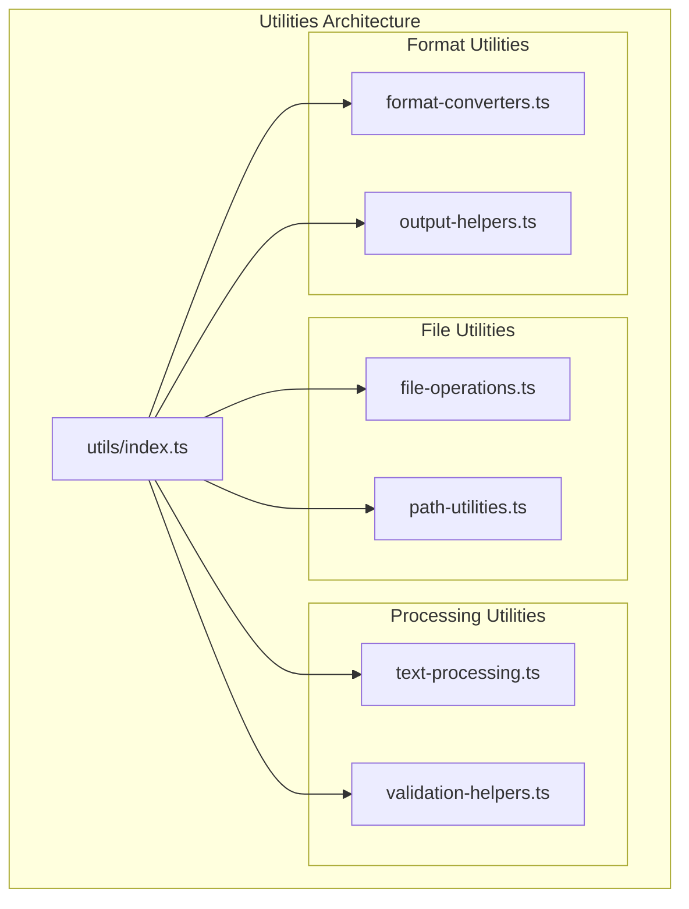
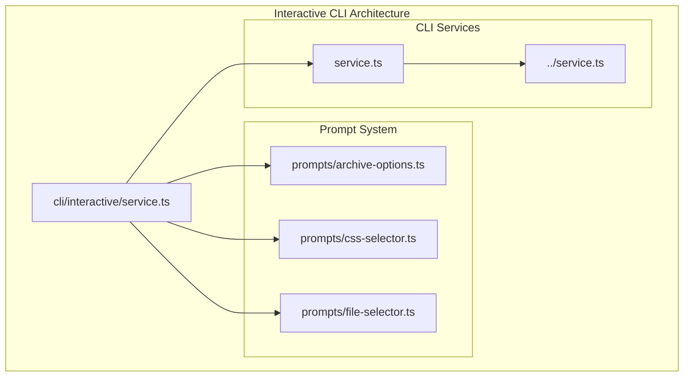

# Core System Architecture

## High-Level Architecture

```mermaid
graph TB
    subgraph "Input Layer"
        INPUT[Document Input]
        MD[".md files"]
        RST[".rst files"]
        TEX[".tex files"]
        TXT[".txt files"]
    end

    subgraph "CLI Layer"
        CLI[CLI Interface]
        ARGS[Command Arguments]
        OPTS[Options Parsing]
    end

    subgraph "Core Processing Engine"
        MAIN[Main Processor]
        YAML[YAML Parser]
        CONV[Format Converters]

        subgraph "Remark-based Processing Architecture"
            REMARK_PROC[Remark Processor]
            TEMPLATE_FIELDS[Template Fields Plugin]
            CROSS_REFS[Cross-References Plugin]
            FIELD_TRACKING[Field Tracking Plugin]
            CLAUSES[Clauses Plugin]
            HEADERS[Headers Plugin]
            IMPORTS[Imports Plugin]
            MIXINS[Mixins Plugin]
        end

        subgraph "Helper System"
            HELPERS[Helper Functions]
            DATE[Date Helpers]
            NUM[Number Helpers]
            STR[String Helpers]
        end
    end

    subgraph "Extensions Layer"
        VALID[Validators]
        BATCH[Batch Processor]
        TRACK[Field Tracker]
        UTIL[Utilities]
        AST_MIXIN[AST Mixin Processor]
    end

    subgraph "Output Layer"
        HTML[HTML Generator]
        PDF[PDF Generator]
        META[Metadata Exporter]
        OUT[Output Files]
    end

    INPUT --> CLI
    MD --> REMARK_PROC
    RST --> CONV
    TEX --> CONV
    TXT --> REMARK_PROC
    CONV --> REMARK_PROC

    CLI --> REMARK_PROC
    ARGS --> OPTS
    OPTS --> REMARK_PROC

    REMARK_PROC --> YAML
    REMARK_PROC --> TEMPLATE_FIELDS
    REMARK_PROC --> CROSS_REFS
    REMARK_PROC --> FIELD_TRACKING
    REMARK_PROC --> CLAUSES
    REMARK_PROC --> HEADERS
    REMARK_PROC --> IMPORTS
    REMARK_PROC --> MIXINS

    TEMPLATE_FIELDS --> HELPERS
    HELPERS --> DATE
    HELPERS --> NUM
    HELPERS --> STR

    REMARK_PROC --> VALID
    REMARK_PROC --> BATCH
    REMARK_PROC --> TRACK
    REMARK_PROC --> AST_MIXIN

    REMARK_PROC --> HTML
    REMARK_PROC --> PDF
    REMARK_PROC --> META
    HTML --> OUT
    PDF --> OUT
    META --> OUT

    %% All processing is now remark-based
```

## Module Architecture

### Core Module (`src/core/`)

The core module maintains parity with the original Ruby Legal Markdown
implementation with minimal, Ruby-compatible functionality:

**Key Characteristics:**

- **Ruby Compatibility**: Maintains behavior compatibility with original Ruby
  implementation
- **Minimal Dependencies**: Limited external dependencies for core functionality
- **Type Safety**: Full TypeScript implementation with comprehensive types
- **Base Processor Pattern**: Consistent processing architecture across all
  processors

### Remark Plugins Module (`src/plugins/`)

Modern AST-based processing using the unified/remark ecosystem:

**Key Features:**

- **AST-based Processing**: Direct manipulation of markdown syntax trees
- **Plugin Architecture**: Modular, composable processing components
- **Context Awareness**: Full understanding of document structure
- **No Text Contamination**: Precise targeting without affecting surrounding
  content

### Extensions Module (`src/extensions/`)

Enhanced functionality beyond the core Ruby-compatible implementation:

**Extension Categories:**

- **Processing**: Batch processing, pipeline management, template loops
- **Generation**: HTML/PDF output with customizable templates
- **Tracking**: Advanced field tracking and reporting
- **Parsing**: Extended parser capabilities

### Constants Module (`src/constants/`)

Centralized configuration and constants management:

### Assets and Styles Module (`src/assets/` & `src/styles/`)

Static assets and styling for document generation:

### Utilities Module (`src/utils/`)

Common utility functions and helpers:

### Interactive CLI Module (`src/cli/interactive/`)

Advanced interactive command-line interface:

**Interactive Features:**

- **File Selection**: Interactive file and directory selection
- **Option Configuration**: Dynamic option configuration with validation
- **Progress Tracking**: Real-time processing progress display
- **Error Recovery**: Interactive error handling and recovery options

## System Integration

The modular architecture ensures clean separation of concerns while maintaining
tight integration between components:

1. **Core Compatibility**: Core module maintains Ruby implementation
   compatibility
2. **Plugin Extensibility**: Remark plugins provide modern AST processing
3. **Extension Points**: Extensions module enables advanced functionality
4. **Centralized Configuration**: Constants module provides system-wide
   configuration
5. **Asset Management**: Dedicated asset management for output generation
6. **Utility Support**: Common utilities support all system components
7. **Interactive Interface**: Enhanced CLI experience with interactive
   capabilities

This architecture supports both backward compatibility and modern development
practices while providing a foundation for future enhancements.
