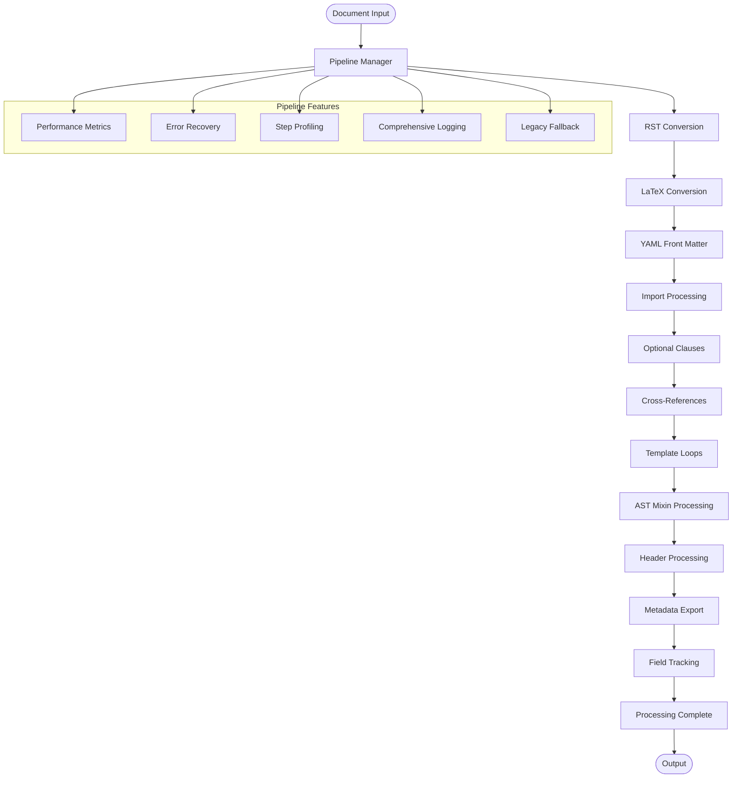
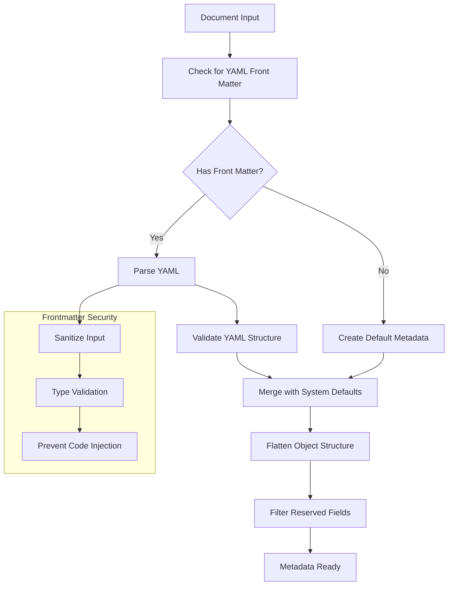
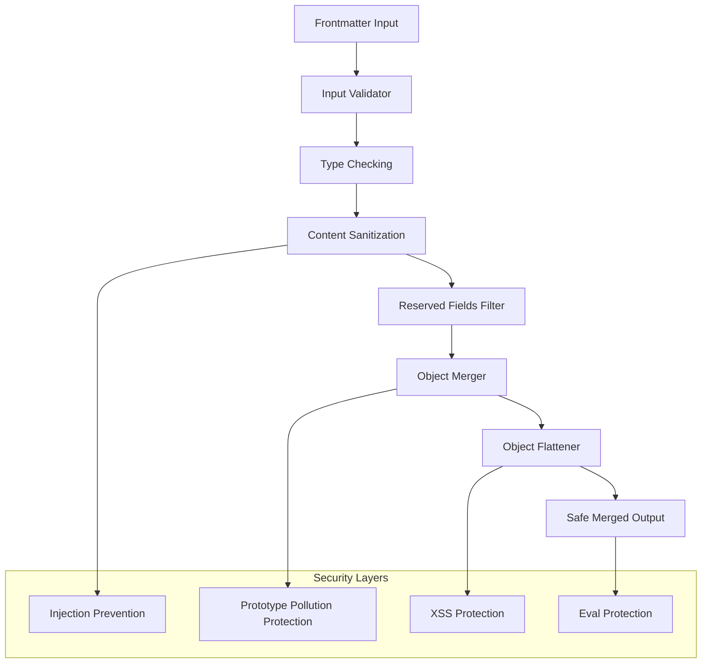
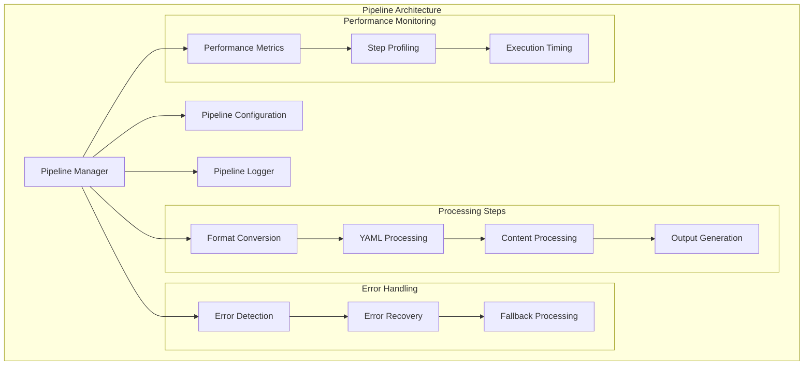

# Processing Pipeline Architecture

The document processing follows a hybrid architecture approach: a primary
remark-based AST processor with legacy pipeline components for specific
functionality and backward compatibility.

## Modern Remark-based Processing (Primary Architecture)

The primary processing path uses unified/remark ecosystem for AST-based
processing:

```mermaid
flowchart TD
    START([Document Input]) --> REMARK_PROC[Remark Processor]

    REMARK_PROC --> YAML_PARSE[Parse YAML Frontmatter]
    YAML_PARSE --> CREATE_PROC[Create Unified Processor]

    CREATE_PROC --> TEMPLATE_PLUGIN[remarkTemplateFields Plugin]
    TEMPLATE_PLUGIN --> CROSS_REF_PLUGIN[remarkCrossReferences Plugin]
    CROSS_REF_PLUGIN --> FIELD_TRACK_PLUGIN[remarkFieldTracking Plugin]

    FIELD_TRACK_PLUGIN --> AST_PROCESS[Process AST]
    AST_PROCESS --> MARKDOWN_OUT[Markdown Output]
    MARKDOWN_OUT --> FIELD_REPORT[Generate Field Report]

    FIELD_REPORT --> COMPLETE[Processing Complete]
    COMPLETE --> END([Clean Output])

    subgraph "Remark Plugins"
        TEMPLATE_PLUGIN --> FIELD_RESOLUTION[Resolve {{fields}}]
        CROSS_REF_PLUGIN --> REF_RESOLUTION[Resolve |references|]
        FIELD_TRACK_PLUGIN --> TRACK_FIELDS[Track Field Usage]
    end

    subgraph "AST Advantages"
        NO_CONTAMINATION[No Text Contamination]
        ISOLATED_PROCESSING[Isolated Node Processing]
        DOUBLE_WRAP_PREVENTION[Double-wrap Prevention]
        CLEAN_HTML_ESCAPING[Proper HTML Escaping]
    end

    AST_PROCESS --> NO_CONTAMINATION
    AST_PROCESS --> ISOLATED_PROCESSING
    AST_PROCESS --> DOUBLE_WRAP_PREVENTION
    AST_PROCESS --> CLEAN_HTML_ESCAPING
```

### Remark Processing Benefits

**AST-based Advantages:**

- **No Text Contamination**: Field highlighting only applies to actual template
  fields
- **Context Awareness**: Full understanding of markdown structure prevents false
  positives
- **Isolated Processing**: Each AST node processed independently without
  affecting others
- **Double-wrap Prevention**: Prevents reprocessing of already processed content
- **Clean HTML Escaping**: Proper handling of HTML entities within AST nodes

**Plugin Architecture:**

- **Template Fields Plugin**: Resolves `{{field}}` syntax with frontmatter
  values
- **Cross-References Plugin**: Handles `|reference|` syntax for internal
  document linking
- **Field Tracking Plugin**: Tracks field usage and generates comprehensive
  reports

## Legacy Pipeline Architecture (Fallback)

The original pipeline system for backward compatibility:



### Pipeline Processing Steps

**Format Conversion Steps:**

1. **RST Conversion**: reStructuredText to Markdown conversion
2. **LaTeX Conversion**: LaTeX to Markdown conversion
3. **YAML Front Matter**: Parse and validate document metadata

**Content Processing Steps:** 4. **Import Processing**: Handle `@import`
directives for document composition 5. **Optional Clauses**: Process conditional
content based on frontmatter flags 6. **Cross-References**: Resolve internal
document references 7. **Template Loops**: Handle iterative content generation

**Finalization Steps:** 8. **AST Mixin Processing**: Apply advanced AST
transformations 9. **Header Processing**: Generate structured headers with
numbering 10. **Metadata Export**: Extract and format document metadata 11.
**Field Tracking**: Generate field usage reports and highlighting

## Processing Details

### 1. YAML Front Matter Processing with Frontmatter Merging



**Key Features:**

- **YAML Validation**: Comprehensive validation with error reporting
- **Object Flattening**: Nested objects flattened for template field access
- **Reserved Field Filtering**: System fields protected from overwrite
- **Security Measures**: Input sanitization and injection prevention

### 2. Frontmatter Merging System

The frontmatter merging system provides a secure and flexible way to combine
metadata from multiple sources:

#### Frontmatter Security Architecture



### 3. Header Processing Workflow

```mermaid
flowchart TD
    START[Content Input] --> SCAN_HEADERS[Scan for Header Patterns]

    SCAN_HEADERS --> PARSE_STRUCTURE[Parse Header Structure]
    PARSE_STRUCTURE --> VALIDATE_HIERARCHY[Validate Hierarchy]
    VALIDATE_HIERARCHY --> NUMBER_HEADERS[Apply Numbering]

    NUMBER_HEADERS --> FORMAT_OUTPUT[Format Output]
    FORMAT_OUTPUT --> GENERATE_TOC[Generate Table of Contents]
    GENERATE_TOC --> COMPLETE[Processing Complete]

    subgraph "Header Patterns"
        L_PATTERN[l. (Level 1)]
        LL_PATTERN[ll. (Level 2)]
        LLL_PATTERN[lll. (Level 3)]
        LLLL_PATTERN[llll. (Level 4)]
    end

    SCAN_HEADERS --> L_PATTERN
    SCAN_HEADERS --> LL_PATTERN
    SCAN_HEADERS --> LLL_PATTERN
    SCAN_HEADERS --> LLLL_PATTERN
```

### 4. Pipeline System

#### Pipeline Step Architecture



#### Key Pipeline Improvements

**Performance Optimizations:**

- **Lazy Loading**: Components loaded only when needed
- **Caching**: Intermediate results cached for repeated processing
- **Parallel Processing**: Independent steps executed in parallel
- **Memory Management**: Efficient memory usage for large documents

**Error Handling:**

- **Graceful Degradation**: Partial processing on non-critical errors
- **Error Recovery**: Automatic recovery from transient failures
- **Detailed Reporting**: Comprehensive error context and suggestions
- **Fallback Processing**: Alternative processing paths for edge cases

**Monitoring and Debugging:**

- **Step Profiling**: Individual step performance measurement
- **Execution Timing**: Detailed timing information for optimization
- **Resource Monitoring**: Memory and CPU usage tracking
- **Debug Logging**: Comprehensive logging for troubleshooting

### 5. Optional Clause Processing

```mermaid
flowchart TD
    START[Content Input] --> SCAN_CLAUSES[Scan for Optional Clauses]

    SCAN_CLAUSES --> PARSE_SYNTAX[Parse [content]{condition} Syntax]
    PARSE_SYNTAX --> EXTRACT_CONDITIONS[Extract Conditions]
    EXTRACT_CONDITIONS --> EVAL_CONDITIONS[Evaluate Conditions]

    EVAL_CONDITIONS --> CHECK_FRONTMATTER[Check Frontmatter Values]
    CHECK_FRONTMATTER --> APPLY_LOGIC[Apply Boolean Logic]

    APPLY_LOGIC --> INCLUDE_CONTENT{Include Content?}
    INCLUDE_CONTENT -->|Yes| INCLUDE[Include Content]
    INCLUDE_CONTENT -->|No| EXCLUDE[Exclude Content]

    INCLUDE --> PROCESS_NESTED[Process Nested Clauses]
    EXCLUDE --> CONTINUE[Continue Processing]
    PROCESS_NESTED --> CONTINUE
    CONTINUE --> COMPLETE[Processing Complete]
```

This hybrid pipeline architecture ensures both modern processing capabilities
through remark-based AST processing and comprehensive backward compatibility
through the legacy pipeline system. The system automatically selects the
appropriate processing path based on document requirements and available
features.
