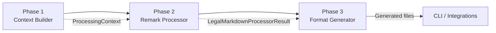

# Processing Pipeline Architecture

- [Overview](#overview)
- [Phase 1 - Context Builder](#phase-1--context-builder)
- [Phase 2 - Remark Content Processing](#phase-2--remark-content-processing)
- [Phase 3 - Format Generation](#phase-3--format-generation)
- [Pipeline Entry Points](#pipeline-entry-points)
- [Performance & Validation](#performance--validation)
- [Extension & Migration Notes](#extension--migration-notes)

## Overview

Legal Markdown JS now ships with a **three-phase processing pipeline** that
removes duplicate remark executions and lets every consumer share a cached AST.
The architecture is implemented in `src/core/pipeline` and was introduced while
working on the incremental pipeline initiative (Issue #122). The phases are:

| Phase | Responsibility                                           | Key Outputs                                                             |
| ----- | -------------------------------------------------------- | ----------------------------------------------------------------------- |
| 1     | Parse frontmatter, resolve force-commands, merge options | `ProcessingContext`                                                     |
| 2     | Run the remark processor exactly once                    | Cached `LegalMarkdownProcessorResult` (content, AST, metadata, exports) |
| 3     | Generate requested artefacts without re-processing       | HTML, PDF, Markdown, metadata files                                     |

The pipeline modules are exported from `src/core/pipeline/index.ts`, making them
available to CLI services, integrations and future API consumers.

## Phase 1 - Context Builder

Phase 1 lives in `src/core/pipeline/context-builder.ts`. It is responsible for
transforming raw markdown + CLI options into a normalized `ProcessingContext`:

- Parses YAML frontmatter via `parseYamlFrontMatter`
- Extracts, renders and applies force-commands (`extractForceCommands`,
  `parseForceCommands`, `applyForceCommands`)
- Merges CLI options, force-commands and additional metadata
- Enables field tracking automatically when highlighting is requested
- Provides validation helpers (`validateProcessingContext`) and metadata merging
  (`mergeMetadata`) for downstream code

The returned `ProcessingContext` bundles the raw content (with and without
YAML), resolved options, merged metadata and the base path that the remark phase
uses for relative imports. Debug logging is emitted when `options.debug` is true
to make tracing easier.

## Phase 2 - Remark Content Processing

Phase 2 reuses the existing remark processor from
`src/extensions/remark/legal-markdown-processor.ts`. The differences introduced
by the pipeline work are:

- `processLegalMarkdownWithRemark` now returns a `LegalMarkdownProcessorResult`
  that includes the processed markdown, metadata, exported file list **and** a
  cached AST (`ast?: Root`)
- Additional metadata gathered in Phase 1 is passed through with the
  `additionalMetadata` option so header numbering and other plugins see the
  consolidated state
- Plugin order validation migrated next to the remark plugins. The validator and
  registry live in `src/plugins/remark/plugin-order-validator.ts` and
  `src/plugins/remark/plugin-metadata-registry.ts`, keeping ordering rules close
  to the implementations (see
  [Remark Content Processing](04_remark_integration.md))

Because Phase 2 only runs **once**, all format generation steps consume the same
AST and metadata snapshot, eliminating the previous "format × remark runs"
combinatorial explosion.

## Phase 3 - Format Generation

Phase 3 is implemented by `src/core/pipeline/format-generator.ts` and focuses on
artefact creation:

- `generateAllFormats` writes HTML, PDF, Markdown and metadata exports without
  re-running the remark phase. It orchestrates Html/Pdf generators and simple
  file writes from the cached AST and processed markdown
- `processAndGenerateFormats` is a convenience helper that executes Phases 2 and
  3 together when Phase 1 already provided a `ProcessingContext`
- Highlight variants share the same cached AST and differ only by the
  `includeHighlighting` flag passed into the Html/Pdf generators
- Output directories are created on demand and comprehensive error messages are
  thrown when creation fails
- Every invocation returns both the generated file list and timing statistics so
  callers can present user feedback or feed telemetry

## Pipeline Entry Points

Two services drive the pipeline at runtime:

- `src/cli/service.ts` - `generateFormattedOutputWithOptions` performs the three
  phases sequentially, ensuring HTML/PDF/Markdown/metadata artefacts come from a
  single remark pass and archiving reuses the processed content
- `src/cli/interactive/service.ts` - the interactive CLI maps user selections to
  CLI options, builds the processing context, runs the remark phase once, then
  calls `generateAllFormats` with the resulting AST

Both services keep their existing single-format behaviour (plain remark output)
for scenarios where only markdown is requested.

## Performance & Validation

- Integration benchmark tests
  (`tests/integration/pipeline-3-phase.integration.test.ts`) confirm a ~50-75 %
  reduction in processing time for multi-format runs by comparing the legacy
  behaviour with the three-phase pipeline
- Unit suites in `tests/unit/core/pipeline/context-builder.test.ts` and
  `tests/unit/core/pipeline/format-generator.test.ts` cover metadata merging,
  error handling and format generation pathways
- Additional CLI and remark plugin tests were updated to assert that the AST is
  preserved across output modes and plugin order validation is enforced when
  requested (`tests/unit/plugins/remark/imports.unit.test.ts`,
  `tests/unit/plugins/remark/css-classes.unit.test.ts`)

## Extension & Migration Notes

- The pipeline exports are additive; existing consumers that call
  `processLegalMarkdownWithRemark` directly remain supported
- New helpers (`buildProcessingContext`, `generateAllFormats`,
  `processAndGenerateFormats`) provide clear integration points for upcoming API
  layers or background workers
- Legacy pipeline code paths tracked in `docs/legacy-deprecation-plan.md` can be
  migrated incrementally by swapping in the three-phase helpers without touching
  business logic
