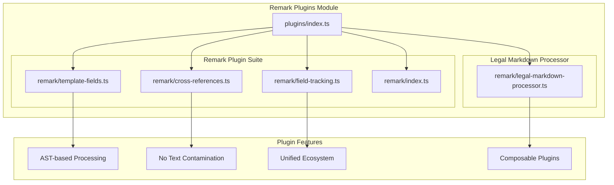

# Remark Plugins Module Integration <!-- omit in toc -->

- [Overview](#overview)
- [Remark Plugins Module Architecture](#remark-plugins-module-architecture)
- [Plugin Suite](#plugin-suite)
  - [Template Fields Plugin](#template-fields-plugin)
  - [Cross-References Plugin](#cross-references-plugin)
  - [Field Tracking Plugin](#field-tracking-plugin)
- [Legal Markdown Processor](#legal-markdown-processor)
- [AST-based Processing Advantages](#ast-based-processing-advantages)
- [Plugin Features](#plugin-features)
  - [Core Capabilities](#core-capabilities)
  - [Integration Benefits](#integration-benefits)
- [HTML Field Tracking Investigation Methodology](#html-field-tracking-investigation-methodology)
  - [Diagnostic Process: Browser Bundle Integration Issues](#diagnostic-process-browser-bundle-integration-issues)
    - [Step 1: Symptom Identification](#step-1-symptom-identification)
    - [Step 2: Trace the Processing Pipeline](#step-2-trace-the-processing-pipeline)
    - [Step 3: Enable Debug Logging](#step-3-enable-debug-logging)
    - [Step 4: Identify Plugin Interaction Issues](#step-4-identify-plugin-interaction-issues)
    - [Step 5: AST Node Type Analysis](#step-5-ast-node-type-analysis)
    - [Step 6: Function-Level Debugging](#step-6-function-level-debugging)
    - [Step 7: Validation Testing](#step-7-validation-testing)
    - [Step 8: Solution Implementation Pattern](#step-8-solution-implementation-pattern)
    - [Diagnostic Tools \& Commands](#diagnostic-tools--commands)

## Overview

The Remark Plugins Module (`src/plugins/`) provides modern AST-based processing
plugins using the unified/remark ecosystem. This module represents the **only**
processing architecture in Legal Markdown JS, providing cleaner, more reliable
document processing compared to legacy regex-based approaches.

## Remark Plugins Module Architecture



## Plugin Suite

### Template Fields Plugin

The Template Fields Plugin (`remark/template-fields.ts`) processes `{{field}}`
expressions within the document:

- **Field Resolution**: Resolves template variables against metadata
- **Helper Function Support**: Integrates with date, number, and string helpers
- **Conditional Logic**: Processes conditional expressions like
  `{{condition ? value : default}}`
- **AST Preservation**: Maintains document structure during processing

### Cross-References Plugin

The Cross-References Plugin (`remark/cross-references.ts`) handles document
cross-referencing:

- **Reference Resolution**: Processes `|reference|` patterns
- **Link Generation**: Creates internal document links
- **Header Tracking**: Maintains header numbering state
- **Navigation Support**: Enables document navigation features

### Field Tracking Plugin

The Field Tracking Plugin (`remark/field-tracking.ts`) monitors field usage
throughout processing:

- **Usage Tracking**: Records which fields are used and how
- **Status Classification**: Categorizes fields as `filled`, `empty`, or `logic`
- **Highlighting Support**: Enables field highlighting in output
- **Report Generation**: Creates comprehensive field usage reports

## Legal Markdown Processor

The Legal Markdown Processor (`remark/legal-markdown-processor.ts`) orchestrates
the entire remark-based processing pipeline:

```mermaid
flowchart TD
    START([Document Input]) --> REMARK_PROC[Remark Processor]

    REMARK_PROC --> YAML_PARSE[Parse YAML Frontmatter]
    YAML_PARSE --> CREATE_PROC[Create Unified Processor]

    CREATE_PROC --> TEMPLATE_PLUGIN[remarkTemplateFields Plugin]
    TEMPLATE_PLUGIN --> CROSS_REF_PLUGIN[remarkCrossReferences Plugin]
    CROSS_REF_PLUGIN --> FIELD_TRACK_PLUGIN[remarkFieldTracking Plugin]

    FIELD_TRACK_PLUGIN --> AST_PROCESS[Process AST]
    AST_PROCESS --> MARKDOWN_OUT[Markdown Output]
    MARKDOWN_OUT --> FIELD_REPORT[Generate Field Report]

    FIELD_REPORT --> COMPLETE[Processing Complete]
    COMPLETE --> END([Clean Output])

    subgraph "Remark Plugins"
        TEMPLATE_PLUGIN --> FIELD_RESOLUTION[Resolve {{fields}}]
        CROSS_REF_PLUGIN --> REF_RESOLUTION[Resolve |references|]
        FIELD_TRACK_PLUGIN --> TRACK_FIELDS[Track Field Usage]
    end

    subgraph "AST Advantages"
        NO_CONTAMINATION[No Text Contamination]
        ISOLATED_PROCESSING[Isolated Node Processing]
        DOUBLE_WRAP_PREVENTION[Double-wrap Prevention]
        CLEAN_HTML_ESCAPING[Proper HTML Escaping]
    end

    AST_PROCESS --> NO_CONTAMINATION
    AST_PROCESS --> ISOLATED_PROCESSING
    AST_PROCESS --> DOUBLE_WRAP_PREVENTION
    AST_PROCESS --> CLEAN_HTML_ESCAPING
```

## AST-based Processing Advantages

The remark-based architecture provides significant advantages:

1. **No Text Contamination**: AST processing prevents accidental modification of
   document content
2. **Isolated Node Processing**: Each document element is processed
   independently
3. **Double-wrap Prevention**: AST structure prevents recursive processing
   issues
4. **Proper HTML Escaping**: Automatic handling of special characters and markup
5. **Composability**: Plugins can be combined and reordered as needed
6. **Extensibility**: New plugins can be added without affecting existing
   functionality

## Plugin Features

### Core Capabilities

- **AST-based Processing**: Full document parsing into abstract syntax tree
- **No Text Contamination**: Surgical modifications without affecting
  surrounding content
- **Unified Ecosystem**: Integration with the broader remark/unified ecosystem
- **Composable Plugins**: Modular design for flexible processing pipelines

### Integration Benefits

- **Type Safety**: Full TypeScript support with strict typing
- **Error Handling**: Comprehensive error reporting and recovery
- **Performance**: Optimized AST traversal and modification
- **Extensibility**: Easy addition of new processing capabilities

The remark integration represents the foundation of the modern Legal Markdown JS
architecture, providing reliable, maintainable, and extensible document
processing capabilities.

## HTML Field Tracking Investigation Methodology

### Diagnostic Process: Browser Bundle Integration Issues

This section documents the step-by-step diagnostic methodology for
troubleshooting HTML escaping issues in remark-based processing, particularly in
browser environments.

#### Step 1: Symptom Identification

**Observable Behavior**:

- HTML spans in field tracking appear escaped: `\<span class="legal-field">`
  instead of `<span class="legal-field">`
- Issue occurs specifically in browser bundle, not in Node.js environment
- Markdown syntax like `_italic_` and `__bold__` not converting properly

**Initial Questions**:

1. Is remark actually being used in the browser bundle?
2. Where in the pipeline is HTML being escaped?
3. Are there differences between browser and Node.js processing?

#### Step 2: Trace the Processing Pipeline

**Investigation Tools**:

```bash
# Check if browser bundle uses fallback processors
grep -r "fallback processor" src/browser.ts

# Identify which functions are actually called
grep -r "processLegalMarkdownWithRemark" src/browser.ts

# Verify webpack bundle configuration
cat webpack.config.cjs | grep -A5 -B5 "entry"
```

**Key Finding**: Browser bundle was using placeholder functions instead of
actual remark processors.

#### Step 3: Enable Debug Logging

**Add Strategic Debug Points**:

```typescript
// In template-fields plugin
if (debug) {
  console.log(
    `📊 Node type: ${node.type}, enableFieldTracking: ${enableFieldTracking}`
  );
  console.log(`🔄 Replaced ${field.pattern} with "${formattedValue}"`);
}

// In headers plugin
if (debug) {
  console.log(`[remarkHeaders] Processed level ${level} header:`, headerText);
}
```

**Run Debug Tests**:

```bash
node -e "import { processLegalMarkdownWithRemark } from './dist/index.js'; /* test code */"
```

#### Step 4: Identify Plugin Interaction Issues

**Analysis Method**:

1. Compare processing order vs. execution logs
2. Check which plugin receives what input
3. Verify node types throughout the pipeline

**Plugin execution order**:

```text
remarkTemplateFields → creates HTML spans
remarkHeaders → processes after, but loses HTML information
remarkStringify → escapes HTML in text nodes
```

#### Step 5: AST Node Type Analysis

**Investigation Points**:

- What node types does each plugin handle?
- How does remark-stringify treat different node types?
- Where do text nodes become HTML nodes?

**Critical Insight**:

- `remark-stringify` escapes HTML content in `text` nodes
- `remark-stringify` preserves HTML content in `html` nodes
- Plugin must ensure proper node type assignment

#### Step 6: Function-Level Debugging

**Targeted Investigation**:

```typescript
// Check if functions are being called
console.log(`🔧 updateHeaderNode called with: "${newText}"`);

// Verify node type changes
console.log(`📊 Converting node from ${node.type} to html`);

// Trace content preservation
console.log(`📋 extractTextContent returning: "${result}"`);
```

**Key Finding**: `extractTextContent` function ignored HTML nodes, causing
information loss.

#### Step 7: Validation Testing

**Test Strategy**:

1. Create minimal reproduction cases
2. Test each plugin in isolation
3. Verify complete pipeline functionality
4. Compare browser vs. Node.js output

**Validation Commands**:

```bash
# Build and test
npm run build:umd && node -e "/* test code */"

# Run unit tests
npm test tests/unit/playground/

# Verify formatting works
echo "_italic_ and __bold__" | node -e "/* process and check */"
```

#### Step 8: Solution Implementation Pattern

**Systematic Approach**:

1. **Identify root cause**: Which component is causing the issue?
2. **Trace data flow**: How does data move through the pipeline?
3. **Find intervention point**: Where can we fix without breaking other
   functionality?
4. **Implement minimal fix**: Change only what's necessary
5. **Validate comprehensively**: Test all related functionality

#### Diagnostic Tools & Commands

**Essential Commands for Similar Issues**:

```bash
# Check browser bundle integration
grep -r "processLegalMarkdownWithRemark" src/browser.ts

# Verify plugin order in processor
grep -A10 -B5 "processor.use" src/extensions/remark/legal-markdown-processor.ts

# Find HTML escaping patterns
grep -r "escapeHtml\|&lt;\|\\<" src/

# Test with debug enabled
DEBUG=true node -e "/* test code */"

# Compare outputs
diff <(node -e "/* node version */") <(node -e "/* browser version */")
```

**Investigation Checklist**:

- [ ] Is the right processor being called?
- [ ] Are plugins executing in correct order?
- [ ] Are node types preserved through the pipeline?
- [ ] Does each plugin handle all relevant node types?
- [ ] Is HTML being escaped at the right stage?
- [ ] Are debug logs showing expected values?

This methodology provides a systematic approach to diagnosing similar AST
processing issues in remark-based systems.
