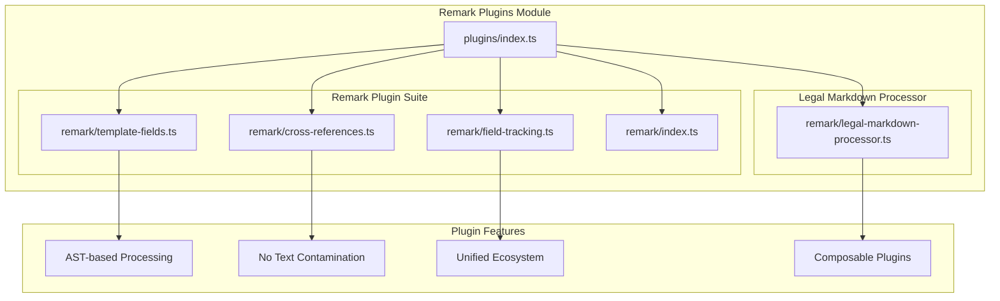

# Remark Plugins Module Integration <!-- omit in toc -->

- [Overview](#overview)
- [Remark Plugins Module Architecture](#remark-plugins-module-architecture)
- [Plugin Suite](#plugin-suite)
  - [Template Fields Plugin](#template-fields-plugin)
  - [Cross-References Plugin](#cross-references-plugin)
  - [Field Tracking Plugin](#field-tracking-plugin)
- [Legal Markdown Processor](#legal-markdown-processor)
- [AST-based Processing Advantages](#ast-based-processing-advantages)
- [Plugin Features](#plugin-features)

## Overview

The Remark Plugins Module (`src/plugins/`) provides modern AST-based processing
plugins using the unified/remark ecosystem. This module represents the primary
processing architecture, moving away from legacy regex-based processing to
provide cleaner, more reliable document processing.

## Remark Plugins Module Architecture



## Plugin Suite

### Template Fields Plugin

The Template Fields Plugin (`remark/template-fields.ts`) processes `{{field}}`
expressions within the document:

- **Field Resolution**: Resolves template variables against metadata
- **Helper Function Support**: Integrates with date, number, and string helpers
- **Conditional Logic**: Processes conditional expressions like
  `{{condition ? value : default}}`
- **AST Preservation**: Maintains document structure during processing

### Cross-References Plugin

The Cross-References Plugin (`remark/cross-references.ts`) handles document
cross-referencing:

- **Reference Resolution**: Processes `|reference|` patterns
- **Link Generation**: Creates internal document links
- **Header Tracking**: Maintains header numbering state
- **Navigation Support**: Enables document navigation features

### Field Tracking Plugin

The Field Tracking Plugin (`remark/field-tracking.ts`) monitors field usage
throughout processing:

- **Usage Tracking**: Records which fields are used and how
- **Status Classification**: Categorizes fields as `filled`, `empty`, or `logic`
- **Highlighting Support**: Enables field highlighting in output
- **Report Generation**: Creates comprehensive field usage reports

## Legal Markdown Processor

The Legal Markdown Processor (`remark/legal-markdown-processor.ts`) orchestrates
the entire remark-based processing pipeline:

```mermaid
flowchart TD
    START([Document Input]) --> REMARK_PROC[Remark Processor]

    REMARK_PROC --> YAML_PARSE[Parse YAML Frontmatter]
    YAML_PARSE --> CREATE_PROC[Create Unified Processor]

    CREATE_PROC --> TEMPLATE_PLUGIN[remarkTemplateFields Plugin]
    TEMPLATE_PLUGIN --> CROSS_REF_PLUGIN[remarkCrossReferences Plugin]
    CROSS_REF_PLUGIN --> FIELD_TRACK_PLUGIN[remarkFieldTracking Plugin]

    FIELD_TRACK_PLUGIN --> AST_PROCESS[Process AST]
    AST_PROCESS --> MARKDOWN_OUT[Markdown Output]
    MARKDOWN_OUT --> FIELD_REPORT[Generate Field Report]

    FIELD_REPORT --> COMPLETE[Processing Complete]
    COMPLETE --> END([Clean Output])

    subgraph "Remark Plugins"
        TEMPLATE_PLUGIN --> FIELD_RESOLUTION[Resolve {{fields}}]
        CROSS_REF_PLUGIN --> REF_RESOLUTION[Resolve |references|]
        FIELD_TRACK_PLUGIN --> TRACK_FIELDS[Track Field Usage]
    end

    subgraph "AST Advantages"
        NO_CONTAMINATION[No Text Contamination]
        ISOLATED_PROCESSING[Isolated Node Processing]
        DOUBLE_WRAP_PREVENTION[Double-wrap Prevention]
        CLEAN_HTML_ESCAPING[Proper HTML Escaping]
    end

    AST_PROCESS --> NO_CONTAMINATION
    AST_PROCESS --> ISOLATED_PROCESSING
    AST_PROCESS --> DOUBLE_WRAP_PREVENTION
    AST_PROCESS --> CLEAN_HTML_ESCAPING
```

## AST-based Processing Advantages

The remark-based architecture provides significant advantages over legacy
text-based processing:

1. **No Text Contamination**: AST processing prevents accidental modification of
   document content
2. **Isolated Node Processing**: Each document element is processed
   independently
3. **Double-wrap Prevention**: AST structure prevents recursive processing
   issues
4. **Proper HTML Escaping**: Automatic handling of special characters and markup
5. **Composability**: Plugins can be combined and reordered as needed
6. **Extensibility**: New plugins can be added without affecting existing
   functionality

## Plugin Features

### Core Capabilities

- **AST-based Processing**: Full document parsing into abstract syntax tree
- **No Text Contamination**: Surgical modifications without affecting
  surrounding content
- **Unified Ecosystem**: Integration with the broader remark/unified ecosystem
- **Composable Plugins**: Modular design for flexible processing pipelines

### Integration Benefits

- **Type Safety**: Full TypeScript support with strict typing
- **Error Handling**: Comprehensive error reporting and recovery
- **Performance**: Optimized AST traversal and modification
- **Extensibility**: Easy addition of new processing capabilities

The remark integration represents the foundation of the modern Legal Markdown JS
architecture, providing reliable, maintainable, and extensible document
processing capabilities.
