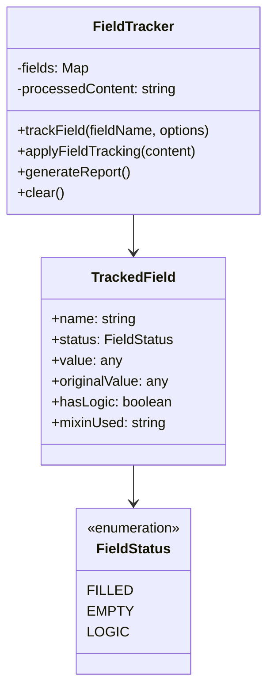
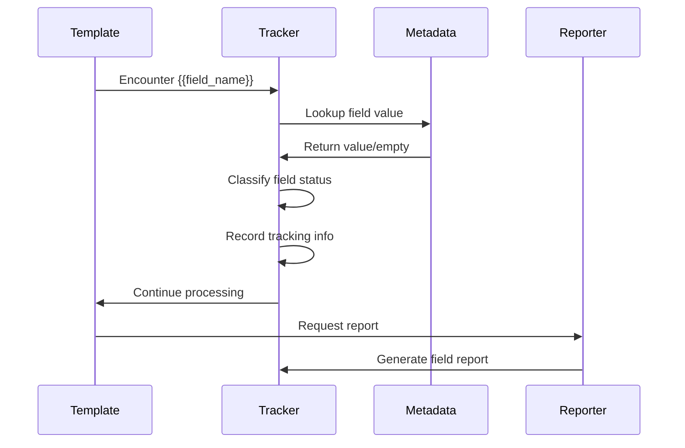
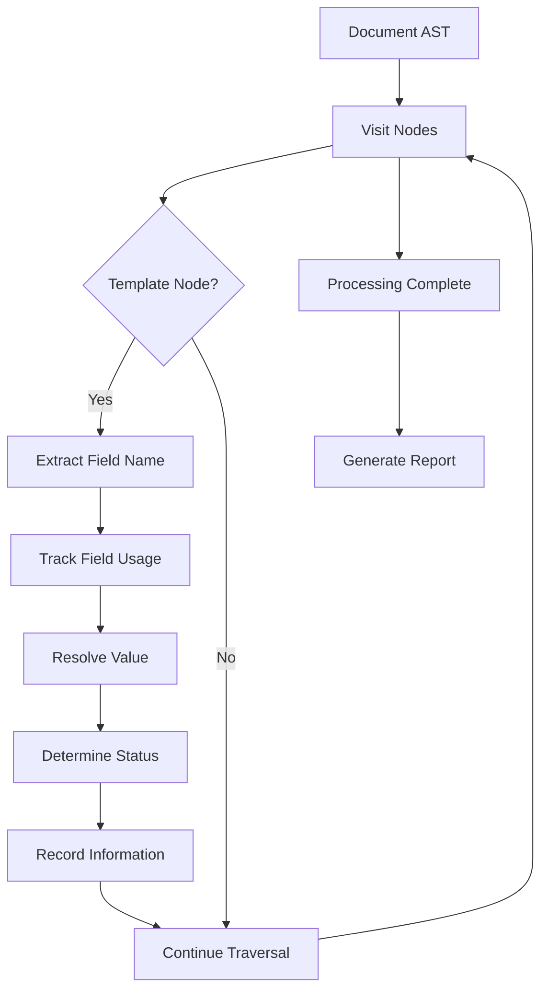

# Field Tracking System <!-- omit in toc -->

- [Overview](#overview)
- [Field Tracking Architecture](#field-tracking-architecture)
- [TrackedField Structure](#trackedfield-structure)
- [Field Status Classification](#field-status-classification)
- [Field Tracking Implementation](#field-tracking-implementation)
- [Report Generation](#report-generation)
- [Integration with Processing Pipeline](#integration-with-processing-pipeline)

## Overview

The Field Tracking System provides comprehensive monitoring and reporting of
field usage throughout the Legal Markdown processing pipeline. It tracks
variable resolution, field status, and generates detailed reports for document
analysis and debugging.

## Field Tracking Architecture



## TrackedField Structure

Each tracked field contains comprehensive information about its usage:

```typescript
interface TrackedField {
  name: string; // Field name (e.g., "client_name")
  status: FieldStatus; // Classification of field usage
  value: any; // Resolved value
  originalValue: any; // Original metadata value
  hasLogic: boolean; // Whether field contains logic expressions
  mixinUsed: MixinType; // Type of processing applied
  resolvedValue?: string; // Final resolved string value
  isHighlighted?: boolean; // Whether field is highlighted in output
}
```

## Field Status Classification

The field tracking system classifies fields into three categories:

### FILLED

- Fields that have non-empty values in the metadata
- Successfully resolved during processing
- Contribute meaningful content to the final document

### EMPTY

- Fields referenced in the document but missing from metadata
- Fields with empty string or null values
- May need attention from document authors

### LOGIC

- Fields that contain conditional expressions
- Helper function calls (e.g., `date_helper()`)
- Complex processing logic that requires evaluation

## Field Tracking Implementation

### Basic Field Tracking



### Advanced Tracking Features

1. **Logic Detection**: Automatically identifies complex expressions
2. **Helper Integration**: Tracks usage of date, number, and string helpers
3. **Conditional Tracking**: Monitors conditional expression evaluation
4. **Highlighting Support**: Enables visual field highlighting in output

## Report Generation

The field tracking system generates comprehensive reports for analysis:

```typescript
interface FieldReport {
  total: number; // Total fields processed
  filled: number; // Successfully filled fields
  empty: number; // Empty/missing fields
  logic: number; // Logic-based fields
  fields: Map<string, TrackedField>; // Detailed field information
  statusCounts: Record<FieldStatus, number>; // Status distribution
}
```

### Report Output Example

```yaml
Field Tracking Report:
  Total Fields: 15
  Filled: 12
  Empty: 2
  Logic: 1

Field Details:
  client_name: FILLED (John Doe)
  contract_date: FILLED (2024-01-15)
  optional_clause: EMPTY
  calculated_total: LOGIC (sum_helper(amounts))
```

## Integration with Processing Pipeline

### Remark Plugin Integration

The field tracking integrates seamlessly with the remark processing pipeline:



### Pipeline Step Integration

Field tracking operates as both a plugin and a pipeline step:

1. **Plugin Mode**: Integrated within remark processing for real-time tracking
2. **Pipeline Mode**: Dedicated step for comprehensive field analysis
3. **Hybrid Mode**: Combined approach for maximum coverage

### Output Integration

Field tracking information can be integrated into various output formats:

- **HTML**: Field highlighting with CSS classes
- **Markdown**: Span elements for field identification
- **JSON**: Structured field reports for analysis
- **YAML**: Human-readable field summaries

The field tracking system provides essential visibility into document
processing, enabling authors to identify missing fields, debug processing
issues, and ensure document completeness.
