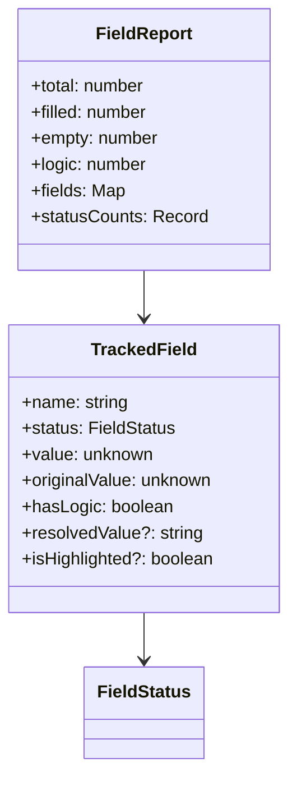
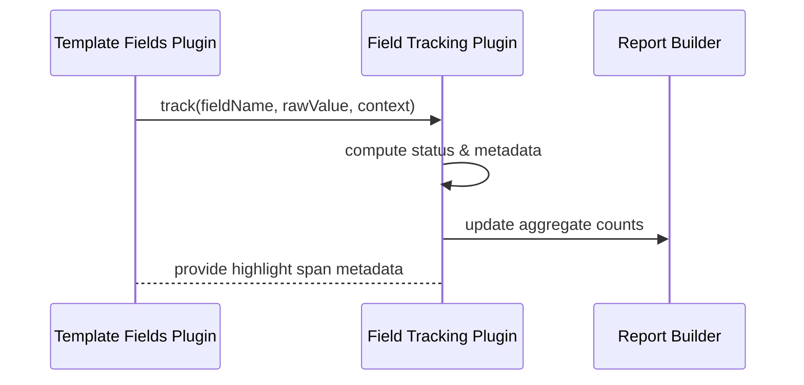

# Field Tracking System <!-- omit in toc -->

- [Overview](#overview)
- [Tracking Data Structures](#tracking-data-structures)
- [Status Classification](#status-classification)
- [Processing Flow](#processing-flow)
- [Report Generation](#report-generation)
- [Pipeline Integration](#pipeline-integration)

## Overview

Field tracking surfaces how template fields are used across a document. It runs
as part of the remark pipeline (Phase 2) and powers:

- Highlighting for HTML/PDF outputs
- Field usage reports for QA workflows
- Metadata consumed by the CLI and interactive UI when displaying diagnostics

The tracking logic lives in `src/plugins/remark/field-tracking.ts` and attaches
results to the `LegalMarkdownProcessorResult.reports` payload.

## Tracking Data Structures



## Status Classification

Field statuses describe how each template reference resolved:

- **`filled`** - metadata provided a non-empty value
- **`empty`** - metadata missing or blank, signalling a potential QA issue
- **`logic`** - expression involves helpers/conditionals and cannot be reduced
  to a literal value without evaluation context

Classification happens inside the template-fields plugin, which records an event
for the tracker whenever a field is visited.

## Processing Flow



Key behaviours:

1. Template-fields plugin emits tracking events whenever it resolves `{{field}}`
   expressions
2. Field-tracking plugin records `TrackedField` entries and, when highlighting
   is enabled, annotates the AST with span nodes used later by HTML/PDF
   generators
3. After traversal the tracker produces `FieldReport` summaries attached to the
   processor result

## Report Generation

`LegalMarkdownProcessorResult.reports?.fieldTracking` contains the structured
report:

```typescript
interface FieldTrackingReport {
  total: number;
  filled: number;
  empty: number;
  logic: number;
  fields: Record<string, TrackedField>;
}
```

Consumers (CLI, integration tests, web UI) use this data to surface missing
fields or highlight logic-driven sections. Outputs can be rendered as JSON, YAML
or human-readable tables depending on caller preference.

## Pipeline Integration

- **Phase 1** (`buildProcessingContext`) enables field tracking automatically
  whenever highlighting is requested, ensuring the tracker receives the proper
  flag
- **Phase 2** (`processLegalMarkdownWithRemark`) runs both template-fields and
  field-tracking plugins in the validated order to keep tracking data in sync
- **Phase 3** (`generateAllFormats`) reads highlight spans to emit dual HTML/PDF
  outputs (normal + highlight) when requested and can export reports alongside
  other metadata

Field tracking therefore remains tightly coupled to the remark pipeline while
still producing reusable artefacts for downstream tooling.
