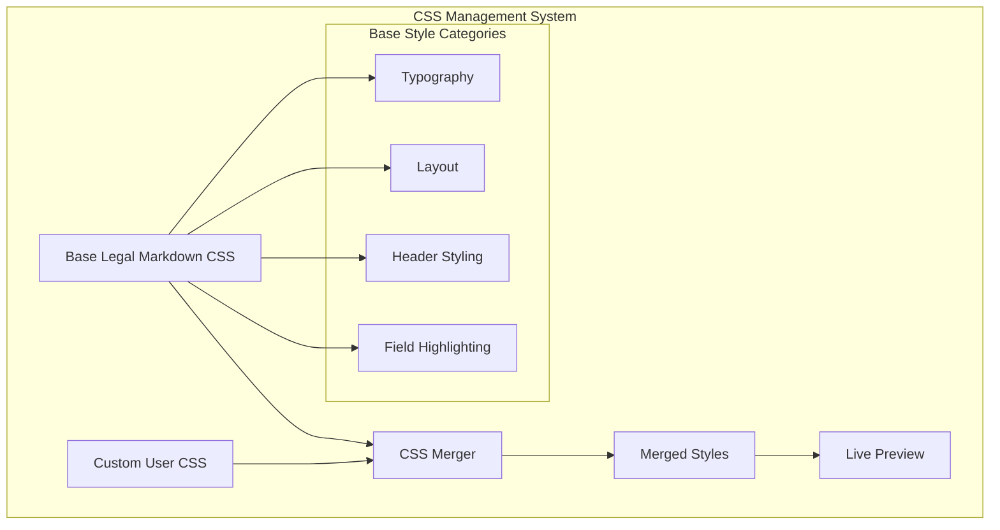
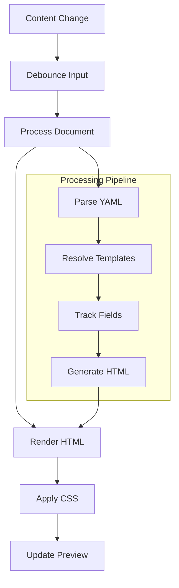
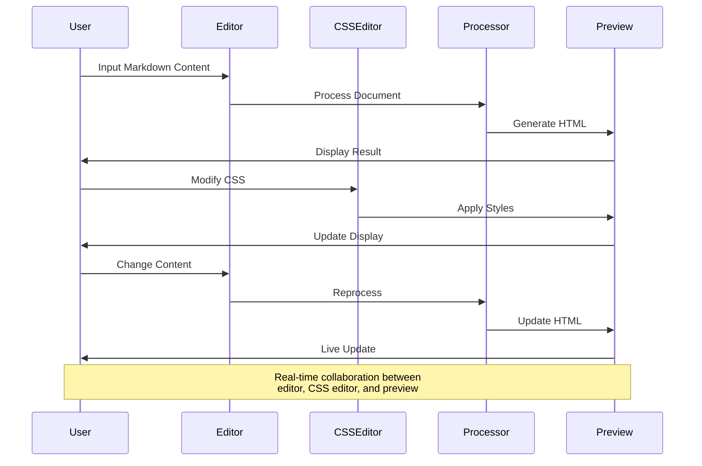
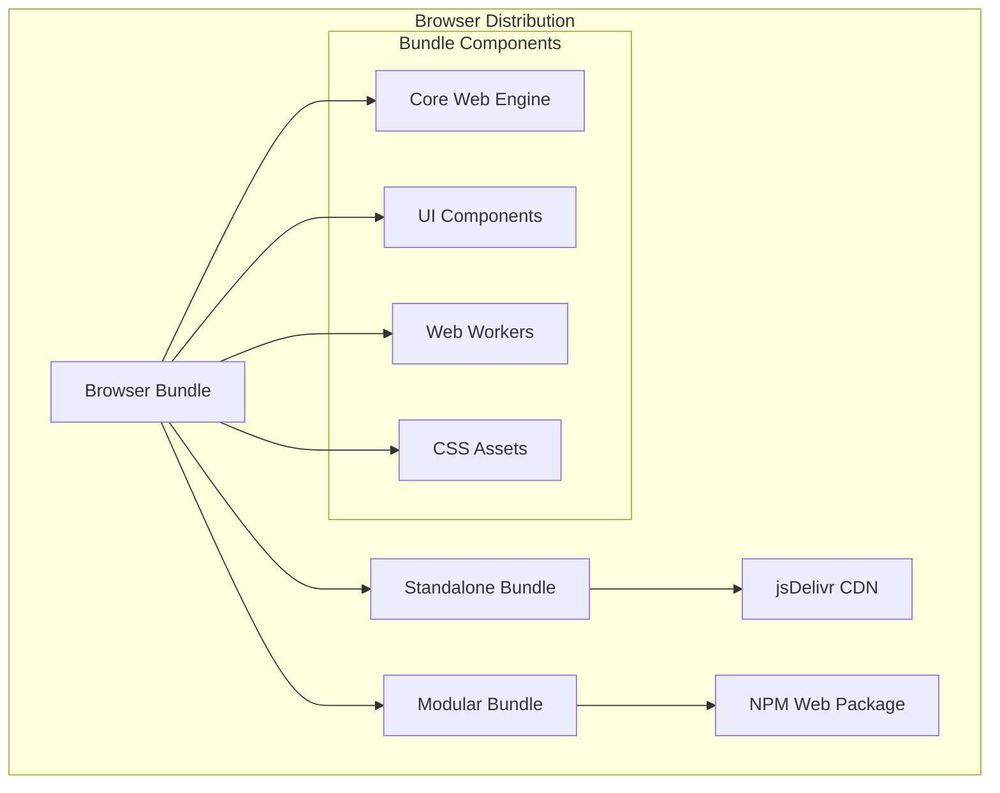

# Web Interface Architecture <!-- omit in toc -->

- [Overview](#overview)
- [Web Interface Components](#web-interface-components)
- [Editor Features](#editor-features)
- [CSS Editor Integration](#css-editor-integration)
- [Live Preview System](#live-preview-system)
- [Processing Flow](#processing-flow)
- [Browser Bundle Architecture](#browser-bundle-architecture)
- [Distribution Strategy](#distribution-strategy)

## Overview

Legal Markdown JS includes a comprehensive web interface that provides real-time
document editing and preview capabilities through a browser-based application.
The web interface offers a complete document authoring environment with
integrated CSS editing and live preview functionality.

## Web Interface Components

```mermaid
graph TB
    subgraph "Web Interface Layer"
        WEB[Web Interface] --> EDITOR[Document Editor]
        WEB --> CSS_EDITOR[CSS Editor]
        WEB --> PREVIEW[Live Preview]

        EDITOR --> RESIZABLE[Resizable Columns]
        CSS_EDITOR --> RESIZABLE
        PREVIEW --> RESIZABLE

        subgraph "Editor Features"
            SYNTAX[Syntax Highlighting]
            REALTIME[Real-time Processing]
            EXAMPLES[Predefined Examples]
            UPLOAD[File Upload]
        end

        subgraph "CSS Editor Features"
            CSS_SYNTAX[CSS Syntax Highlighting]
            AUTO_APPLY[Auto-apply CSS]
            BASE_TOGGLE[Base Styles Toggle]
            CUSTOM_STYLES[Custom Styling]
        end

        subgraph "Preview Features"
            LIVE_RENDER[Live Rendering]
            HIGHLIGHT_FIELDS[Field Highlighting]
            RESPONSIVE[Responsive Design]
            DARK_MODE[Dark Mode]
        end

        EDITOR --> SYNTAX
        EDITOR --> REALTIME
        EDITOR --> EXAMPLES
        EDITOR --> UPLOAD

        CSS_EDITOR --> CSS_SYNTAX
        CSS_EDITOR --> AUTO_APPLY
        CSS_EDITOR --> BASE_TOGGLE
        CSS_EDITOR --> CUSTOM_STYLES

        PREVIEW --> LIVE_RENDER
        PREVIEW --> HIGHLIGHT_FIELDS
        PREVIEW --> RESPONSIVE
        PREVIEW --> DARK_MODE
    end

    WEB --> CORE[Core Processing Engine]
    CORE --> OUTPUT[HTML Output]
```



## Editor Features

### Document Editor

The main document editor provides a complete Legal Markdown authoring
experience:

- **Syntax Highlighting**: Full Legal Markdown syntax support with color coding
- **Real-time Processing**: Immediate processing as users type
- **Predefined Examples**: Built-in examples for common document types
- **File Upload**: Support for uploading existing Legal Markdown files
- **Auto-completion**: Intelligent suggestions for field names and syntax
- **Error Highlighting**: Visual indication of syntax errors

### Advanced Editor Capabilities

- **Multi-cursor Editing**: Edit multiple locations simultaneously
- **Find and Replace**: Advanced search and replace functionality
- **Code Folding**: Collapse sections for better navigation
- **Line Numbers**: Optional line numbering for reference
- **Indentation Guides**: Visual guides for proper formatting

## CSS Editor Integration

### CSS Editor Features

The integrated CSS editor allows real-time style customization:

- **CSS Syntax Highlighting**: Full CSS syntax support with IntelliSense
- **Auto-apply CSS**: Immediate style application to preview
- **Base Styles Toggle**: Option to include/exclude default Legal Markdown
  styles
- **Custom Styling**: Complete control over document appearance
- **CSS Validation**: Real-time validation of CSS syntax

### Style Management



## Live Preview System

### Real-time Rendering

The preview system provides immediate visual feedback:

- **Live Rendering**: Instant preview updates as content changes
- **Field Highlighting**: Visual indication of template fields
- **Responsive Design**: Preview adapts to different screen sizes
- **Dark Mode Support**: Toggle between light and dark themes
- **Print Preview**: Accurate representation of printed output

### Preview Features



## Processing Flow

### Web Interface Processing Flow



### Performance Optimization

- **Debounced Processing**: Prevents excessive processing during rapid typing
- **Incremental Updates**: Only processes changed sections when possible
- **Caching**: Caches processed results for unchanged content
- **Web Workers**: Offloads processing to prevent UI blocking

## Browser Bundle Architecture

### Distribution Components



### Bundle Features

- **Standalone Bundle**: Complete self-contained web application
- **Modular Bundle**: Composable components for integration
- **CDN Ready**: Optimized for content delivery networks
- **Web Workers**: Background processing for performance

## Distribution Strategy

### Multiple Distribution Channels

1. **CDN Distribution**: Direct inclusion via jsDelivr or unpkg
2. **NPM Package**: Installation via npm for build integration
3. **Direct Download**: Static files for self-hosting
4. **GitHub Pages**: Live demo and documentation

### Integration Examples

#### Direct CDN Usage

```html
<script src="https://cdn.jsdelivr.net/npm/legal-markdown-js@latest/dist/umd/legal-markdown.umd.min.js"></script>
```

#### NPM Integration

```bash
npm install legal-markdown-js
```

#### Self-hosted Deployment

```bash
# Download and serve static files
wget https://github.com/compleatang/legal-markdown-js/releases/latest/web-bundle.zip
unzip web-bundle.zip -d web/
```

The web interface provides a complete browser-based authoring environment for
Legal Markdown documents, combining powerful editing capabilities with real-time
preview and styling features.
