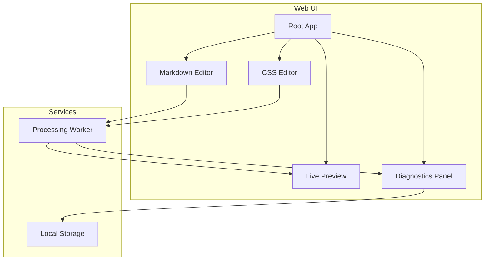
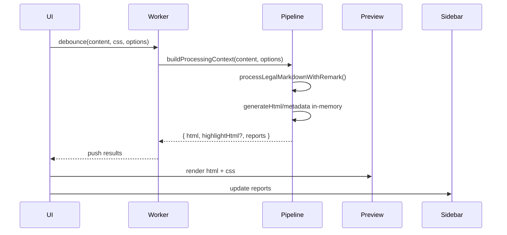
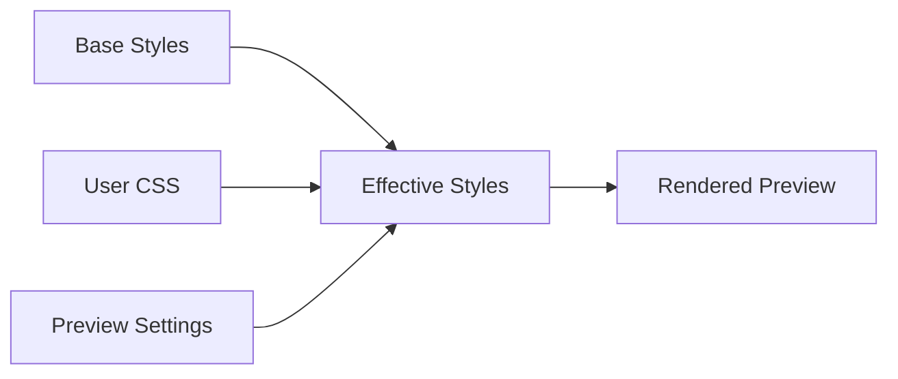

# Web Interface Architecture <!-- omit in toc -->

- [Overview](#overview)
- [Component Map](#component-map)
- [Processing Flow](#processing-flow)
- [Styling Workflow](#styling-workflow)
- [Browser Bundle Architecture](#browser-bundle-architecture)
- [Distribution Strategy](#distribution-strategy)

## Overview

The browser application offers an end-to-end authoring environment with live
preview, CSS editing and highlight tooling. It consumes the same three-phase
pipeline as the CLI by calling the bundled `processLegalMarkdownWithRemark`
function (Phase 2) and on-demand format helpers.

## Component Map

- **Editor** - Monaco/CodeMirror-based component providing syntax highlighting,
  sample documents and file upload
- **CSS Editor** - Standalone pane for overriding default styles with live
  preview updates
- **Preview** - Renders the processed HTML (normal + highlight when available)
- **Diagnostics Sidebar** - Presents field tracking summaries and metadata

## Processing Flow

The worker bundles a trimmed version of the pipeline:

- Phase 1 executes to parse YAML/force-commands and normalise options
- Phase 2 runs the remark plugins and collects field tracking data
- Phase 3 generates HTML in memory (PDF generation remains CLI-only)

Falling back to the worker keeps the UI responsive while executing CPU-heavy
processing.

## Styling Workflow

- Default CSS covers layout, legal headers, field highlighting and typography
- Users can toggle base styles and layer custom CSS snippets
- Preview maintains two stylesheets when highlight mode is enabled (normal +
  highlight variant)

## Browser Bundle Architecture

- Built via `npm run build:umd` into `dist/browser/legal-markdown.js`
- Exposes `processLegalMarkdownWithRemark`, helpers and constants for the UI
- Includes plugin metadata so the web build mirrors CLI validation behaviour
- Web worker separates pipeline execution from UI rendering

## Distribution Strategy

- Bundled assets (JS, CSS, fonts) hosted alongside the web SPA or embedded in
  downstream applications
- Versioned releases match npm package versions to guarantee API parity
- Browser environment stays in sync with Node builds through shared source files
  and end-to-end smoke tests
  (`tests/integration/legacy-remark-parity.integration.test.ts`)

The result is a cohesive browser experience that reflects the same processing
logic and diagnostics available on the command line.
