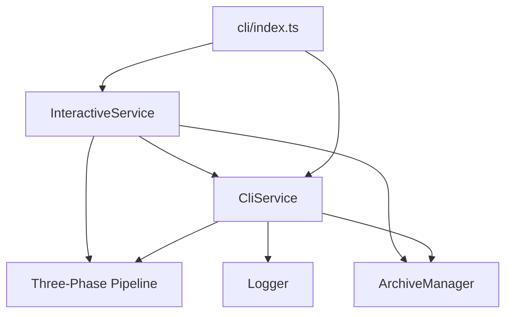
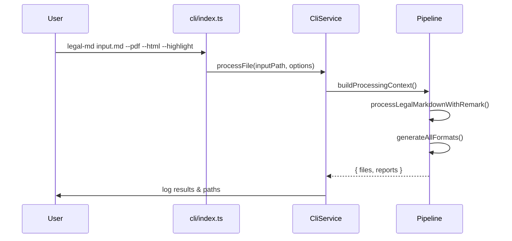
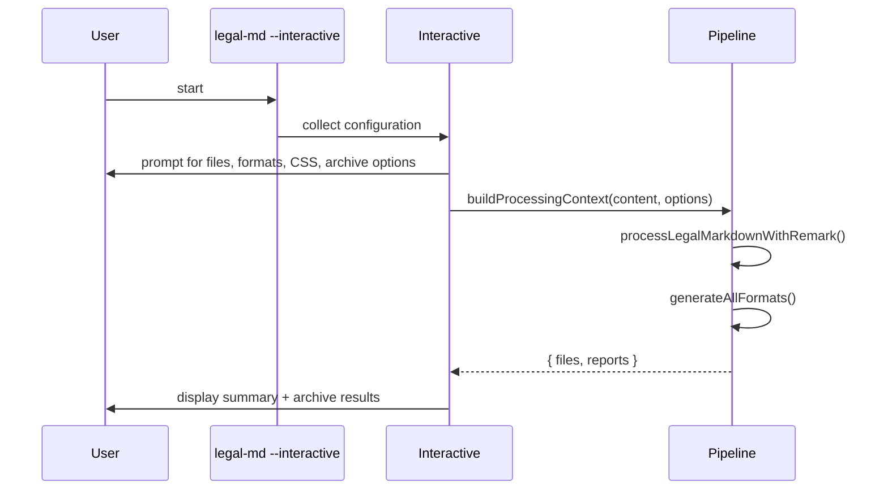

# CLI Architecture <!-- omit in toc -->

- [Overview](#overview)
- [Component Diagram](#component-diagram)
- [Batch CLI Flow](#batch-cli-flow)
- [Interactive CLI Flow](#interactive-cli-flow)
- [Service Layer Responsibilities](#service-layer-responsibilities)
- [Command-Line Surface](#command-line-surface)

## Overview

The CLI provides two entry points over the three-phase pipeline:

1. **Batch mode** (`legal-md <input> [options]`) for scripted usage
2. **Interactive mode** (`legal-md --interactive`) for guided workflows

Both modes delegate work to the shared `CliService` and `InteractiveService`,
which in turn call the pipeline helpers (`buildProcessingContext`,
`processLegalMarkdownWithRemark`, `generateAllFormats`).

## Component Diagram

## Batch CLI Flow

Highlights:

- Force-commands are resolved during context building
- Remark runs once with `noIndent: true` to serve HTML/PDF
- Generated files (and highlight variants) are reported back to the user
- Archive manager optionally saves original/processed copies after completion

## Interactive CLI Flow

Interactive mode reuses the same pipeline methods but wraps them in guided
prompts, file discovery helpers and diagnostic messaging tailored for non-shell
users.

## Service Layer Responsibilities

`CliService` (`src/cli/service.ts`) handles:

- Option normalisation (enable field tracking when highlight is requested,
  resolve CSS paths, set `noIndent` for format generation)
- Context building and the single remark execution
- Coordinating `generateAllFormats` and displaying generated artefacts
- Archiving processed/original files when requested
- Error handling + debug logging through the shared logger

`InteractiveService` extends the flow by:

- Translating prompt answers into CLI options
- Choosing output directories and archive destinations
- Reusing processed content when archiving to avoid additional pipeline runs

## Command-Line Surface

Key options (full list available via `legal-md --help`):

- `--html`, `--pdf`, `--highlight`, `--css <path>` - format generation controls
- `--output <path>` / `--output-dir <path>` - output routing
- `--export-yaml`, `--export-json` - metadata exports
- `--debug`, `--validate-plugin-order` - diagnostics
- `--archive`, `--archive-dir` - archiving behaviour
- `--interactive` - launch interactive workflow

All options ultimately map to the `LegalMarkdownOptions` interface consumed by
`buildProcessingContext`, keeping feature behaviour consistent between batch and
interactive modes.
