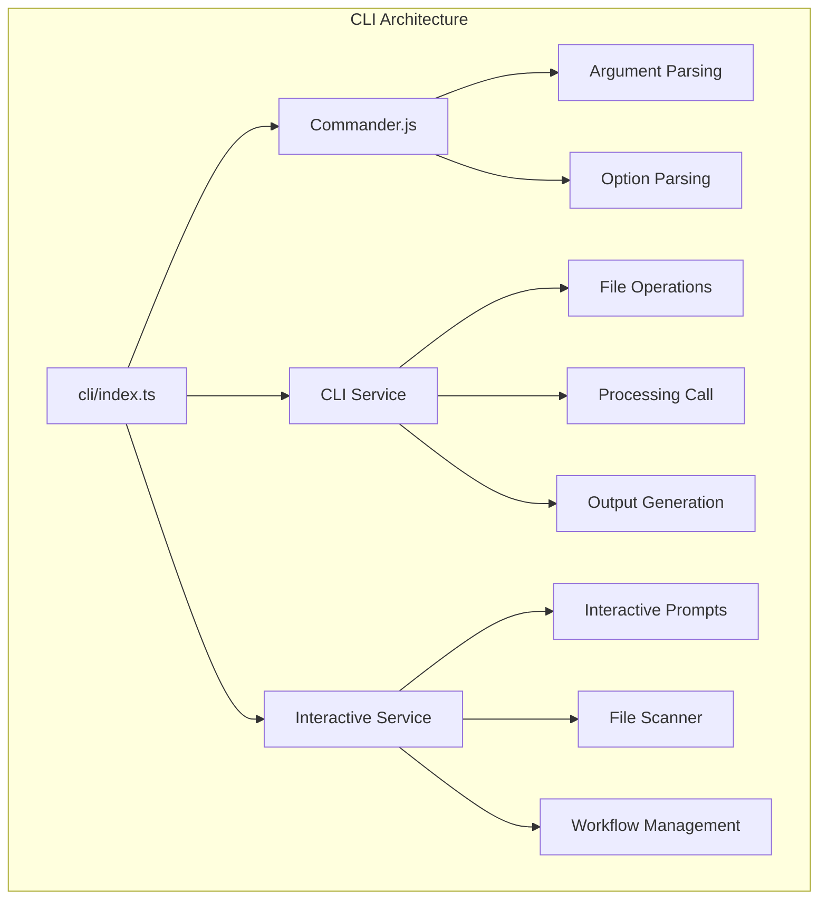
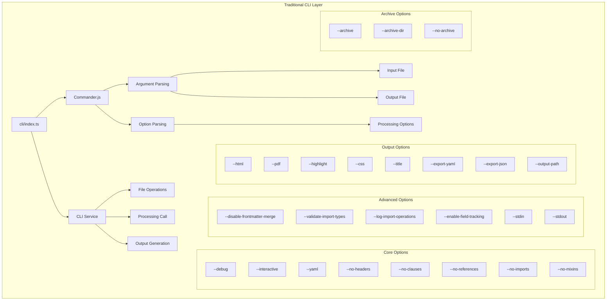
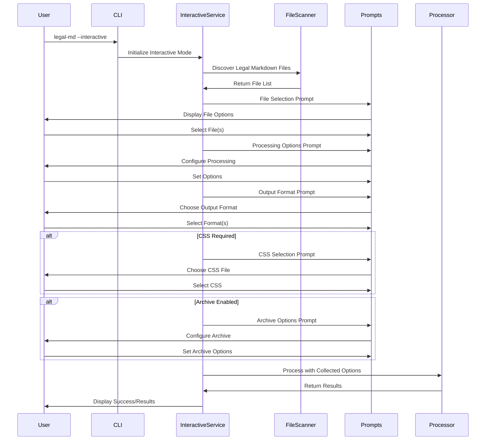
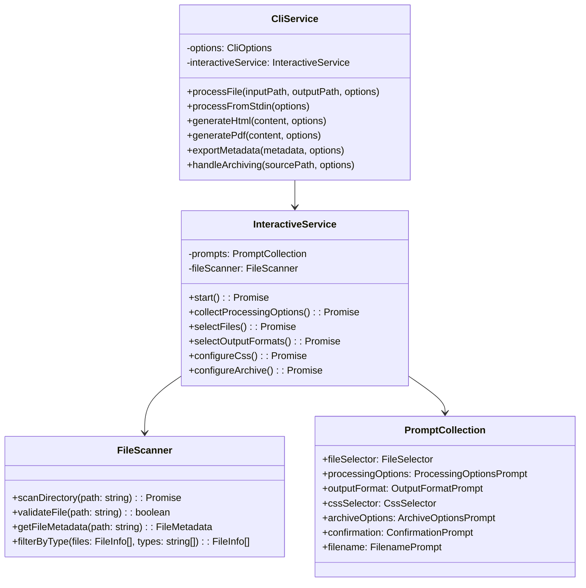
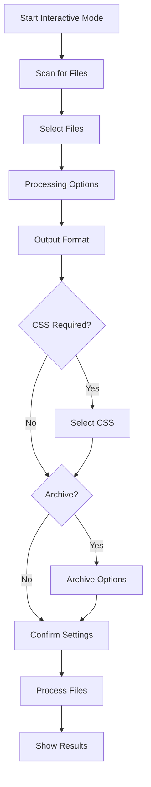

# CLI Architecture <!-- omit in toc -->

- [Overview](#overview)
- [CLI System Components](#cli-system-components)
- [Traditional CLI Mode](#traditional-cli-mode)
- [Interactive CLI Mode](#interactive-cli-mode)
- [CLI Service Architecture](#cli-service-architecture)
- [Command Line Options](#command-line-options)
- [Interactive Features](#interactive-features)

## Overview

The CLI system features both traditional command-line interface and advanced
interactive mode, providing flexible access to Legal Markdown processing
capabilities. The CLI architecture supports both simple one-off processing and
complex interactive workflows.

## CLI System Components

## Traditional CLI Mode

### Basic Command Structure

## Interactive CLI Mode

### Interactive Processing Flow

## CLI Service Architecture

### Service Layer Design

## Command Line Options

### Core Processing Options

| Option            | Description                 | Example                           |
| ----------------- | --------------------------- | --------------------------------- |
| `--debug`         | Enable debug output         | `legal-md doc.md --debug`         |
| `--yaml`          | YAML front matter only      | `legal-md doc.md --yaml`          |
| `--no-headers`    | Disable header processing   | `legal-md doc.md --no-headers`    |
| `--no-clauses`    | Disable optional clauses    | `legal-md doc.md --no-clauses`    |
| `--no-references` | Disable cross-references    | `legal-md doc.md --no-references` |
| `--no-imports`    | Disable file imports        | `legal-md doc.md --no-imports`    |
| `--no-mixins`     | Disable template processing | `legal-md doc.md --no-mixins`     |

### Advanced Options

| Option                        | Description                 | Example                                       |
| ----------------------------- | --------------------------- | --------------------------------------------- |
| `--disable-frontmatter-merge` | Disable frontmatter merging | `legal-md doc.md --disable-frontmatter-merge` |
| `--validate-import-types`     | Validate imported types     | `legal-md doc.md --validate-import-types`     |
| `--log-import-operations`     | Log import operations       | `legal-md doc.md --log-import-operations`     |
| `--enable-field-tracking`     | Enable field tracking       | `legal-md doc.md --enable-field-tracking`     |
| `--stdin`                     | Read from standard input    | `cat doc.md \| legal-md --stdin`              |
| `--stdout`                    | Write to standard output    | `legal-md doc.md --stdout`                    |

### Output Format Options

| Option            | Description               | Example                                     |
| ----------------- | ------------------------- | ------------------------------------------- |
| `--html`          | Generate HTML output      | `legal-md doc.md --html`                    |
| `--pdf`           | Generate PDF output       | `legal-md doc.md --pdf`                     |
| `--highlight`     | Enable field highlighting | `legal-md doc.md --html --highlight`        |
| `--css <path>`    | Custom CSS file           | `legal-md doc.md --html --css styles.css`   |
| `--title <title>` | Document title            | `legal-md doc.md --html --title "Contract"` |
| `--export-yaml`   | Export metadata as YAML   | `legal-md doc.md --export-yaml`             |
| `--export-json`   | Export metadata as JSON   | `legal-md doc.md --export-json`             |

### Archive Options

| Option                 | Description              | Example                                           |
| ---------------------- | ------------------------ | ------------------------------------------------- |
| `--archive`            | Enable source archiving  | `legal-md doc.md --archive`                       |
| `--archive-dir <path>` | Custom archive directory | `legal-md doc.md --archive --archive-dir backup/` |
| `--no-archive`         | Disable archiving        | `legal-md doc.md --no-archive`                    |

## Interactive Features

### File Discovery and Selection

The interactive mode provides intelligent file discovery:

- **Automatic Scanning**: Discovers Legal Markdown files in current directory
- **Recursive Search**: Optionally searches subdirectories
- **File Validation**: Validates file format and accessibility
- **Metadata Preview**: Shows basic file information
- **Multi-selection**: Supports batch processing of multiple files

### Processing Configuration

Interactive prompts guide users through processing options:

### Smart Defaults

The interactive system provides intelligent defaults:

- **File Type Detection**: Automatically detects Legal Markdown files
- **Output Format Suggestions**: Recommends appropriate output formats
- **CSS Discovery**: Finds available CSS files in common locations
- **Archive Location**: Suggests sensible archive directories
- **Processing Options**: Sets appropriate defaults based on file content

The CLI architecture provides both simple command-line usage and sophisticated
interactive workflows, making Legal Markdown processing accessible to users with
different levels of expertise and workflow requirements.
