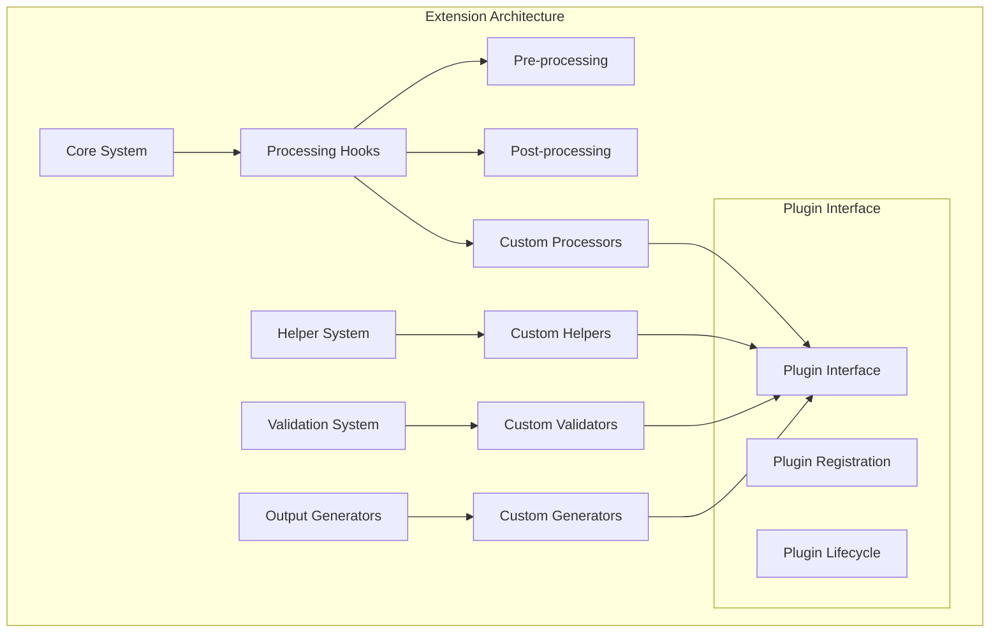
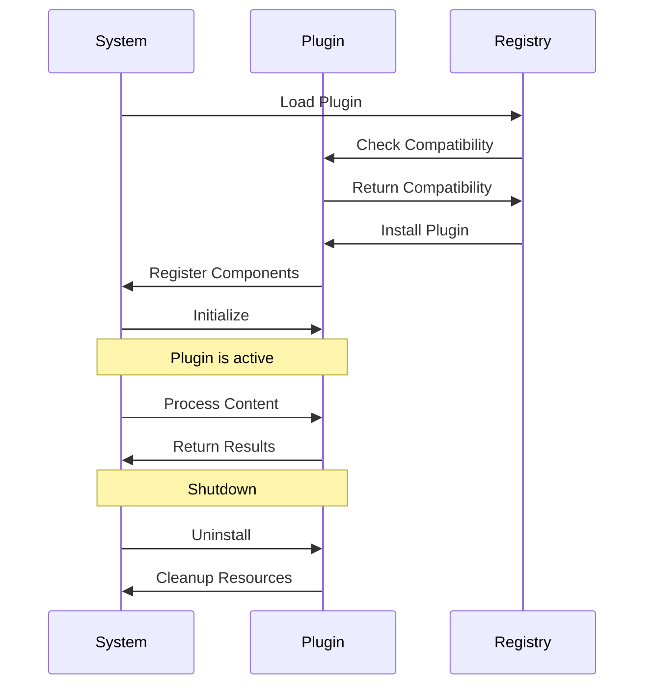

# Extension Points <!-- omit in toc -->

- [Overview](#overview)
- [Extension Architecture](#extension-architecture)
- [Processing Hooks](#processing-hooks)
- [Plugin Interface](#plugin-interface)
- [Custom Helper System](#custom-helper-system)
- [Custom Validators](#custom-validators)
- [Custom Generators](#custom-generators)
- [Extension Registration](#extension-registration)
- [Extension Examples](#extension-examples)

## Overview

The Legal Markdown JS architecture provides several extension points for custom
functionality, enabling developers to extend the system with custom processors,
helpers, validators, and output generators. The extension system is designed to
be modular, type-safe, and easy to integrate.

## Extension Architecture



## Processing Hooks

### Hook Points

The system provides several hook points for custom processing:

1. **Pre-processing Hooks**: Execute before main processing begins
2. **Post-processing Hooks**: Execute after main processing completes
3. **Pipeline Step Hooks**: Execute between specific pipeline steps
4. **Error Handling Hooks**: Execute when errors occur

### Hook Interface

```typescript
interface ProcessingHook {
  name: string;
  phase: 'pre' | 'post' | 'error' | 'step';
  priority: number;
  enabled: boolean;
  execute(context: ProcessingContext): Promise<ProcessingContext>;
}

interface ProcessingContext {
  content: string;
  metadata: Record<string, any>;
  options: LegalMarkdownOptions;
  stepName?: string;
  error?: Error;
}
```

### Hook Registration

```typescript
// Register a pre-processing hook
registerHook({
  name: 'custom-pre-processor',
  phase: 'pre',
  priority: 100,
  enabled: true,
  async execute(context) {
    // Custom pre-processing logic
    context.metadata.processedAt = new Date().toISOString();
    return context;
  },
});
```

## Plugin Interface

### Base Plugin Structure

```typescript
interface LegalMarkdownPlugin {
  name: string;
  version: string;
  description?: string;
  dependencies?: string[];

  install(system: LegalMarkdownSystem): void;
  uninstall(system: LegalMarkdownSystem): void;
  isCompatible(version: string): boolean;
}

interface LegalMarkdownSystem {
  registerHelper(helper: CustomHelper): void;
  registerValidator(validator: CustomValidator): void;
  registerGenerator(generator: CustomGenerator): void;
  registerProcessor(processor: CustomProcessor): void;
  registerHook(hook: ProcessingHook): void;
}
```

### Plugin Lifecycle



## Custom Helper System

### Helper Interface

```typescript
interface CustomHelper {
  name: string;
  description?: string;
  parameters: ParameterDefinition[];

  execute(args: any[], context: HelperContext): Promise<string>;
  validate(args: any[]): ValidationResult;
}

interface HelperContext {
  metadata: Record<string, any>;
  options: LegalMarkdownOptions;
  fieldName?: string;
}
```

### Helper Examples

#### Currency Formatter Helper

```typescript
const currencyHelper: CustomHelper = {
  name: 'currency',
  description: 'Format numbers as currency',
  parameters: [
    { name: 'amount', type: 'number', required: true },
    { name: 'currency', type: 'string', default: 'USD' },
    { name: 'locale', type: 'string', default: 'en-US' },
  ],

  async execute([amount, currency = 'USD', locale = 'en-US']) {
    return new Intl.NumberFormat(locale, {
      style: 'currency',
      currency: currency,
    }).format(amount);
  },

  validate(args) {
    if (typeof args[0] !== 'number') {
      return { valid: false, error: 'Amount must be a number' };
    }
    return { valid: true };
  },
};
```

#### Legal Date Helper

```typescript
const legalDateHelper: CustomHelper = {
  name: 'legal_date',
  description: 'Format dates in legal format',
  parameters: [
    { name: 'date', type: 'string|Date', required: true },
    { name: 'format', type: 'string', default: 'full' },
  ],

  async execute([date, format = 'full']) {
    const dateObj = new Date(date);
    const day = dateObj.getDate();
    const month = dateObj.toLocaleString('en', { month: 'long' });
    const year = dateObj.getFullYear();

    const ordinal = (n: number) => {
      const s = ['th', 'st', 'nd', 'rd'];
      const v = n % 100;
      return n + (s[(v - 20) % 10] || s[v] || s[0]);
    };

    return `${ordinal(day)} day of ${month}, ${year}`;
  },

  validate(args) {
    try {
      new Date(args[0]);
      return { valid: true };
    } catch {
      return { valid: false, error: 'Invalid date format' };
    }
  },
};
```

## Custom Validators

### Validator Interface

```typescript
interface CustomValidator {
  name: string;
  description?: string;

  validate(value: any, context: ValidationContext): ValidationResult;
  getSchema(): JSONSchema;
}

interface ValidationContext {
  fieldName: string;
  metadata: Record<string, any>;
  options: LegalMarkdownOptions;
}

interface ValidationResult {
  valid: boolean;
  error?: string;
  warnings?: string[];
}
```

### Validator Examples

#### Email Validator

```typescript
const emailValidator: CustomValidator = {
  name: 'email',
  description: 'Validate email addresses',

  validate(value, context) {
    const emailRegex = /^[^\s@]+@[^\s@]+\.[^\s@]+$/;

    if (typeof value !== 'string') {
      return { valid: false, error: 'Email must be a string' };
    }

    if (!emailRegex.test(value)) {
      return { valid: false, error: 'Invalid email format' };
    }

    return { valid: true };
  },

  getSchema() {
    return {
      type: 'string',
      format: 'email',
    };
  },
};
```

## Custom Generators

### Generator Interface

```typescript
interface CustomGenerator {
  name: string;
  description?: string;
  outputFormat: string;
  fileExtension: string;

  generate(
    content: string,
    metadata: Record<string, any>,
    options: GeneratorOptions
  ): Promise<GeneratorResult>;
  validate(options: GeneratorOptions): ValidationResult;
}

interface GeneratorResult {
  content: Buffer | string;
  mimeType: string;
  filename?: string;
  metadata?: Record<string, any>;
}
```

### Generator Examples

#### DOCX Generator

```typescript
const docxGenerator: CustomGenerator = {
  name: 'docx',
  description: 'Generate Microsoft Word documents',
  outputFormat: 'docx',
  fileExtension: '.docx',

  async generate(content, metadata, options) {
    // Convert markdown to DOCX using pandoc or similar
    const docxBuffer = await convertToDocx(content, options);

    return {
      content: docxBuffer,
      mimeType:
        'application/vnd.openxmlformats-officedocument.wordprocessingml.document',
      filename: options.filename || 'document.docx',
    };
  },

  validate(options) {
    return { valid: true };
  },
};
```

## Extension Registration

### System Registration

```typescript
import { LegalMarkdownSystem } from 'legal-markdown-js';

// Register custom components
const system = new LegalMarkdownSystem();

system.registerHelper(currencyHelper);
system.registerHelper(legalDateHelper);
system.registerValidator(emailValidator);
system.registerGenerator(docxGenerator);

// Register as plugin
const customPlugin: LegalMarkdownPlugin = {
  name: 'legal-extensions',
  version: '1.0.0',
  description: 'Custom legal document extensions',

  install(system) {
    system.registerHelper(currencyHelper);
    system.registerHelper(legalDateHelper);
    system.registerValidator(emailValidator);
    system.registerGenerator(docxGenerator);
  },

  uninstall(system) {
    system.unregisterHelper('currency');
    system.unregisterHelper('legal_date');
    system.unregisterValidator('email');
    system.unregisterGenerator('docx');
  },

  isCompatible(version) {
    return semver.satisfies(version, '>=2.14.0');
  },
};

system.installPlugin(customPlugin);
```

## Extension Examples

### Complete Extension Package

```typescript
// legal-markdown-extensions.ts
export class LegalMarkdownExtensions {
  static install(system: LegalMarkdownSystem) {
    // Business logic helpers
    system.registerHelper(new CalculationHelper());
    system.registerHelper(new ContractDateHelper());
    system.registerHelper(new PartyReferenceHelper());

    // Document validators
    system.registerValidator(new LegalEntityValidator());
    system.registerValidator(new JurisdictionValidator());
    system.registerValidator(new ComplianceValidator());

    // Output generators
    system.registerGenerator(new DocxGenerator());
    system.registerGenerator(new ExcelGenerator());
    system.registerGenerator(new ESignatureGenerator());

    // Processing hooks
    system.registerHook(new ComplianceCheckHook());
    system.registerHook(new DocumentAuditHook());
  }
}
```

### Usage Example

```typescript
import { LegalMarkdown } from 'legal-markdown-js';
import { LegalMarkdownExtensions } from './legal-markdown-extensions';

const processor = new LegalMarkdown();

// Install extensions
LegalMarkdownExtensions.install(processor.system);

// Use extended functionality
const result = await processor.process(content, {
  // Use custom helper
  template: '{{currency(amount, "EUR", "de-DE")}}',
  // Use custom validator
  validators: ['email', 'legal-entity'],
  // Use custom generator
  outputFormat: 'docx',
});
```

The extension system provides a powerful and flexible way to customize Legal
Markdown JS for specific use cases, domains, or organizational requirements
while maintaining type safety and system integrity.
