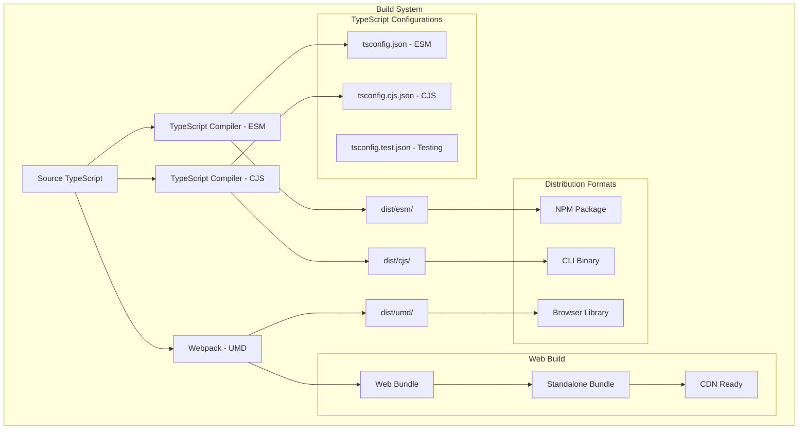
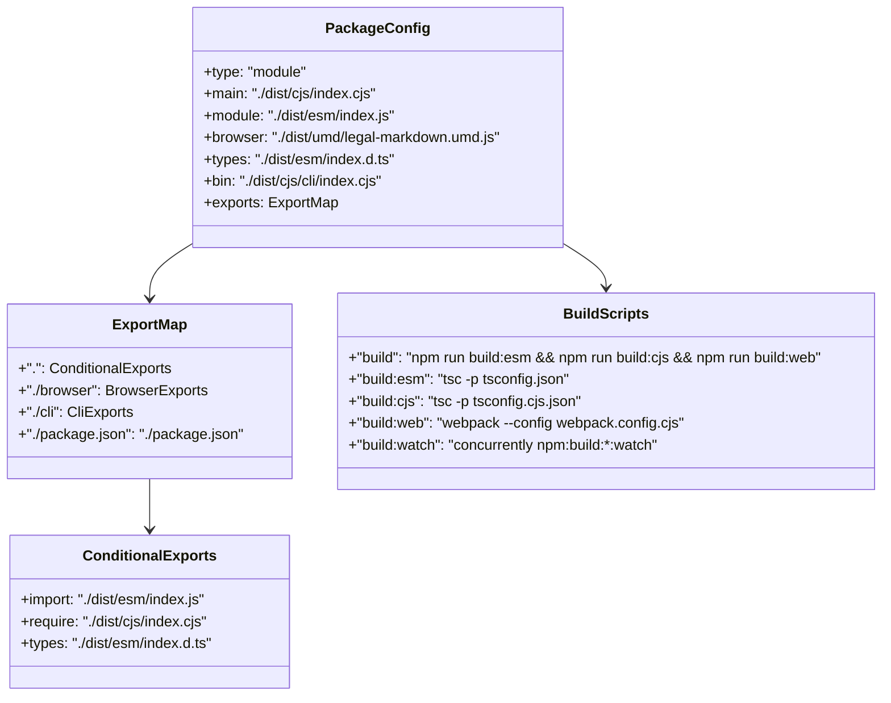
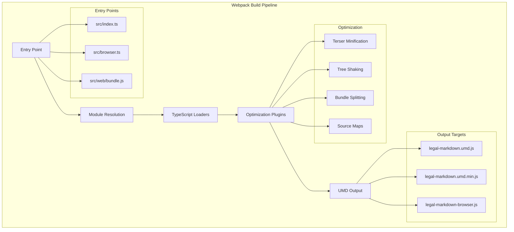
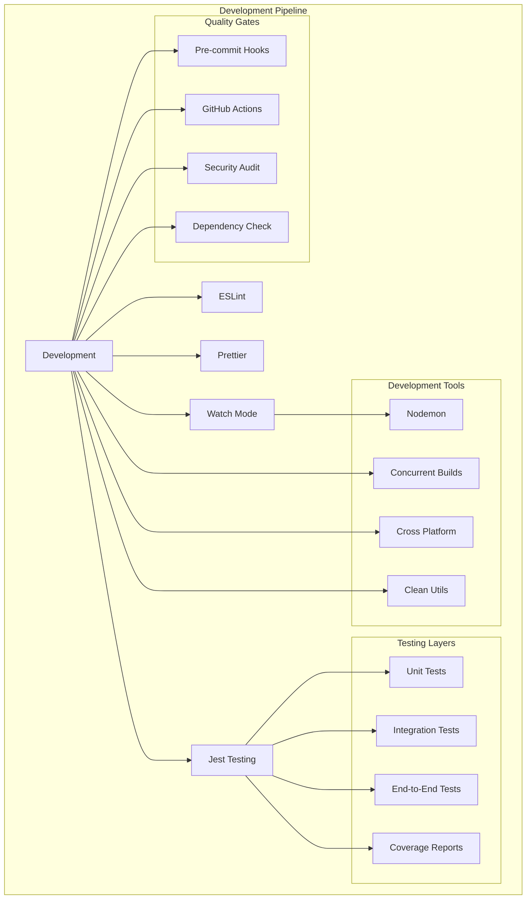
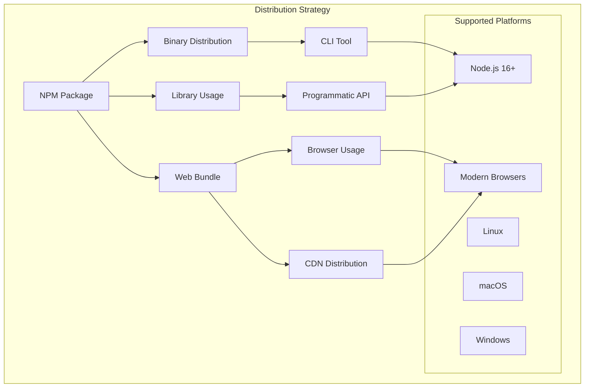

# Build System and Deployment <!-- omit in toc -->

- [Overview](#overview)
- [Dual Build Architecture](#dual-build-architecture)
- [TypeScript Configuration](#typescript-configuration)
- [Package.json Configuration](#packagejson-configuration)
- [Webpack Configuration for Web](#webpack-configuration-for-web)
- [Development and Testing Infrastructure](#development-and-testing-infrastructure)
- [Distribution Strategy](#distribution-strategy)
- [Deployment Targets](#deployment-targets)

## Overview

The project features a sophisticated dual-build system supporting both ESM and
CommonJS, with additional UMD builds for browser usage. This comprehensive build
system ensures compatibility across different environments while maintaining
modern JavaScript standards.

## Dual Build Architecture



## TypeScript Configuration

### ESM Configuration (tsconfig.json)

```json
{
  "compilerOptions": {
    "target": "ES2020",
    "module": "ESNext",
    "moduleResolution": "node",
    "lib": ["ES2020", "DOM"],
    "outDir": "./dist/esm",
    "rootDir": "./src",
    "strict": true,
    "esModuleInterop": true,
    "skipLibCheck": true,
    "forceConsistentCasingInFileNames": true,
    "declaration": true,
    "declarationMap": true,
    "sourceMap": true,
    "removeComments": false,
    "preserveConstEnums": true,
    "allowSyntheticDefaultImports": true,
    "experimentalDecorators": true,
    "emitDecoratorMetadata": true
  },
  "include": ["src/**/*"],
  "exclude": ["node_modules", "dist", "**/*.test.ts", "**/*.spec.ts"]
}
```

### CommonJS Configuration (tsconfig.cjs.json)

```json
{
  "extends": "./tsconfig.json",
  "compilerOptions": {
    "module": "CommonJS",
    "outDir": "./dist/cjs",
    "outExtension": {
      ".js": ".cjs"
    },
    "declaration": false,
    "declarationMap": false
  }
}
```

### Test Configuration (tsconfig.test.json)

```json
{
  "extends": "./tsconfig.json",
  "compilerOptions": {
    "outDir": "./dist/test",
    "declaration": false,
    "declarationMap": false,
    "types": ["jest", "node"]
  },
  "include": ["src/**/*", "tests/**/*"]
}
```

## Package.json Configuration

### Export Map Structure



### Detailed Export Configuration

```json
{
  "type": "module",
  "main": "./dist/cjs/index.cjs",
  "module": "./dist/esm/index.js",
  "browser": "./dist/umd/legal-markdown.umd.js",
  "types": "./dist/esm/index.d.ts",
  "bin": {
    "legal-md": "./dist/cjs/cli/index.cjs",
    "legal-markdown": "./dist/cjs/cli/index.cjs"
  },
  "exports": {
    ".": {
      "import": "./dist/esm/index.js",
      "require": "./dist/cjs/index.cjs",
      "types": "./dist/esm/index.d.ts"
    },
    "./browser": {
      "import": "./dist/esm/browser.js",
      "require": "./dist/cjs/browser.cjs",
      "browser": "./dist/umd/legal-markdown.umd.js"
    },
    "./cli": {
      "import": "./dist/esm/cli/index.js",
      "require": "./dist/cjs/cli/index.cjs"
    },
    "./package.json": "./package.json"
  }
}
```

## Webpack Configuration for Web

### Build Pipeline



### Webpack Configuration Example

```javascript
// webpack.config.cjs
const path = require('path');
const TerserPlugin = require('terser-webpack-plugin');

module.exports = {
  mode: 'production',
  entry: {
    'legal-markdown': './src/browser.ts',
    'legal-markdown.min': './src/browser.ts',
  },
  output: {
    path: path.resolve(__dirname, 'dist/umd'),
    filename: '[name].umd.js',
    library: 'LegalMarkdown',
    libraryTarget: 'umd',
    globalObject: 'this',
  },
  resolve: {
    extensions: ['.ts', '.js'],
    fallback: {
      fs: false,
      path: require.resolve('path-browserify'),
      process: require.resolve('process/browser'),
    },
  },
  module: {
    rules: [
      {
        test: /\.ts$/,
        use: 'ts-loader',
        exclude: /node_modules/,
      },
    ],
  },
  optimization: {
    minimizer: [
      new TerserPlugin({
        include: /\.min\.js$/,
        terserOptions: {
          compress: {
            drop_console: true,
          },
        },
      }),
    ],
  },
  devtool: 'source-map',
};
```

## Development and Testing Infrastructure

### Development Pipeline



### Build Scripts

```json
{
  "scripts": {
    "build": "npm run clean && npm run build:esm && npm run build:cjs && npm run build:web",
    "build:esm": "tsc -p tsconfig.json",
    "build:cjs": "tsc -p tsconfig.cjs.json && npm run fix-cjs-extensions",
    "build:web": "webpack --config webpack.config.cjs",
    "build:watch": "concurrently \"npm:build:esm -- --watch\" \"npm:build:cjs -- --watch\" \"npm:build:web -- --watch\"",
    "clean": "rimraf dist",
    "fix-cjs-extensions": "find dist/cjs -name '*.js' -exec mv {} {}.tmp \\; -exec mv {}.tmp {}.cjs \\;",
    "dev": "nodemon --exec \"npm run build:esm\" --watch src --ext ts",
    "test": "jest",
    "test:watch": "jest --watch",
    "test:coverage": "jest --coverage",
    "lint": "eslint src tests --ext .ts",
    "lint:fix": "eslint src tests --ext .ts --fix",
    "format": "prettier --write src tests",
    "format:check": "prettier --check src tests",
    "audit": "npm audit --audit-level moderate",
    "audit:fix": "npm audit fix",
    "prepublishOnly": "npm run build && npm test",
    "prepare": "husky install"
  }
}
```

### Quality Assurance Tools

#### ESLint Configuration

```json
{
  "extends": [
    "@typescript-eslint/recommended",
    "prettier/@typescript-eslint",
    "plugin:prettier/recommended"
  ],
  "parser": "@typescript-eslint/parser",
  "plugins": ["@typescript-eslint"],
  "rules": {
    "@typescript-eslint/no-unused-vars": [
      "error",
      { "argsIgnorePattern": "^_" }
    ],
    "@typescript-eslint/explicit-function-return-type": "warn",
    "@typescript-eslint/no-explicit-any": "warn",
    "prefer-const": "error",
    "no-var": "error"
  }
}
```

#### Jest Configuration

```json
{
  "preset": "ts-jest",
  "testEnvironment": "node",
  "testMatch": ["**/__tests__/**/*.ts", "**/?(*.)+(spec|test).ts"],
  "collectCoverageFrom": ["src/**/*.ts", "!src/**/*.d.ts", "!src/tests/**"],
  "coverageThreshold": {
    "global": {
      "branches": 80,
      "functions": 80,
      "lines": 80,
      "statements": 80
    }
  }
}
```

## Distribution Strategy

### Multi-Platform Distribution



## Deployment Targets

### NPM Package

- **Main Distribution**: Published to npm registry
- **Version Management**: Semantic versioning with automated releases
- **Documentation**: Comprehensive README and API docs
- **Examples**: Included example files and use cases

### CLI Binary

- **Global Installation**: `npm install -g legal-markdown-js`
- **Binary Name**: `legal-md` and `legal-markdown`
- **Platform Support**: All Node.js supported platforms
- **Auto-completion**: Shell completion scripts

### Browser Library

- **CDN Distribution**: Available on jsDelivr and unpkg
- **UMD Format**: Universal module definition for broad compatibility
- **Minified Versions**: Optimized builds for production
- **Source Maps**: Available for debugging

### Development Distribution

- **GitHub Releases**: Tagged releases with changelog
- **Docker Images**: Containerized versions for CI/CD
- **Development Builds**: Pre-release builds for testing
- **Documentation Site**: GitHub Pages with comprehensive docs

The build and deployment system ensures Legal Markdown JS is accessible across
all target environments while maintaining high performance and compatibility
standards.
