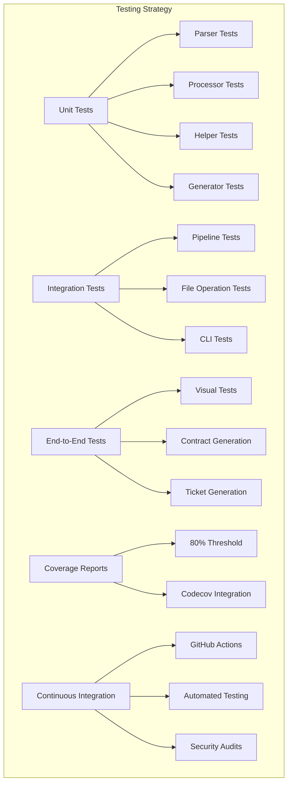
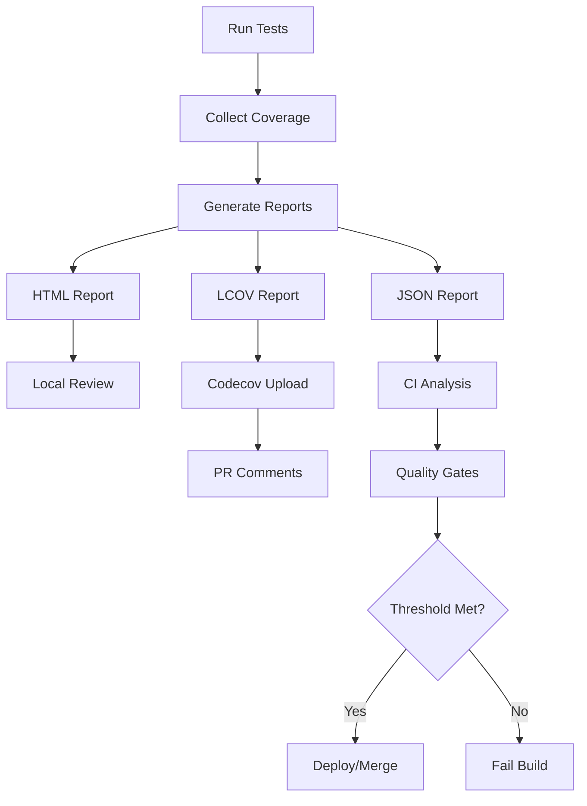

# Testing Architecture <!-- omit in toc -->

- [Overview](#overview)
- [Testing Strategy Overview](#testing-strategy-overview)
- [Unit Testing Layer](#unit-testing-layer)
- [Integration Testing Layer](#integration-testing-layer)
- [End-to-End Testing Layer](#end-to-end-testing-layer)
- [Coverage Requirements](#coverage-requirements)
- [Continuous Integration](#continuous-integration)
- [Testing Tools and Configuration](#testing-tools-and-configuration)
- [Test Data Management](#test-data-management)

## Overview

Legal Markdown JS employs a comprehensive testing strategy with multiple layers
of testing to ensure reliability, correctness, and maintainability. The testing
architecture includes unit tests, integration tests, and end-to-end tests with
automated coverage reporting and continuous integration.

## Testing Strategy Overview



## Unit Testing Layer

### Core Component Tests

Unit tests focus on individual components in isolation:

#### Parser Tests

- **YAML Parser**: Tests frontmatter parsing, validation, and error handling
- **Content Detector**: Tests file type detection and format recognition
- **Pandoc Integration**: Tests external parser integration and fallbacks

#### Processor Tests

- **Template Fields**: Tests `{{field}}` resolution and helper functions
- **Cross-References**: Tests `|reference|` processing and link generation
- **Optional Clauses**: Tests conditional text inclusion/exclusion
- **Header Processing**: Tests automatic header numbering and formatting

#### Helper Function Tests

- **Date Helpers**: Tests date formatting, calculations, and locale support
- **Number Helpers**: Tests number formatting, calculations, and currency
- **String Helpers**: Tests text manipulation and formatting functions

#### Generator Tests

- **HTML Generator**: Tests HTML output generation and CSS integration
- **PDF Generator**: Tests PDF creation, styling, and formatting
- **Metadata Exporter**: Tests YAML/JSON metadata export functionality

### Example Unit Test Structure

```typescript
// tests/unit/processors/template-fields.test.ts
describe('Template Fields Processor', () => {
  let processor: TemplateFieldsProcessor;

  beforeEach(() => {
    processor = new TemplateFieldsProcessor();
  });

  describe('Simple Field Resolution', () => {
    it('should resolve basic template fields', () => {
      const content = 'Hello {{name}}!';
      const metadata = { name: 'World' };

      const result = processor.process(content, metadata);

      expect(result.content).toBe('Hello World!');
      expect(result.fieldReport.filled).toBe(1);
    });

    it('should handle missing fields gracefully', () => {
      const content = 'Hello {{missing_field}}!';
      const metadata = {};

      const result = processor.process(content, metadata);

      expect(result.content).toBe('Hello {{missing_field}}!');
      expect(result.fieldReport.empty).toBe(1);
    });
  });

  describe('Helper Function Integration', () => {
    it('should process date helper functions', () => {
      const content = 'Date: {{date_helper("2024-01-01", "MMMM d, yyyy")}}';
      const metadata = {};

      const result = processor.process(content, metadata);

      expect(result.content).toBe('Date: January 1, 2024');
      expect(result.fieldReport.logic).toBe(1);
    });
  });

  describe('Conditional Expressions', () => {
    it('should evaluate conditional expressions', () => {
      const content = '{{condition ? "Yes" : "No"}}';
      const metadata = { condition: true };

      const result = processor.process(content, metadata);

      expect(result.content).toBe('Yes');
    });
  });
});
```

## Integration Testing Layer

### Pipeline Integration Tests

Integration tests verify component interactions and data flow:

#### Pipeline Tests

- **Full Pipeline**: Tests complete processing pipeline from input to output
- **Step Ordering**: Tests proper execution order and data passing
- **Error Recovery**: Tests error handling and recovery mechanisms
- **Performance**: Tests processing performance and memory usage

#### File Operation Tests

- **Import Processing**: Tests file import and frontmatter merging
- **Archive Management**: Tests source file backup and version control
- **Output Generation**: Tests multi-format output generation
- **Path Resolution**: Tests file path handling and security

#### CLI Integration Tests

- **Command Processing**: Tests CLI argument parsing and option handling
- **Interactive Mode**: Tests interactive prompts and user workflows
- **Output Formatting**: Tests CLI output formatting and error reporting
- **Exit Codes**: Tests proper exit code handling for different scenarios

### Example Integration Test

```typescript
// tests/integration/pipeline.test.ts
describe('Processing Pipeline Integration', () => {
  let tempDir: string;
  let processor: LegalMarkdown;

  beforeEach(async () => {
    tempDir = await fs.mkdtemp(path.join(os.tmpdir(), 'legal-md-test-'));
    processor = new LegalMarkdown();
  });

  afterEach(async () => {
    await fs.rmdir(tempDir, { recursive: true });
  });

  it('should process complete legal document', async () => {
    const inputFile = path.join(tempDir, 'contract.md');
    const outputFile = path.join(tempDir, 'contract.html');

    const content = `---
title: Service Agreement
client_name: Acme Corp
contract_date: 2024-01-15
---

# {{title}}

This agreement is between the Service Provider and {{client_name}}.

## 1. Term
This agreement becomes effective on {{contract_date}}.`;

    await fs.writeFile(inputFile, content);

    const result = await processor.processFile(inputFile, {
      html: true,
      output: outputFile,
      highlight: true,
    });

    expect(result.success).toBe(true);
    expect(result.fieldReport.filled).toBe(3);

    const htmlContent = await fs.readFile(outputFile, 'utf-8');
    expect(htmlContent).toContain('<h1>Service Agreement</h1>');
    expect(htmlContent).toContain('Acme Corp');
    expect(htmlContent).toContain('2024-01-15');
  });
});
```

## End-to-End Testing Layer

### Real-world Document Tests

End-to-end tests use complete, realistic documents:

#### Document Type Tests

- **Contracts**: Complete legal contracts with all features
- **Policies**: Corporate policies and procedures
- **Letters**: Business correspondence and legal notices
- **Reports**: Technical and legal reports

#### Feature Combination Tests

- **Complex Templates**: Documents using multiple template features
- **Multi-file Documents**: Documents with imports and includes
- **Styled Output**: Documents with custom CSS and formatting
- **Interactive Processing**: Complete CLI workflows

### Example E2E Test

```typescript
// tests/e2e/contract-generation.test.ts
describe('Contract Generation E2E', () => {
  it('should generate complete service agreement', async () => {
    const contractTemplate = path.join(
      __dirname,
      'fixtures/service-agreement.md'
    );
    const metadata = {
      client_name: 'Technology Solutions Inc.',
      provider_name: 'Legal Services LLC',
      contract_date: '2024-01-15',
      service_fee: 5000,
      payment_terms: '30 days',
    };

    const result = await cli.run([
      contractTemplate,
      '--html',
      '--pdf',
      '--highlight',
      '--metadata',
      JSON.stringify(metadata),
    ]);

    expect(result.exitCode).toBe(0);
    expect(result.files).toHaveLength(2); // HTML and PDF

    // Verify HTML output
    const htmlContent = await fs.readFile(result.files[0], 'utf-8');
    expect(htmlContent).toContain('Technology Solutions Inc.');
    expect(htmlContent).toContain('$5,000');

    // Verify PDF was created
    const pdfStats = await fs.stat(result.files[1]);
    expect(pdfStats.size).toBeGreaterThan(1000);
  });
});
```

## Coverage Requirements

### Coverage Thresholds

```json
{
  "coverageThreshold": {
    "global": {
      "branches": 80,
      "functions": 80,
      "lines": 80,
      "statements": 80
    },
    "src/core/": {
      "branches": 90,
      "functions": 90,
      "lines": 90,
      "statements": 90
    },
    "src/plugins/": {
      "branches": 85,
      "functions": 85,
      "lines": 85,
      "statements": 85
    }
  }
}
```

### Coverage Reporting



## Continuous Integration

### GitHub Actions Workflow

```yaml
# .github/workflows/test.yml
name: Test Suite

on:
  push:
    branches: [main, develop]
  pull_request:
    branches: [main]

jobs:
  test:
    runs-on: ubuntu-latest
    strategy:
      matrix:
        node-version: [16.x, 18.x, 20.x]

    steps:
      - uses: actions/checkout@v3

      - name: Use Node.js ${{ matrix.node-version }}
        uses: actions/setup-node@v3
        with:
          node-version: ${{ matrix.node-version }}
          cache: 'npm'

      - run: npm ci

      - name: Run linting
        run: npm run lint

      - name: Run unit tests
        run: npm run test:unit

      - name: Run integration tests
        run: npm run test:integration

      - name: Run E2E tests
        run: npm run test:e2e

      - name: Generate coverage
        run: npm run test:coverage

      - name: Upload coverage to Codecov
        uses: codecov/codecov-action@v3
        with:
          token: ${{ secrets.CODECOV_TOKEN }}
          files: ./coverage/lcov.info
```

## Testing Tools and Configuration

### Vitest Configuration

```typescript
// vitest.config.ts
export default defineConfig({
  test: {
    environment: 'node',
    globals: true,
    include: ['tests/**/*.test.ts'],
  collectCoverageFrom: ['src/**/*.ts', '!src/**/*.d.ts', '!src/tests/**'],
  coverageReporters: ['text', 'lcov', 'html', 'json'],
  setupFilesAfterEnv: ['<rootDir>/tests/setup.ts'],
  testTimeout: 30000,
  maxWorkers: '50%',
};
```

### Test Utilities

```typescript
// tests/utils/test-helpers.ts
export class TestFixtures {
  static async createTempDir(): Promise<string> {
    return await fs.mkdtemp(path.join(os.tmpdir(), 'legal-md-test-'));
  }

  static async cleanupTempDir(dir: string): Promise<void> {
    await fs.rmdir(dir, { recursive: true });
  }

  static loadFixture(name: string): string {
    return fs.readFileSync(
      path.join(__dirname, '..', 'fixtures', name),
      'utf-8'
    );
  }

  static async runCLI(args: string[]): Promise<CLIResult> {
    // CLI test helper implementation
  }
}
```

## Test Data Management

### Fixture Organization

```
tests/
├── fixtures/
│   ├── documents/
│   │   ├── simple-contract.md
│   │   ├── complex-agreement.md
│   │   └── policy-document.md
│   ├── metadata/
│   │   ├── contract-data.yaml
│   │   └── policy-data.json
│   ├── expected/
│   │   ├── simple-contract.html
│   │   └── complex-agreement.pdf
│   └── styles/
│       ├── basic.css
│       └── professional.css
├── unit/
├── integration/
└── e2e/
```

### Dynamic Test Generation

```typescript
// tests/unit/processors/template-fields.generated.test.ts
const testCases = [
  {
    name: 'simple field',
    input: 'Hello {{name}}',
    metadata: { name: 'World' },
    expected: 'Hello World',
  },
  {
    name: 'missing field',
    input: 'Hello {{missing}}',
    metadata: {},
    expected: 'Hello {{missing}}',
  },
  // ... more test cases
];

describe('Template Fields - Generated Tests', () => {
  testCases.forEach(testCase => {
    it(`should handle ${testCase.name}`, () => {
      const result = processor.process(testCase.input, testCase.metadata);
      expect(result.content).toBe(testCase.expected);
    });
  });
});
```

The comprehensive testing architecture ensures Legal Markdown JS maintains high
quality, reliability, and correctness across all supported features and
environments.
