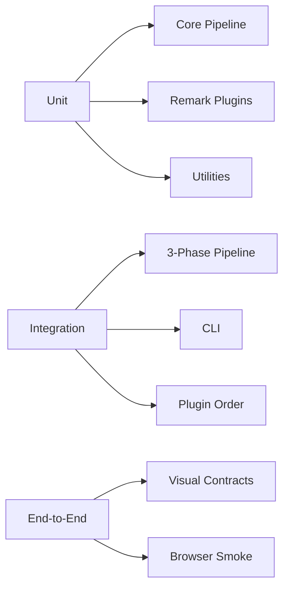

# Testing Architecture <!-- omit in toc -->

- [Overview](#overview)
- [Test Layers](#test-layers)
- [Key Suites](#key-suites)
- [Tooling & Configuration](#tooling--configuration)
- [CI Expectations](#ci-expectations)
- [Data & Fixtures](#data--fixtures)

## Overview

Testing is based on Vitest with strict TypeScript type checking. Suites track
the three-phase pipeline refactor and ensure parity with historical behaviour.

## Test Layers

- **Unit** - pure functions and modules (parsers, plugin helpers, generators)
- **Integration** - end-to-end runs through key entry points
- **E2E** - scenario tests exercising real documents and visual diff tooling

## Key Suites

| Path                                                            | Purpose                                                                             |
| --------------------------------------------------------------- | ----------------------------------------------------------------------------------- |
| `tests/unit/core/pipeline/context-builder.test.ts`              | Validates Phase 1 option merging, force-command resolution, validation helpers      |
| `tests/unit/core/pipeline/format-generator.test.ts`             | Ensures Phase 3 orchestrates HTML/PDF/Markdown generation (skipped where I/O heavy) |
| `tests/integration/pipeline-3-phase.integration.test.ts`        | Confirms the new pipeline executes once per run and compares against legacy timings |
| `tests/integration/plugin-order-validation.integration.test.ts` | Verifies metadata registry + validator catch ordering violations and suggest fixes  |
| `tests/unit/plugins/remark/*`                                   | Cover plugin-specific logic (imports, headers, css classes, html comments, etc.)    |
| `tests/unit/cli/interactive/service.test.ts`                    | Tests interactive CLI mapping and archiving behaviour                               |
| `tests/integration/legacy-remark-parity.integration.test.ts`    | Guards compatibility with historical remark outputs                                 |
| `tests/e2e` scripts                                             | Generate PDF/HTML artefacts for manual review (run on demand)                       |

All suites run under Vitest; heavier PDF/visual checks are opt-in via env flags.

## Tooling & Configuration

- `vitest.config.ts` introduces path aliases and coverage instrumentation via
  `@vitest/coverage-v8`
- `npm run test`, `npm run test:unit`, `npm run test:integration`,
  `npm run test:plugins` provide targeted entry points
- `npm run typecheck` (`tsc --noEmit`) runs alongside tests in CI to keep typing
  honest
- Coverage thresholds are enforced by Vitest configuration (see `package.json`
  scripts for `test:coverage`)

## CI Expectations

CI pipelines (GitHub Actions) execute:

1. `npm ci`
2. `npm run lint`
3. `npm run typecheck`
4. `npm run test:ci` (Vitest in non-watch mode with JSON reporter)
5. `npm run build`

Failing suites block merge; release automation (`semantic-release`) runs the
same sequence in prerelease checks.

## Data & Fixtures

- Fixtures live under `tests/fixtures` and `tests/shared` for cross-suite reuse
- Integration suites create temporary directories for output inspection and
  clean them up after runs
- Visual/E2E tests place generated artefacts under `tmp/` or `dist/tests` for
  manual inspection, ensuring they do not pollute source control

Testing discipline focuses on guarding pipeline invariants (single remark run,
plugin order, deterministic output) while keeping regression coverage for legacy
constraints.
