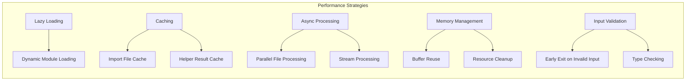
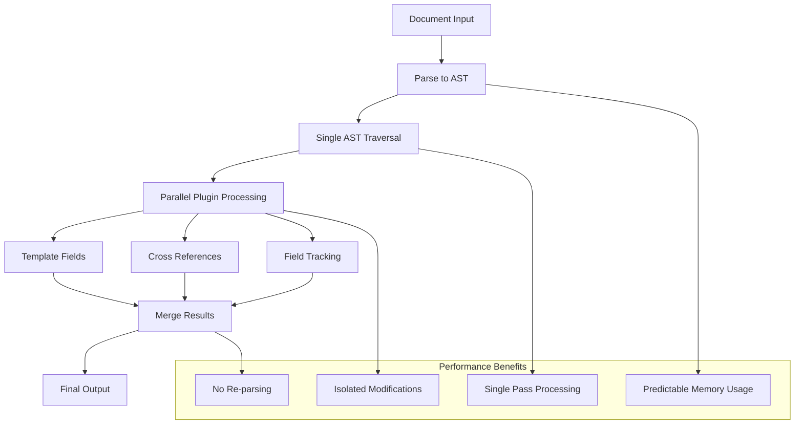
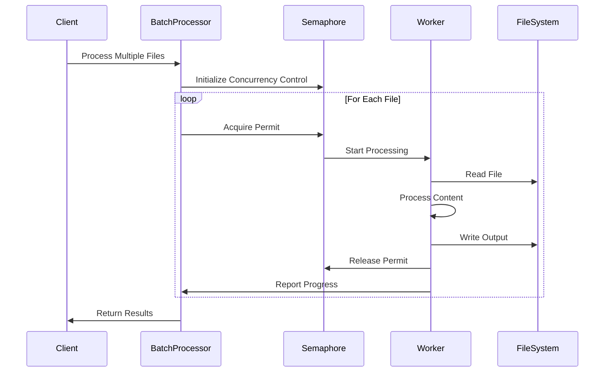
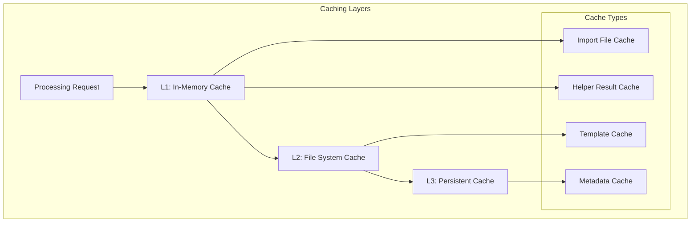

# Performance Considerations <!-- omit in toc -->

- [Overview](#overview)
- [Processing Optimization](#processing-optimization)
- [Memory Management](#memory-management)
- [Batch Processing Architecture](#batch-processing-architecture)
- [Caching Strategies](#caching-strategies)
- [Performance Monitoring](#performance-monitoring)
- [Optimization Techniques](#optimization-techniques)
- [Benchmarking and Profiling](#benchmarking-and-profiling)

## Overview

Legal Markdown JS is designed with performance as a primary consideration,
employing various optimization strategies to ensure efficient processing of
documents ranging from simple templates to complex multi-file legal documents.
The performance architecture focuses on minimizing processing time, memory
usage, and resource consumption.

## Processing Optimization

### Performance Strategies Overview



### Lazy Loading Implementation

```typescript
// Dynamic module loading for performance
class LegalMarkdown {
  private _pdfGenerator?: PDFGenerator;
  private _pandocParser?: PandocParser;

  async generatePDF(content: string, options: PDFOptions): Promise<Buffer> {
    if (!this._pdfGenerator) {
      // Load PDF generator only when needed
      const { PDFGenerator } = await import('./generators/pdf-generator');
      this._pdfGenerator = new PDFGenerator();
    }

    return this._pdfGenerator.generate(content, options);
  }

  private async loadPandocParser(): Promise<PandocParser> {
    if (!this._pandocParser) {
      try {
        const { PandocParser } = await import('./parsers/pandoc-parser');
        this._pandocParser = new PandocParser();
      } catch (error) {
        // Fallback to alternative parser
        const { FallbackParser } = await import('./parsers/fallback-parser');
        this._pandocParser = new FallbackParser() as any;
      }
    }
    return this._pandocParser;
  }
}
```

### AST Processing Efficiency

The remark-based processing provides significant performance advantages:



## Memory Management

### Memory Optimization Strategies

```typescript
// Memory-efficient processing
class MemoryOptimizedProcessor {
  private readonly maxMemoryUsage = 100 * 1024 * 1024; // 100MB
  private readonly chunkSize = 1024 * 1024; // 1MB chunks

  async processLargeDocument(filePath: string): Promise<ProcessingResult> {
    const stats = await fs.stat(filePath);

    if (stats.size > this.maxMemoryUsage) {
      return this.processInChunks(filePath);
    }

    return this.processInMemory(filePath);
  }

  private async processInChunks(filePath: string): Promise<ProcessingResult> {
    const stream = fs.createReadStream(filePath, {
      encoding: 'utf-8',
      highWaterMark: this.chunkSize,
    });

    let result = '';
    const processor = new StreamProcessor();

    for await (const chunk of stream) {
      const processed = await processor.processChunk(chunk);
      result += processed;

      // Force garbage collection if available
      if (global.gc) {
        global.gc();
      }
    }

    return { content: result };
  }
}
```

### Resource Cleanup

```typescript
// Automatic resource management
class ResourceManager {
  private resources: Set<Disposable> = new Set();

  register<T extends Disposable>(resource: T): T {
    this.resources.add(resource);
    return resource;
  }

  async cleanup(): Promise<void> {
    const cleanupPromises = Array.from(this.resources).map(resource =>
      resource.dispose()
    );

    await Promise.allSettled(cleanupPromises);
    this.resources.clear();
  }
}

// Usage with automatic cleanup
async function processWithCleanup(content: string): Promise<ProcessingResult> {
  const manager = new ResourceManager();

  try {
    const parser = manager.register(new YamlParser());
    const processor = manager.register(new TemplateProcessor());

    return await processor.process(content);
  } finally {
    await manager.cleanup();
  }
}
```

## Batch Processing Architecture

### Concurrent Processing Flow



### Batch Processing Implementation

```typescript
// High-performance batch processor
class BatchProcessor {
  private readonly maxConcurrency: number;
  private readonly semaphore: Semaphore;

  constructor(maxConcurrency = os.cpus().length) {
    this.maxConcurrency = maxConcurrency;
    this.semaphore = new Semaphore(maxConcurrency);
  }

  async processFiles(
    files: string[],
    options: ProcessingOptions
  ): Promise<BatchResult[]> {
    const results: Promise<BatchResult>[] = files.map(file =>
      this.processFileWithConcurrencyControl(file, options)
    );

    return Promise.allSettled(results).then(settled =>
      settled.map(this.handleSettledResult)
    );
  }

  private async processFileWithConcurrencyControl(
    file: string,
    options: ProcessingOptions
  ): Promise<BatchResult> {
    await this.semaphore.acquire();

    try {
      const startTime = performance.now();
      const result = await this.processSingleFile(file, options);
      const duration = performance.now() - startTime;

      return {
        file,
        success: true,
        result,
        duration,
        memoryUsage: process.memoryUsage(),
      };
    } catch (error) {
      return {
        file,
        success: false,
        error: error.message,
        duration: 0,
      };
    } finally {
      this.semaphore.release();
    }
  }
}
```

## Caching Strategies

### Multi-level Caching System



### Caching Implementation

```typescript
// Multi-level cache implementation
class ProcessingCache {
  private readonly memoryCache = new Map<string, CacheEntry>();
  private readonly maxMemoryEntries = 1000;
  private readonly ttl = 5 * 60 * 1000; // 5 minutes

  async get<T>(key: string, factory: () => Promise<T>): Promise<T> {
    // Check memory cache first
    const memoryEntry = this.memoryCache.get(key);
    if (memoryEntry && !this.isExpired(memoryEntry)) {
      return memoryEntry.value as T;
    }

    // Check file system cache
    const fsEntry = await this.getFromFileSystem(key);
    if (fsEntry && !this.isExpired(fsEntry)) {
      this.setInMemory(key, fsEntry.value);
      return fsEntry.value as T;
    }

    // Generate new value
    const value = await factory();
    this.setInMemory(key, value);
    this.setInFileSystem(key, value);

    return value;
  }

  private setInMemory<T>(key: string, value: T): void {
    // Evict oldest entries if at capacity
    if (this.memoryCache.size >= this.maxMemoryEntries) {
      const oldestKey = this.memoryCache.keys().next().value;
      this.memoryCache.delete(oldestKey);
    }

    this.memoryCache.set(key, {
      value,
      timestamp: Date.now(),
    });
  }
}
```

### Helper Function Caching

```typescript
// Cached helper execution
class CachedHelperSystem {
  private cache = new Map<string, any>();

  async executeHelper(
    helperName: string,
    args: any[],
    context: HelperContext
  ): Promise<string> {
    const cacheKey = this.generateCacheKey(helperName, args, context);

    if (this.cache.has(cacheKey)) {
      return this.cache.get(cacheKey);
    }

    const result = await this.executeHelperUncached(helperName, args, context);

    // Cache pure functions only
    if (this.isPureHelper(helperName)) {
      this.cache.set(cacheKey, result);
    }

    return result;
  }

  private isPureHelper(helperName: string): boolean {
    // Helpers that don't depend on current time or random values
    const pureHelpers = [
      'format_number',
      'format_currency',
      'uppercase',
      'lowercase',
    ];
    return pureHelpers.includes(helperName);
  }
}
```

## Performance Monitoring

### Metrics Collection

```typescript
// Performance monitoring system
class PerformanceMonitor {
  private metrics: Map<string, PerformanceMetric[]> = new Map();

  async measureAsync<T>(operation: string, fn: () => Promise<T>): Promise<T> {
    const startTime = performance.now();
    const startMemory = process.memoryUsage();

    try {
      const result = await fn();
      this.recordSuccess(operation, startTime, startMemory);
      return result;
    } catch (error) {
      this.recordError(operation, startTime, startMemory, error);
      throw error;
    }
  }

  private recordSuccess(
    operation: string,
    startTime: number,
    startMemory: NodeJS.MemoryUsage
  ): void {
    const endTime = performance.now();
    const endMemory = process.memoryUsage();

    const metric: PerformanceMetric = {
      operation,
      duration: endTime - startTime,
      memoryDelta: endMemory.heapUsed - startMemory.heapUsed,
      timestamp: Date.now(),
      success: true,
    };

    this.addMetric(operation, metric);
  }

  getStats(operation: string): OperationStats {
    const metrics = this.metrics.get(operation) || [];
    const successfulMetrics = metrics.filter(m => m.success);

    return {
      totalCalls: metrics.length,
      successfulCalls: successfulMetrics.length,
      averageDuration: this.average(successfulMetrics.map(m => m.duration)),
      medianDuration: this.median(successfulMetrics.map(m => m.duration)),
      p95Duration: this.percentile(
        successfulMetrics.map(m => m.duration),
        95
      ),
      averageMemoryDelta: this.average(
        successfulMetrics.map(m => m.memoryDelta)
      ),
    };
  }
}
```

## Optimization Techniques

### Input Validation Optimization

```typescript
// Fast input validation
class OptimizedValidator {
  private static readonly commonPatterns = {
    yamlFrontmatter: /^---\r?\n/,
    templateField: /\{\{[^}]+\}\}/g,
    reference: /\|[^|]+\|/g,
  };

  hasYamlFrontmatter(content: string): boolean {
    // Quick check without full parsing
    return OptimizedValidator.commonPatterns.yamlFrontmatter.test(content);
  }

  countTemplateFields(content: string): number {
    const matches = content.match(
      OptimizedValidator.commonPatterns.templateField
    );
    return matches ? matches.length : 0;
  }

  shouldSkipProcessing(
    content: string,
    options: LegalMarkdownOptions
  ): boolean {
    // Early exit conditions
    if (options.yamlOnly && !this.hasYamlFrontmatter(content)) {
      return true;
    }

    if (options.noMixins && this.countTemplateFields(content) === 0) {
      return true;
    }

    return false;
  }
}
```

### Stream Processing for Large Files

```typescript
// Stream-based processing for large files
class StreamProcessor {
  async processLargeFile(filePath: string): Promise<ProcessingResult> {
    const readStream = fs.createReadStream(filePath, { encoding: 'utf-8' });
    const writeStream = fs.createWriteStream(filePath + '.out');

    let buffer = '';
    const processor = new ChunkProcessor();

    readStream.on('data', async (chunk: string) => {
      buffer += chunk;

      // Process complete lines only
      const lines = buffer.split('\n');
      buffer = lines.pop() || ''; // Keep incomplete line in buffer

      for (const line of lines) {
        const processed = await processor.processLine(line);
        writeStream.write(processed + '\n');
      }
    });

    readStream.on('end', async () => {
      // Process remaining buffer
      if (buffer) {
        const processed = await processor.processLine(buffer);
        writeStream.write(processed);
      }
      writeStream.end();
    });

    return new Promise((resolve, reject) => {
      writeStream.on('finish', () => resolve({ success: true }));
      writeStream.on('error', reject);
    });
  }
}
```

## Benchmarking and Profiling

### Performance Benchmarks

```typescript
// Benchmark suite
class PerformanceBenchmark {
  async runBenchmarks(): Promise<BenchmarkResults> {
    const results: BenchmarkResults = {};

    // Small document benchmark
    results.smallDocument = await this.benchmarkSmallDocument();

    // Large document benchmark
    results.largeDocument = await this.benchmarkLargeDocument();

    // Batch processing benchmark
    results.batchProcessing = await this.benchmarkBatchProcessing();

    // Memory usage benchmark
    results.memoryUsage = await this.benchmarkMemoryUsage();

    return results;
  }

  private async benchmarkSmallDocument(): Promise<BenchmarkResult> {
    const content = this.generateTestDocument(1000); // 1KB document
    const iterations = 1000;

    const startTime = performance.now();

    for (let i = 0; i < iterations; i++) {
      await this.processor.process(content);
    }

    const duration = performance.now() - startTime;

    return {
      description: 'Small document processing',
      iterations,
      totalDuration: duration,
      averageDuration: duration / iterations,
      throughput: iterations / (duration / 1000), // ops/sec
    };
  }
}
```

### Profiling Integration

```typescript
// CPU profiling support
class Profiler {
  private profiler?: any;

  async startProfiling(name: string): Promise<void> {
    if (process.env.NODE_ENV === 'development') {
      try {
        this.profiler = require('inspector').Session();
        this.profiler.connect();
        this.profiler.post('Profiler.enable');
        this.profiler.post('Profiler.start');
      } catch (error) {
        console.warn('Profiling not available:', error.message);
      }
    }
  }

  async stopProfiling(name: string): Promise<void> {
    if (this.profiler) {
      this.profiler.post('Profiler.stop', (err: any, { profile }: any) => {
        if (!err) {
          fs.writeFileSync(
            `profile-${name}.cpuprofile`,
            JSON.stringify(profile)
          );
        }
      });
    }
  }
}
```

The performance architecture ensures Legal Markdown JS can handle documents
ranging from simple templates to complex legal documents efficiently, with
consistent performance characteristics across different usage patterns.
