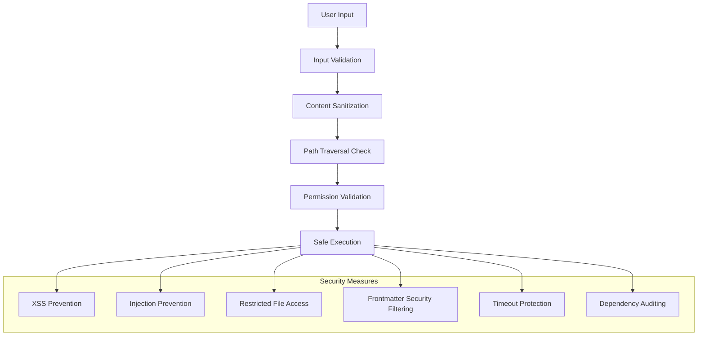

# Security Considerations <!-- omit in toc -->

- [Overview](#overview)
- [Security Architecture](#security-architecture)
- [Input Validation and Sanitization](#input-validation-and-sanitization)
- [Frontmatter Security Filtering](#frontmatter-security-filtering)
- [File System Security](#file-system-security)
- [Code Injection Prevention](#code-injection-prevention)
- [Cross-Site Scripting (XSS) Prevention](#cross-site-scripting-xss-prevention)
- [Dependency Security](#dependency-security)
- [Runtime Security Measures](#runtime-security-measures)

## Overview

Legal Markdown JS implements comprehensive security measures to protect against
various threats including code injection, path traversal, XSS attacks, and
malicious frontmatter. The security architecture follows defense-in-depth
principles with multiple layers of protection.

## Security Architecture



## Input Validation and Sanitization

### Input Validation Layer

```typescript
// Comprehensive input validation
class SecurityValidator {
  private static readonly MAX_FILE_SIZE = 10 * 1024 * 1024; // 10MB
  private static readonly MAX_IMPORT_DEPTH = 10;
  private static readonly ALLOWED_FILE_EXTENSIONS = [
    '.md',
    '.txt',
    '.markdown',
  ];

  validateInput(
    content: string,
    options: LegalMarkdownOptions
  ): ValidationResult {
    const errors: string[] = [];

    // Size validation
    if (content.length > SecurityValidator.MAX_FILE_SIZE) {
      errors.push(
        `Content size exceeds maximum allowed (${SecurityValidator.MAX_FILE_SIZE} bytes)`
      );
    }

    // Content validation
    if (this.containsMaliciousPatterns(content)) {
      errors.push('Content contains potentially malicious patterns');
    }

    // Options validation
    if (options.basePath && this.isUnsafePath(options.basePath)) {
      errors.push('Base path contains unsafe directory traversal');
    }

    return {
      valid: errors.length === 0,
      errors,
    };
  }

  private containsMaliciousPatterns(content: string): boolean {
    const maliciousPatterns = [
      /<script\b[^<]*(?:(?!<\/script>)<[^<]*)*<\/script>/gi, // Script tags
      /javascript:/i, // JavaScript URLs
      /data:.*base64/i, // Base64 data URLs
      /vbscript:/i, // VBScript URLs
      /on\w+\s*=/i, // Event handlers
      /eval\s*\(/i, // eval() calls
      /Function\s*\(/i, // Function constructor
    ];

    return maliciousPatterns.some(pattern => pattern.test(content));
  }

  private isUnsafePath(path: string): boolean {
    const normalizedPath = this.normalizePath(path);

    // Check for directory traversal attempts
    if (normalizedPath.includes('../') || normalizedPath.includes('..\\')) {
      return true;
    }

    // Check for absolute paths outside allowed directories
    if (
      Path.isAbsolute(normalizedPath) &&
      !this.isAllowedAbsolutePath(normalizedPath)
    ) {
      return true;
    }

    return false;
  }
}
```

### Content Sanitization

```typescript
// Content sanitization utilities
class ContentSanitizer {
  sanitizeForHTML(content: string): string {
    return content
      .replace(/&/g, '&amp;')
      .replace(/</g, '&lt;')
      .replace(/>/g, '&gt;')
      .replace(/"/g, '&quot;')
      .replace(/'/g, '&#x27;')
      .replace(/\//g, '&#x2F;');
  }

  sanitizeFieldValue(value: any): any {
    if (typeof value === 'string') {
      return this.sanitizeString(value);
    }

    if (Array.isArray(value)) {
      return value.map(item => this.sanitizeFieldValue(item));
    }

    if (typeof value === 'object' && value !== null) {
      const sanitized: Record<string, any> = {};
      for (const [key, val] of Object.entries(value)) {
        if (this.isAllowedFieldName(key)) {
          sanitized[key] = this.sanitizeFieldValue(val);
        }
      }
      return sanitized;
    }

    return value;
  }

  private sanitizeString(str: string): string {
    // Remove potential code injection patterns
    return str
      .replace(/<script\b[^<]*(?:(?!<\/script>)<[^<]*)*<\/script>/gi, '')
      .replace(/javascript:/gi, '')
      .replace(/vbscript:/gi, '')
      .replace(/on\w+\s*=/gi, '')
      .trim();
  }

  private isAllowedFieldName(name: string): boolean {
    // Prevent prototype pollution
    const disallowedNames = ['__proto__', 'constructor', 'prototype'];
    return !disallowedNames.includes(name);
  }
}
```

## Frontmatter Security Filtering

### Reserved Fields Protection

```typescript
// Frontmatter security system
class FrontmatterSecurity {
  private static readonly RESERVED_FIELDS = [
    'level-one',
    'level-two',
    'level-three',
    'level-four',
    'level-five',
    'level-six',
    'force_commands',
    'commands',
    'pipeline-config',
    'meta-yaml-output',
    'meta-json-output',
    '__proto__',
    'constructor',
    'prototype',
  ];

  private static readonly DANGEROUS_PATTERNS = [
    /\$\{.*\}/, // Template literals
    /`.*`/, // Backtick templates
    /eval\s*\(/, // eval calls
    /Function\s*\(/, // Function constructor
    /require\s*\(/, // require calls
    /import\s+.*from/, // import statements
  ];

  filterFrontmatter(metadata: Record<string, any>): FilterResult {
    const filtered: Record<string, any> = {};
    const violations: string[] = [];

    for (const [key, value] of Object.entries(metadata)) {
      if (this.isReservedField(key)) {
        violations.push(`Reserved field removed: ${key}`);
        continue;
      }

      if (this.containsDangerousContent(value)) {
        violations.push(`Dangerous content in field: ${key}`);
        continue;
      }

      filtered[key] = this.sanitizeValue(value);
    }

    return { filtered, violations };
  }

  private isReservedField(fieldName: string): boolean {
    return FrontmatterSecurity.RESERVED_FIELDS.includes(
      fieldName.toLowerCase()
    );
  }

  private containsDangerousContent(value: any): boolean {
    if (typeof value === 'string') {
      return FrontmatterSecurity.DANGEROUS_PATTERNS.some(pattern =>
        pattern.test(value)
      );
    }

    if (Array.isArray(value)) {
      return value.some(item => this.containsDangerousContent(item));
    }

    if (typeof value === 'object' && value !== null) {
      return Object.values(value).some(val =>
        this.containsDangerousContent(val)
      );
    }

    return false;
  }
}
```

### Frontmatter Merge Security

```typescript
// Secure frontmatter merging
class SecureFrontmatterMerger extends FrontmatterMerger {
  private readonly security = new FrontmatterSecurity();
  private readonly timeoutMs = 5000; // 5 second timeout

  async mergeSecurely(
    main: Record<string, any>,
    imports: Record<string, any>[]
  ): Promise<SecureMergeResult> {
    const startTime = Date.now();

    // Pre-filter all inputs
    const filteredMain = this.security.filterFrontmatter(main);
    const filteredImports = imports.map(imp =>
      this.security.filterFrontmatter(imp)
    );

    // Check timeout
    if (Date.now() - startTime > this.timeoutMs) {
      throw new SecurityError('Frontmatter merge timeout exceeded');
    }

    // Perform merge with size limits
    const merged = await this.performLimitedMerge(
      filteredMain.filtered,
      filteredImports.map(f => f.filtered)
    );

    return {
      merged,
      violations: [
        ...filteredMain.violations,
        ...filteredImports.flatMap(f => f.violations),
      ],
      processingTime: Date.now() - startTime,
    };
  }

  private async performLimitedMerge(
    main: Record<string, any>,
    imports: Record<string, any>[]
  ): Promise<Record<string, any>> {
    const MAX_FIELDS = 1000;
    const MAX_DEPTH = 10;

    let fieldCount = 0;

    const countFields = (obj: any, depth = 0): void => {
      if (depth > MAX_DEPTH) {
        throw new SecurityError('Object nesting depth exceeded');
      }

      if (typeof obj === 'object' && obj !== null) {
        for (const value of Object.values(obj)) {
          fieldCount++;
          if (fieldCount > MAX_FIELDS) {
            throw new SecurityError('Field count limit exceeded');
          }
          countFields(value, depth + 1);
        }
      }
    };

    // Count fields in all inputs
    countFields(main);
    imports.forEach(imp => countFields(imp));

    // Perform actual merge
    return super.mergeFlattened(main, imports);
  }
}
```

## File System Security

### Path Traversal Prevention

```typescript
// Secure file system operations
class SecureFileSystem {
  private readonly allowedBasePaths: Set<string>;
  private readonly maxFileSize = 10 * 1024 * 1024; // 10MB

  constructor(allowedBasePaths: string[] = []) {
    this.allowedBasePaths = new Set(
      allowedBasePaths.map(path => Path.resolve(path))
    );
  }

  async readSecurely(filePath: string, basePath?: string): Promise<string> {
    const sanitizedPath = this.sanitizePath(filePath, basePath);

    // Validate path is within allowed directories
    if (!this.isPathAllowed(sanitizedPath)) {
      throw new SecurityError(`Access denied: ${filePath}`);
    }

    // Check file exists and is readable
    await this.validateFileAccess(sanitizedPath);

    // Check file size
    const stats = await fs.stat(sanitizedPath);
    if (stats.size > this.maxFileSize) {
      throw new SecurityError(`File too large: ${filePath}`);
    }

    return fs.readFile(sanitizedPath, 'utf-8');
  }

  private sanitizePath(filePath: string, basePath?: string): string {
    // Remove null bytes and other dangerous characters
    const cleaned = filePath.replace(/\0/g, '').replace(/[<>:"|?*]/g, '');

    // Resolve relative paths
    if (basePath) {
      return Path.resolve(basePath, cleaned);
    }

    return Path.resolve(cleaned);
  }

  private isPathAllowed(resolvedPath: string): boolean {
    // If no allowed paths specified, only allow current directory and subdirectories
    if (this.allowedBasePaths.size === 0) {
      const currentDir = process.cwd();
      return resolvedPath.startsWith(currentDir);
    }

    // Check if path is within any allowed base path
    return Array.from(this.allowedBasePaths).some(basePath =>
      resolvedPath.startsWith(basePath)
    );
  }

  private async validateFileAccess(filePath: string): Promise<void> {
    try {
      await fs.access(filePath, fs.constants.R_OK);
    } catch (error) {
      throw new SecurityError(`Cannot read file: ${filePath}`);
    }
  }
}
```

## Code Injection Prevention

### Template Security

```typescript
// Secure template processing
class SecureTemplateProcessor {
  private readonly allowedHelpers = new Set([
    'date_helper',
    'format_number',
    'uppercase',
    'lowercase',
    'format_currency',
    'pluralize',
  ]);

  processTemplate(template: string, context: TemplateContext): string {
    // Parse template safely
    const ast = this.parseTemplateSafely(template);

    // Process with restricted context
    return this.processAST(ast, this.createSecureContext(context));
  }

  private parseTemplateSafely(template: string): TemplateAST {
    // Remove potentially dangerous expressions
    const sanitized = template
      .replace(/\$\{.*?\}/g, '') // Template literals
      .replace(/`.*?`/g, '') // Backticks
      .replace(/eval\s*\(/g, '') // eval calls
      .replace(/Function\s*\(/g, ''); // Function constructor

    return this.parser.parse(sanitized);
  }

  private createSecureContext(context: TemplateContext): SecureContext {
    return {
      ...context,
      // Restrict available functions
      helpers: this.filterHelpers(context.helpers),
      // Prevent access to dangerous globals
      global: undefined,
      process: undefined,
      require: undefined,
      module: undefined,
      exports: undefined,
    };
  }

  private filterHelpers(
    helpers: Record<string, Function>
  ): Record<string, Function> {
    const filtered: Record<string, Function> = {};

    for (const [name, func] of Object.entries(helpers)) {
      if (this.allowedHelpers.has(name)) {
        filtered[name] = this.wrapHelper(func);
      }
    }

    return filtered;
  }

  private wrapHelper(helper: Function): Function {
    return (...args: any[]) => {
      // Validate arguments
      if (args.some(arg => this.isDangerous(arg))) {
        throw new SecurityError('Dangerous argument passed to helper');
      }

      // Execute with timeout
      return this.executeWithTimeout(helper, args, 1000); // 1 second timeout
    };
  }
}
```

## Cross-Site Scripting (XSS) Prevention

### HTML Output Sanitization

```typescript
// XSS prevention for HTML output
class XSSPrevention {
  private static readonly DANGEROUS_TAGS = [
    'script',
    'object',
    'embed',
    'iframe',
    'frame',
    'frameset',
    'applet',
    'base',
    'meta',
    'link',
  ];

  private static readonly DANGEROUS_ATTRIBUTES = [
    'onload',
    'onerror',
    'onclick',
    'onmouseover',
    'onfocus',
    'onblur',
    'onchange',
    'onsubmit',
    'href',
    'src',
  ];

  sanitizeHTML(html: string): string {
    return this.removeDangerousTags(
      this.removeDangerousAttributes(this.escapeScriptContent(html))
    );
  }

  private escapeScriptContent(html: string): string {
    return html.replace(
      /<script\b[^<]*(?:(?!<\/script>)<[^<]*)*<\/script>/gi,
      match => `<!-- Script removed for security: ${this.sanitize(match)} -->`
    );
  }

  private removeDangerousTags(html: string): string {
    const tagPattern = new RegExp(
      `<\\/?(?:${XSSPrevention.DANGEROUS_TAGS.join('|')})\\b[^>]*>`,
      'gi'
    );

    return html.replace(tagPattern, '');
  }

  private removeDangerousAttributes(html: string): string {
    const attrPattern = new RegExp(
      `\\s(?:${XSSPrevention.DANGEROUS_ATTRIBUTES.join('|')})\\s*=\\s*["'][^"']*["']`,
      'gi'
    );

    return html.replace(attrPattern, '');
  }

  private sanitize(content: string): string {
    return (
      content.replace(/</g, '&lt;').replace(/>/g, '&gt;').substring(0, 100) +
      '...'
    );
  }
}
```

## Dependency Security

### Vulnerability Scanning

```typescript
// Dependency security monitoring
class DependencySecurity {
  private vulnerabilities: Map<string, VulnerabilityInfo> = new Map();

  async scanDependencies(): Promise<SecurityReport> {
    const packageJson = await this.readPackageJson();
    const report: SecurityReport = {
      totalDependencies: 0,
      vulnerabilities: [],
      recommendations: [],
    };

    // Scan production dependencies
    for (const [name, version] of Object.entries(
      packageJson.dependencies || {}
    )) {
      const vulns = await this.checkVulnerabilities(name, version);
      report.vulnerabilities.push(...vulns);
      report.totalDependencies++;
    }

    // Scan development dependencies
    for (const [name, version] of Object.entries(
      packageJson.devDependencies || {}
    )) {
      const vulns = await this.checkVulnerabilities(name, version);
      if (vulns.length > 0) {
        report.recommendations.push(`Update dev dependency: ${name}`);
      }
    }

    return report;
  }

  private async checkVulnerabilities(
    packageName: string,
    version: string
  ): Promise<VulnerabilityInfo[]> {
    // Check against known vulnerability databases
    // Implementation would integrate with npm audit, Snyk, or similar
    return [];
  }
}
```

## Runtime Security Measures

### Timeout Protection

```typescript
// Runtime security enforcement
class RuntimeSecurity {
  private readonly defaultTimeout = 30000; // 30 seconds
  private readonly maxMemoryUsage = 100 * 1024 * 1024; // 100MB

  async executeSecurely<T>(
    operation: () => Promise<T>,
    options: SecurityOptions = {}
  ): Promise<T> {
    const timeout = options.timeout || this.defaultTimeout;
    const maxMemory = options.maxMemory || this.maxMemoryUsage;

    return new Promise((resolve, reject) => {
      const startMemory = process.memoryUsage().heapUsed;

      // Set timeout
      const timeoutId = setTimeout(() => {
        reject(new SecurityError('Operation timeout exceeded'));
      }, timeout);

      // Monitor memory usage
      const memoryMonitor = setInterval(() => {
        const currentMemory = process.memoryUsage().heapUsed;
        if (currentMemory - startMemory > maxMemory) {
          clearInterval(memoryMonitor);
          clearTimeout(timeoutId);
          reject(new SecurityError('Memory usage limit exceeded'));
        }
      }, 1000);

      // Execute operation
      operation()
        .then(result => {
          clearTimeout(timeoutId);
          clearInterval(memoryMonitor);
          resolve(result);
        })
        .catch(error => {
          clearTimeout(timeoutId);
          clearInterval(memoryMonitor);
          reject(error);
        });
    });
  }
}

// Custom security error class
class SecurityError extends Error {
  constructor(message: string) {
    super(message);
    this.name = 'SecurityError';
  }
}
```

The comprehensive security architecture ensures Legal Markdown JS can safely
process untrusted input while maintaining functionality and performance,
providing multiple layers of protection against various attack vectors.
