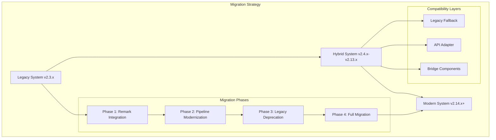
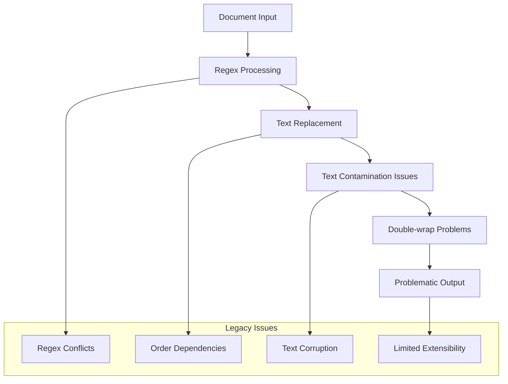
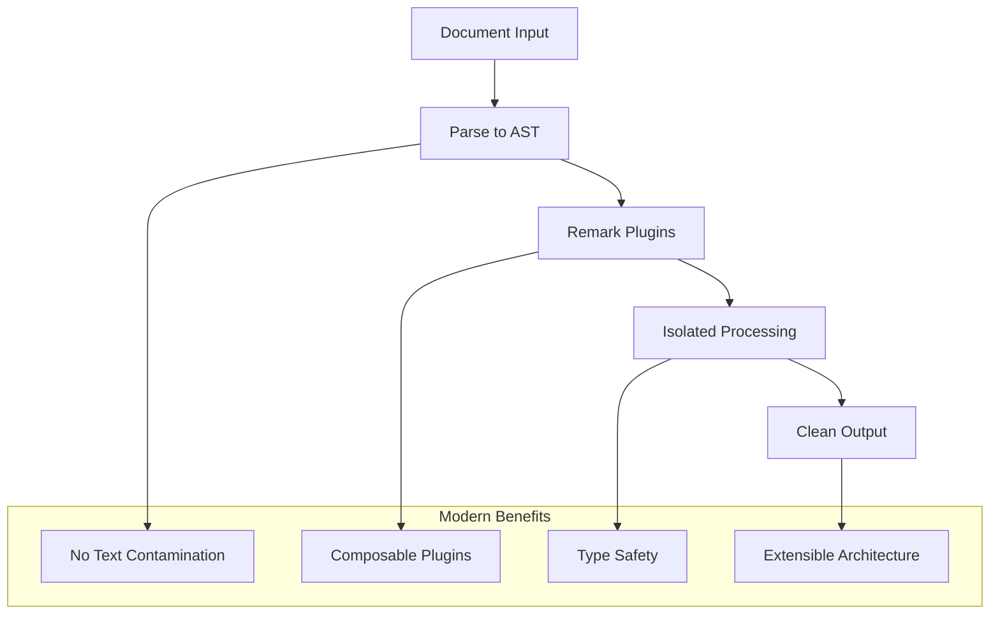
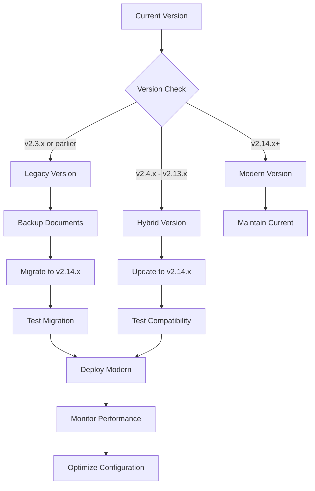

# Migration Strategy <!-- omit in toc -->

- [Overview](#overview)
- [Migration Architecture](#migration-architecture)
- [Legacy to Remark Migration](#legacy-to-remark-migration)
- [Frontmatter System Migration](#frontmatter-system-migration)
- [Pipeline System Migration](#pipeline-system-migration)
- [Breaking Changes Management](#breaking-changes-management)
- [Backward Compatibility](#backward-compatibility)
- [Migration Tools and Utilities](#migration-tools-and-utilities)
- [Version Upgrade Paths](#version-upgrade-paths)

## Overview

Legal Markdown JS has undergone significant architectural evolution from a
legacy regex-based system to a modern AST-based remark processor. The migration
strategy ensures smooth transitions between versions while maintaining backward
compatibility where possible and providing clear upgrade paths for breaking
changes.

## Migration Architecture



## Legacy to Remark Migration

### Processing Architecture Evolution

The migration from legacy regex-based processing to remark-based AST processing
represents the most significant architectural change:

#### Legacy Processing (v2.3.x and earlier)



#### Modern Processing (v2.14.x+)



### Migration Implementation

```typescript
// Migration manager for processing systems
class ProcessingMigration {
  private useRemark = true;
  private fallbackToLegacy = true;

  async process(
    content: string,
    options: LegalMarkdownOptions
  ): Promise<ProcessingResult> {
    if (this.useRemark) {
      try {
        return await this.processWithRemark(content, options);
      } catch (error) {
        if (this.fallbackToLegacy) {
          console.warn(
            'Remark processing failed, falling back to legacy:',
            error.message
          );
          return await this.processWithLegacy(content, options);
        }
        throw error;
      }
    }

    return await this.processWithLegacy(content, options);
  }

  private async processWithRemark(
    content: string,
    options: LegalMarkdownOptions
  ): Promise<ProcessingResult> {
    const processor = new RemarkLegalMarkdownProcessor();
    return processor.process(content, options);
  }

  private async processWithLegacy(
    content: string,
    options: LegalMarkdownOptions
  ): Promise<ProcessingResult> {
    const processor = new LegacyProcessor();
    return processor.process(content, options);
  }
}
```

## Frontmatter System Migration

### Enhanced Frontmatter Merging

The migration introduced advanced frontmatter merging capabilities:

#### Legacy Frontmatter (v2.3.x)

```yaml
# Simple frontmatter only
---
title: Document Title
author: John Doe
---
```

#### Modern Frontmatter (v2.14.x+)

```yaml
# Enhanced frontmatter with import merging
---
title: Document Title
author: John Doe

# Import external metadata
imports:
  - client-data.yaml
  - project-settings.yaml

# Security filtering applied automatically
# Reserved fields filtered out
# Type validation available
---
```

### Migration Path for Frontmatter

```typescript
// Frontmatter migration utility
class FrontmatterMigration {
  migrateDocument(legacyContent: string): MigrationResult {
    const { frontmatter, content } = this.parseLegacyDocument(legacyContent);

    // Convert legacy frontmatter to modern format
    const modernFrontmatter = this.upgradeFrontmatter(frontmatter);

    // Add security enhancements
    const securedFrontmatter = this.addSecurityFeatures(modernFrontmatter);

    // Reconstruct document
    const modernContent = this.reconstructDocument(securedFrontmatter, content);

    return {
      modernContent,
      changes: this.identifyChanges(frontmatter, securedFrontmatter),
      warnings: this.generateWarnings(frontmatter),
    };
  }

  private upgradeFrontmatter(legacy: Record<string, any>): Record<string, any> {
    const modern = { ...legacy };

    // Convert deprecated field names
    if (legacy.yaml_output) {
      modern['meta-yaml-output'] = legacy.yaml_output;
      delete modern.yaml_output;
    }

    if (legacy.json_output) {
      modern['meta-json-output'] = legacy.json_output;
      delete modern.json_output;
    }

    return modern;
  }
}
```

## Pipeline System Migration

### Enhanced Pipeline Architecture

The migration introduced a sophisticated pipeline system:

#### Legacy Processing Order (Fixed)

```typescript
// Fixed processing order in legacy system
const legacyOrder = [
  'rst-conversion',
  'latex-conversion',
  'yaml-parsing',
  'import-processing',
  'clause-processing',
  'reference-processing',
  'mixin-processing',
  'header-processing',
];
```

#### Modern Pipeline System (Configurable)

```typescript
// Configurable pipeline with dependency management
class ModernPipeline {
  private steps = new Map<string, PipelineStep>();

  constructor() {
    this.registerDefaultSteps();
  }

  private registerDefaultSteps(): void {
    this.addStep({
      name: 'yaml-processing',
      processor: new YamlProcessor(),
      order: 1,
      dependencies: [],
    });

    this.addStep({
      name: 'template-loops',
      processor: new TemplateLoopsProcessor(),
      order: 7,
      dependencies: ['yaml-processing'],
    });

    this.addStep({
      name: 'ast-mixins',
      processor: new ASTMixinProcessor(),
      order: 8,
      dependencies: ['template-loops'],
    });

    this.addStep({
      name: 'field-tracking',
      processor: new FieldTrackingProcessor(),
      order: 9,
      dependencies: ['ast-mixins'],
    });
  }
}
```

### Pipeline Migration Utility

```typescript
// Migrate legacy processing options to modern pipeline
class PipelineMigration {
  migrateLegacyOptions(legacyOptions: LegacyOptions): PipelineConfig {
    const config: PipelineConfig = {
      steps: new Map(),
      enabledSteps: [],
      disabledSteps: [],
    };

    // Map legacy boolean flags to pipeline steps
    if (legacyOptions.noHeaders) {
      config.disabledSteps.push('header-processing');
    }

    if (legacyOptions.noClauses) {
      config.disabledSteps.push('clause-processing');
    }

    if (legacyOptions.noReferences) {
      config.disabledSteps.push('reference-processing');
    }

    if (legacyOptions.noImports) {
      config.disabledSteps.push('import-processing');
    }

    if (legacyOptions.noMixins) {
      config.disabledSteps.push('template-processing');
    }

    return config;
  }
}
```

## Breaking Changes Management

### Version 2.14.x Breaking Changes

The major migration to v2.14.x introduced several breaking changes:

#### API Changes

```typescript
// Legacy API (v2.3.x)
interface LegacyAPI {
  process(content: string, options?: any): string;
  processFile(inputPath: string, outputPath: string): void;
}

// Modern API (v2.14.x+)
interface ModernAPI {
  process(
    content: string,
    options?: LegalMarkdownOptions
  ): Promise<ProcessingResult>;
  processFile(
    inputPath: string,
    options?: ProcessingOptions
  ): Promise<FileProcessingResult>;
}
```

#### Option Changes

```typescript
// Legacy options mapping
class OptionsUpgrade {
  upgradeLegacyOptions(legacy: any): LegalMarkdownOptions {
    const modern: LegalMarkdownOptions = {};

    // Direct mappings
    modern.debug = legacy.debug;
    modern.noHeaders = legacy.no_headers;
    modern.noClauses = legacy.no_clauses;

    // Renamed options
    modern.disableFrontmatterMerge = legacy.disable_frontmatter_merge;
    modern.validateImportTypes = legacy.validate_import_types;
    modern.logImportOperations = legacy.log_import_operations;

    // New options with defaults
    modern.enableFieldTracking = legacy.enable_field_tracking ?? false;
    modern.toMarkdown = legacy.to_markdown ?? false;

    return modern;
  }
}
```

## Backward Compatibility

### Compatibility Layer

```typescript
// Backward compatibility wrapper
class LegacyCompatibilityWrapper {
  private modernProcessor: LegalMarkdown;

  constructor() {
    this.modernProcessor = new LegalMarkdown();
  }

  // Legacy synchronous API
  process(content: string, options?: any): string {
    const modernOptions = this.upgradeLegacyOptions(options);

    // Convert async to sync (with warning)
    console.warn('Synchronous API is deprecated. Use async process() instead.');

    let result: string;
    this.modernProcessor
      .process(content, modernOptions)
      .then(res => {
        result = res.content;
      })
      .catch(err => {
        throw err;
      });

    // Note: This is a simplified example - real implementation would use deasync or similar
    return result!;
  }

  // Legacy file processing API
  processFile(inputPath: string, outputPath: string, options?: any): void {
    const modernOptions = {
      ...this.upgradeLegacyOptions(options),
      output: outputPath,
    };

    this.modernProcessor.processFile(inputPath, modernOptions).catch(error => {
      throw error;
    });
  }
}
```

### Feature Flags for Migration

```typescript
// Feature flags for gradual migration
class FeatureFlags {
  private flags = new Map<string, boolean>();

  constructor() {
    // Default feature flags for migration
    this.flags.set('use-remark-processing', true);
    this.flags.set('enable-frontmatter-merge', true);
    this.flags.set('enable-pipeline-system', true);
    this.flags.set('enable-field-tracking', false);
    this.flags.set('legacy-fallback', true);
  }

  isEnabled(feature: string): boolean {
    return this.flags.get(feature) ?? false;
  }

  setFlag(feature: string, enabled: boolean): void {
    this.flags.set(feature, enabled);
  }
}
```

## Migration Tools and Utilities

### Document Migration Tool

```typescript
// CLI tool for migrating documents
class DocumentMigrationTool {
  async migrateDirectory(
    inputDir: string,
    outputDir: string
  ): Promise<MigrationReport> {
    const files = await this.findLegalMarkdownFiles(inputDir);
    const report: MigrationReport = {
      totalFiles: files.length,
      migratedFiles: 0,
      errors: [],
      warnings: [],
    };

    for (const file of files) {
      try {
        const result = await this.migrateFile(file, outputDir);
        report.migratedFiles++;
        report.warnings.push(...result.warnings);
      } catch (error) {
        report.errors.push({
          file,
          error: error.message,
        });
      }
    }

    return report;
  }

  private async migrateFile(
    inputPath: string,
    outputDir: string
  ): Promise<FileMigrationResult> {
    const content = await fs.readFile(inputPath, 'utf-8');
    const migration = new FrontmatterMigration();

    const result = migration.migrateDocument(content);

    const outputPath = path.join(outputDir, path.basename(inputPath));
    await fs.writeFile(outputPath, result.modernContent);

    return {
      inputPath,
      outputPath,
      changes: result.changes,
      warnings: result.warnings,
    };
  }
}
```

### Configuration Migration

```typescript
// Migrate configuration files
class ConfigMigration {
  migrateConfig(legacyConfig: any): ModernConfig {
    const modern: ModernConfig = {
      processing: {},
      output: {},
      security: {},
    };

    // Processing options
    modern.processing.enableRemark = true;
    modern.processing.fallbackToLegacy = legacyConfig.fallback ?? true;
    modern.processing.enableFieldTracking =
      legacyConfig.field_tracking ?? false;

    // Output options
    modern.output.formats = legacyConfig.output_formats ?? ['html'];
    modern.output.css = legacyConfig.css_path;
    modern.output.highlight = legacyConfig.highlight ?? false;

    // Security options
    modern.security.enableFrontmatterFiltering = true;
    modern.security.validateImports = legacyConfig.validate_imports ?? false;
    modern.security.maxFileSize =
      legacyConfig.max_file_size ?? 10 * 1024 * 1024;

    return modern;
  }
}
```

## Version Upgrade Paths

### Recommended Upgrade Strategy



### Step-by-Step Migration Guide

1. **Assessment Phase**
   - Inventory existing documents and templates
   - Identify custom processing logic
   - Review integration points

2. **Preparation Phase**
   - Backup all documents and configurations
   - Set up test environment
   - Install migration tools

3. **Migration Phase**
   - Run document migration tool
   - Update configuration files
   - Test migrated documents

4. **Validation Phase**
   - Compare output between versions
   - Validate field tracking reports
   - Test performance benchmarks

5. **Deployment Phase**
   - Deploy to staging environment
   - Run integration tests
   - Deploy to production

6. **Monitoring Phase**
   - Monitor processing performance
   - Track error rates
   - Collect user feedback

The migration strategy ensures smooth transitions while maximizing the benefits
of the modern remark-based architecture and new features like enhanced
frontmatter merging and field tracking.
