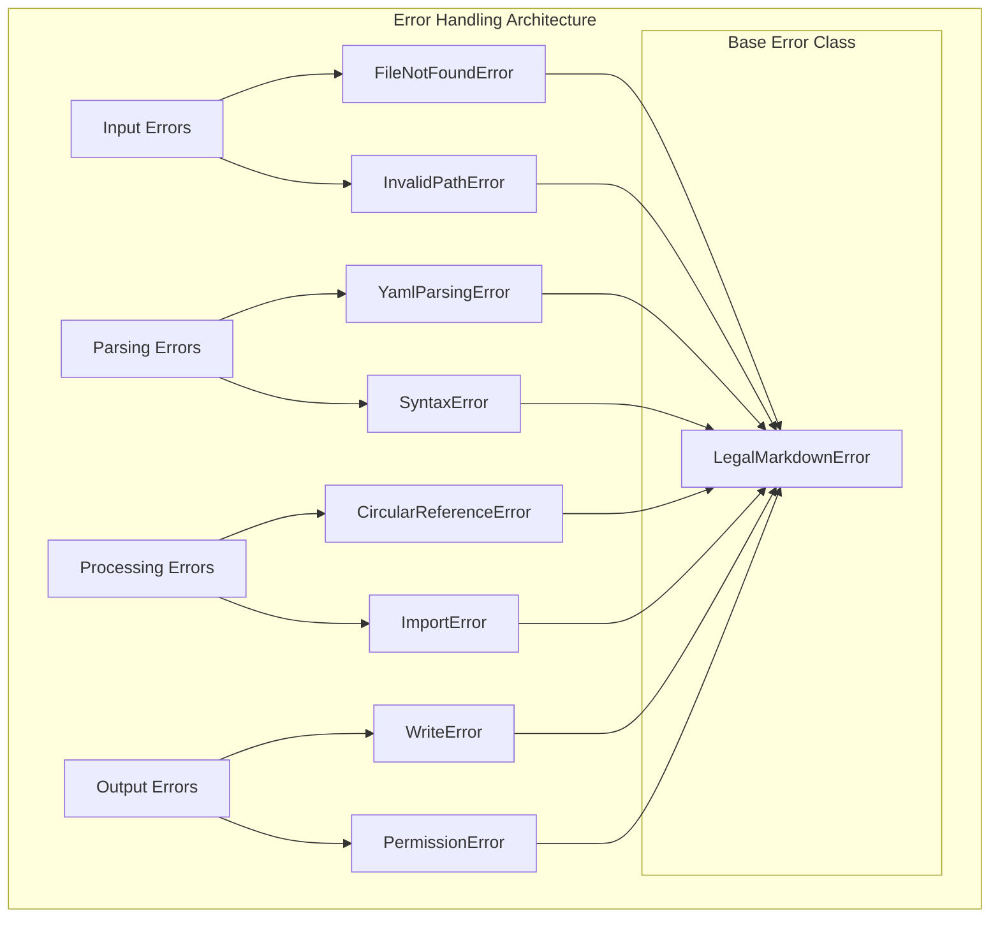

# Error Handling Strategy <!-- omit in toc -->

- [Overview](#overview)
- [Error Handling Architecture](#error-handling-architecture)
- [Error Classification](#error-classification)
- [Error Recovery Mechanisms](#error-recovery-mechanisms)
- [Logging and Debugging](#logging-and-debugging)
- [Common Issues and Solutions](#common-issues-and-solutions)
- [Diagnostic Tools](#diagnostic-tools)
- [Performance Troubleshooting](#performance-troubleshooting)
- [Support and Debugging Guidelines](#support-and-debugging-guidelines)

## Overview

Legal Markdown JS implements a comprehensive error handling strategy that
provides clear diagnostics, graceful degradation, and effective recovery
mechanisms. The error handling architecture ensures that processing issues are
caught early, reported clearly, and resolved efficiently.

## Error Handling Architecture



## Error Classification

### Error Type Hierarchy

```typescript
// Base error class for Legal Markdown
abstract class LegalMarkdownError extends Error {
  public readonly code: string;
  public readonly context: ErrorContext;
  public readonly recoverable: boolean;

  constructor(
    message: string,
    code: string,
    context: ErrorContext = {},
    recoverable = false
  ) {
    super(message);
    this.name = this.constructor.name;
    this.code = code;
    this.context = context;
    this.recoverable = recoverable;

    // Maintain proper stack trace
    if (Error.captureStackTrace) {
      Error.captureStackTrace(this, this.constructor);
    }
  }

  toJSON(): ErrorInfo {
    return {
      name: this.name,
      message: this.message,
      code: this.code,
      context: this.context,
      recoverable: this.recoverable,
      stack: this.stack,
    };
  }
}

interface ErrorContext {
  file?: string;
  line?: number;
  column?: number;
  step?: string;
  field?: string;
  [key: string]: any;
}
```

### Specific Error Types

```typescript
// Input and validation errors
class FileNotFoundError extends LegalMarkdownError {
  constructor(filePath: string) {
    super(
      `File not found: ${filePath}`,
      'FILE_NOT_FOUND',
      { file: filePath },
      false
    );
  }
}

class InvalidPathError extends LegalMarkdownError {
  constructor(path: string, reason: string) {
    super(
      `Invalid path: ${path} (${reason})`,
      'INVALID_PATH',
      { path, reason },
      false
    );
  }
}

// Parsing errors
class YamlParsingError extends LegalMarkdownError {
  constructor(yamlContent: string, originalError: Error, line?: number) {
    super(
      `YAML parsing failed: ${originalError.message}`,
      'YAML_PARSING_ERROR',
      { yamlContent, line, originalError: originalError.message },
      true
    );
  }
}

class SyntaxError extends LegalMarkdownError {
  constructor(content: string, line: number, column: number, expected: string) {
    super(
      `Syntax error at line ${line}, column ${column}: expected ${expected}`,
      'SYNTAX_ERROR',
      { content, line, column, expected },
      true
    );
  }
}

// Processing errors
class CircularReferenceError extends LegalMarkdownError {
  constructor(chain: string[]) {
    super(
      `Circular reference detected: ${chain.join(' -> ')}`,
      'CIRCULAR_REFERENCE',
      { chain },
      false
    );
  }
}

class ImportError extends LegalMarkdownError {
  constructor(importPath: string, reason: string) {
    super(
      `Import failed for ${importPath}: ${reason}`,
      'IMPORT_ERROR',
      { importPath, reason },
      true
    );
  }
}

class TemplateError extends LegalMarkdownError {
  constructor(template: string, field: string, reason: string) {
    super(
      `Template processing failed for field '${field}': ${reason}`,
      'TEMPLATE_ERROR',
      { template, field, reason },
      true
    );
  }
}

// Output errors
class WriteError extends LegalMarkdownError {
  constructor(outputPath: string, reason: string) {
    super(
      `Failed to write output to ${outputPath}: ${reason}`,
      'WRITE_ERROR',
      { outputPath, reason },
      true
    );
  }
}

class PermissionError extends LegalMarkdownError {
  constructor(path: string, operation: string) {
    super(
      `Permission denied for ${operation} on ${path}`,
      'PERMISSION_ERROR',
      { path, operation },
      false
    );
  }
}
```

## Error Recovery Mechanisms

### Graceful Degradation

```typescript
// Error recovery manager
class ErrorRecoveryManager {
  private fallbackStrategies = new Map<string, FallbackStrategy>();

  constructor() {
    this.registerDefaultFallbacks();
  }

  async handleError<T>(
    error: LegalMarkdownError,
    context: ProcessingContext,
    fallbackValue?: T
  ): Promise<ErrorRecoveryResult<T>> {
    // Log the error
    this.logError(error, context);

    // Check if error is recoverable
    if (!error.recoverable) {
      return {
        recovered: false,
        value: fallbackValue,
        error,
        strategy: 'none',
      };
    }

    // Try recovery strategies
    const strategy = this.fallbackStrategies.get(error.code);
    if (strategy) {
      try {
        const result = await strategy.recover(error, context);
        return {
          recovered: true,
          value: result,
          error,
          strategy: strategy.name,
        };
      } catch (recoveryError) {
        // Recovery failed, use fallback
        return {
          recovered: false,
          value: fallbackValue,
          error: recoveryError as LegalMarkdownError,
          strategy: 'fallback',
        };
      }
    }

    return {
      recovered: false,
      value: fallbackValue,
      error,
      strategy: 'none',
    };
  }

  private registerDefaultFallbacks(): void {
    // YAML parsing fallback
    this.fallbackStrategies.set('YAML_PARSING_ERROR', {
      name: 'yaml-fallback',
      async recover(error: YamlParsingError, context: ProcessingContext) {
        // Try to extract partial YAML or return empty metadata
        return {};
      },
    });

    // Import error fallback
    this.fallbackStrategies.set('IMPORT_ERROR', {
      name: 'import-fallback',
      async recover(error: ImportError, context: ProcessingContext) {
        // Continue processing without the failed import
        context.warnings.push(`Skipped import: ${error.context.importPath}`);
        return context.content;
      },
    });

    // Template error fallback
    this.fallbackStrategies.set('TEMPLATE_ERROR', {
      name: 'template-fallback',
      async recover(error: TemplateError, context: ProcessingContext) {
        // Leave template placeholder unchanged
        return context.content.replace(
          error.context.template,
          `{{${error.context.field}}}`
        );
      },
    });
  }
}
```

### Pipeline Error Handling

```typescript
// Pipeline with error recovery
class ResilientPipeline extends PipelineManager {
  async execute(
    content: string,
    metadata: Record<string, any>,
    options: PipelineOptions
  ): Promise<PipelineResult> {
    const result: PipelineResult = {
      success: true,
      content,
      metadata,
      stepResults: [],
      totalDuration: 0,
      errors: [],
      warnings: [],
    };

    const steps = this.getOrderedSteps();
    let currentContent = content;
    let currentMetadata = { ...metadata };

    for (const step of steps) {
      try {
        const stepResult = await this.executeStepWithRecovery(
          step,
          currentContent,
          currentMetadata,
          options
        );

        result.stepResults.push(stepResult);

        if (stepResult.success) {
          currentContent = stepResult.content || currentContent;
          currentMetadata = { ...currentMetadata, ...stepResult.metadata };
        } else {
          // Step failed but pipeline continues
          result.warnings.push(
            `Step '${step.name}' failed but processing continued`
          );
          result.errors.push(...stepResult.errors);
        }
      } catch (error) {
        const stepError = error as LegalMarkdownError;

        if (step.required && !stepError.recoverable) {
          // Critical step failed, abort pipeline
          result.success = false;
          result.errors.push(stepError);
          break;
        } else {
          // Non-critical step failed, continue
          result.warnings.push(
            `Non-critical step '${step.name}' failed: ${stepError.message}`
          );
          result.errors.push(stepError);
        }
      }
    }

    result.content = currentContent;
    result.metadata = currentMetadata;

    return result;
  }
}
```

## Logging and Debugging

### Comprehensive Logging System

```typescript
// Advanced logging for debugging
class LegalMarkdownLogger {
  private logLevel: LogLevel;
  private loggers: Logger[] = [];

  constructor(level: LogLevel = LogLevel.INFO) {
    this.logLevel = level;
    this.setupDefaultLoggers();
  }

  debug(message: string, context?: LogContext): void {
    this.log(LogLevel.DEBUG, message, context);
  }

  info(message: string, context?: LogContext): void {
    this.log(LogLevel.INFO, message, context);
  }

  warn(message: string, context?: LogContext): void {
    this.log(LogLevel.WARN, message, context);
  }

  error(message: string, error?: Error, context?: LogContext): void {
    const errorContext = {
      ...context,
      error: error
        ? {
            name: error.name,
            message: error.message,
            stack: error.stack,
          }
        : undefined,
    };
    this.log(LogLevel.ERROR, message, errorContext);
  }

  private log(level: LogLevel, message: string, context?: LogContext): void {
    if (level < this.logLevel) return;

    const logEntry: LogEntry = {
      timestamp: new Date().toISOString(),
      level: LogLevel[level],
      message,
      context: context || {},
      pid: process.pid,
    };

    this.loggers.forEach(logger => logger.log(logEntry));
  }

  private setupDefaultLoggers(): void {
    // Console logger
    this.loggers.push(new ConsoleLogger());

    // File logger (if configured)
    if (process.env.LOG_FILE) {
      this.loggers.push(new FileLogger(process.env.LOG_FILE));
    }

    // Remote logger (if configured)
    if (process.env.LOG_ENDPOINT) {
      this.loggers.push(new RemoteLogger(process.env.LOG_ENDPOINT));
    }
  }
}

enum LogLevel {
  DEBUG = 0,
  INFO = 1,
  WARN = 2,
  ERROR = 3,
}

interface LogContext {
  file?: string;
  step?: string;
  field?: string;
  duration?: number;
  memoryUsage?: NodeJS.MemoryUsage;
  [key: string]: any;
}
```

### Debug Mode Implementation

```typescript
// Enhanced debugging capabilities
class DebugManager {
  private debugMode = false;
  private debugInfo: DebugInfo = {
    steps: [],
    timing: {},
    memory: {},
    errors: [],
  };

  enableDebug(): void {
    this.debugMode = true;
    this.debugInfo = { steps: [], timing: {}, memory: {}, errors: [] };
  }

  debugStep(stepName: string, fn: () => Promise<any>): Promise<any> {
    if (!this.debugMode) return fn();

    const startTime = performance.now();
    const startMemory = process.memoryUsage();

    return fn()
      .then(result => {
        this.recordStepSuccess(stepName, startTime, startMemory);
        return result;
      })
      .catch(error => {
        this.recordStepError(stepName, startTime, startMemory, error);
        throw error;
      });
  }

  getDebugReport(): DebugReport {
    return {
      summary: {
        totalSteps: this.debugInfo.steps.length,
        successfulSteps: this.debugInfo.steps.filter(s => s.success).length,
        totalDuration: Object.values(this.debugInfo.timing).reduce(
          (a, b) => a + b,
          0
        ),
        peakMemory: Math.max(
          ...Object.values(this.debugInfo.memory).map(m => m.heapUsed)
        ),
      },
      steps: this.debugInfo.steps,
      timing: this.debugInfo.timing,
      memory: this.debugInfo.memory,
      errors: this.debugInfo.errors,
    };
  }
}
```

## Common Issues and Solutions

### Troubleshooting Guide

```typescript
// Common issue diagnostics
class TroubleshootingDiagnostics {
  async diagnoseCommonIssues(
    content: string,
    options: LegalMarkdownOptions,
    error?: Error
  ): Promise<DiagnosticReport> {
    const issues: DiagnosticIssue[] = [];

    // Check for common YAML issues
    if (this.hasYamlFrontmatter(content)) {
      const yamlIssues = await this.diagnoseYamlIssues(content);
      issues.push(...yamlIssues);
    }

    // Check for template field issues
    const templateIssues = this.diagnoseTemplateIssues(content, options);
    issues.push(...templateIssues);

    // Check for import issues
    const importIssues = await this.diagnoseImportIssues(content, options);
    issues.push(...importIssues);

    // Check for file system issues
    const fileIssues = await this.diagnoseFileSystemIssues(options);
    issues.push(...fileIssues);

    return {
      issues,
      recommendations: this.generateRecommendations(issues),
      quickFixes: this.generateQuickFixes(issues),
    };
  }

  private async diagnoseYamlIssues(
    content: string
  ): Promise<DiagnosticIssue[]> {
    const issues: DiagnosticIssue[] = [];

    try {
      const yamlMatch = content.match(/^---\r?\n([\s\S]*?)\r?\n---/);
      if (yamlMatch) {
        const yamlContent = yamlMatch[1];

        // Check for common YAML syntax issues
        if (yamlContent.includes('\t')) {
          issues.push({
            type: 'yaml',
            severity: 'error',
            message: 'YAML contains tabs - use spaces for indentation',
            line: this.findTabLine(yamlContent),
            suggestion: 'Replace tabs with 2 or 4 spaces',
          });
        }

        // Check for unquoted special characters
        if (/:\s*[{}[\]|>*&!%#`@,]/.test(yamlContent)) {
          issues.push({
            type: 'yaml',
            severity: 'warning',
            message: 'Special characters in YAML values should be quoted',
            suggestion: 'Wrap values containing special characters in quotes',
          });
        }
      }
    } catch (error) {
      issues.push({
        type: 'yaml',
        severity: 'error',
        message: `YAML parsing failed: ${error.message}`,
        suggestion: 'Check YAML syntax and indentation',
      });
    }

    return issues;
  }

  private diagnoseTemplateIssues(
    content: string,
    options: LegalMarkdownOptions
  ): DiagnosticIssue[] {
    const issues: DiagnosticIssue[] = [];

    // Find all template fields
    const templateFields = content.match(/\{\{[^}]+\}\}/g) || [];
    const fieldNames = templateFields.map(field =>
      field.replace(/[{}]/g, '').trim()
    );

    // Check for common template issues
    fieldNames.forEach(fieldName => {
      // Check for nested braces
      if (fieldName.includes('{') || fieldName.includes('}')) {
        issues.push({
          type: 'template',
          severity: 'error',
          message: `Invalid nested braces in template field: ${fieldName}`,
          suggestion: 'Remove nested braces or escape them properly',
        });
      }

      // Check for invalid characters
      if (/[<>|&]/.test(fieldName)) {
        issues.push({
          type: 'template',
          severity: 'warning',
          message: `Template field contains potentially problematic characters: ${fieldName}`,
          suggestion: 'Use alphanumeric characters and underscores only',
        });
      }
    });

    return issues;
  }
}
```

## Diagnostic Tools

### Built-in Diagnostics

```typescript
// Comprehensive diagnostic tool
class LegalMarkdownDiagnostics {
  async runFullDiagnostics(
    input: string | string[],
    options: LegalMarkdownOptions
  ): Promise<FullDiagnosticReport> {
    const report: FullDiagnosticReport = {
      timestamp: new Date().toISOString(),
      version: this.getVersion(),
      environment: this.getEnvironmentInfo(),
      input: this.getInputInfo(input),
      issues: [],
      performance: {},
      recommendations: [],
    };

    try {
      // Run basic health checks
      const healthCheck = await this.runHealthCheck();
      report.health = healthCheck;

      // Analyze input
      if (typeof input === 'string') {
        const analysis = await this.analyzeContent(input, options);
        report.contentAnalysis = analysis;
      }

      // Performance test
      const perfTest = await this.runPerformanceTest(input, options);
      report.performance = perfTest;

      // Generate recommendations
      report.recommendations = this.generateRecommendations(report);
    } catch (error) {
      report.issues.push({
        type: 'diagnostic',
        severity: 'error',
        message: `Diagnostic failed: ${error.message}`,
      });
    }

    return report;
  }

  private async runHealthCheck(): Promise<HealthCheckResult> {
    const checks = {
      dependencies: await this.checkDependencies(),
      filesystem: await this.checkFilesystemAccess(),
      memory: this.checkMemoryUsage(),
      permissions: await this.checkPermissions(),
    };

    return {
      overall: Object.values(checks).every(check => check.status === 'ok'),
      checks,
    };
  }

  private async analyzeContent(
    content: string,
    options: LegalMarkdownOptions
  ): Promise<ContentAnalysis> {
    return {
      size: content.length,
      lines: content.split('\n').length,
      hasYaml: /^---\r?\n/.test(content),
      templateFields: (content.match(/\{\{[^}]+\}\}/g) || []).length,
      references: (content.match(/\|[^|]+\|/g) || []).length,
      imports: (content.match(/^@@include\s+/gm) || []).length,
      complexity: this.calculateComplexity(content),
    };
  }
}
```

## Performance Troubleshooting

### Performance Monitoring

```typescript
// Performance diagnostic tools
class PerformanceDiagnostics {
  async diagnosePerformanceIssues(
    content: string,
    options: LegalMarkdownOptions
  ): Promise<PerformanceDiagnosticReport> {
    const report: PerformanceDiagnosticReport = {
      baseline: await this.measureBaseline(),
      processing: await this.measureProcessing(content, options),
      bottlenecks: [],
      recommendations: [],
    };

    // Identify bottlenecks
    report.bottlenecks = this.identifyBottlenecks(report);

    // Generate performance recommendations
    report.recommendations = this.generatePerformanceRecommendations(report);

    return report;
  }

  private async measureProcessing(
    content: string,
    options: LegalMarkdownOptions
  ): Promise<ProcessingMetrics> {
    const startTime = performance.now();
    const startMemory = process.memoryUsage();

    try {
      const processor = new LegalMarkdown();
      await processor.process(content, options);

      const endTime = performance.now();
      const endMemory = process.memoryUsage();

      return {
        duration: endTime - startTime,
        memoryDelta: endMemory.heapUsed - startMemory.heapUsed,
        success: true,
      };
    } catch (error) {
      return {
        duration: performance.now() - startTime,
        memoryDelta: process.memoryUsage().heapUsed - startMemory.heapUsed,
        success: false,
        error: error.message,
      };
    }
  }

  private identifyBottlenecks(report: PerformanceDiagnosticReport): string[] {
    const bottlenecks: string[] = [];

    if (report.processing.duration > 1000) {
      bottlenecks.push('Slow processing time (>1s)');
    }

    if (report.processing.memoryDelta > 50 * 1024 * 1024) {
      bottlenecks.push('High memory usage (>50MB)');
    }

    return bottlenecks;
  }
}
```

## Support and Debugging Guidelines

### User-Facing Error Messages

```typescript
// User-friendly error reporting
class UserErrorReporter {
  formatError(error: LegalMarkdownError): UserErrorReport {
    return {
      title: this.getErrorTitle(error),
      message: this.getErrorMessage(error),
      suggestions: this.getErrorSuggestions(error),
      technicalDetails: {
        code: error.code,
        context: error.context,
        stack: error.stack,
      },
      helpLinks: this.getHelpLinks(error),
    };
  }

  private getErrorMessage(error: LegalMarkdownError): string {
    switch (error.code) {
      case 'YAML_PARSING_ERROR':
        return "There's a problem with the YAML front matter in your document. Please check the syntax and indentation.";

      case 'FILE_NOT_FOUND':
        return `The file '${error.context.file}' could not be found. Please check the file path and ensure the file exists.`;

      case 'TEMPLATE_ERROR':
        return `There\'s an issue with the template field '{{${error.context.field}}}'. Please check the field name and value.`;

      default:
        return error.message;
    }
  }

  private getErrorSuggestions(error: LegalMarkdownError): string[] {
    const suggestions: string[] = [];

    switch (error.code) {
      case 'YAML_PARSING_ERROR':
        suggestions.push(
          'Check for proper YAML indentation (use spaces, not tabs)'
        );
        suggestions.push(
          'Ensure all strings with special characters are quoted'
        );
        suggestions.push('Verify that the YAML block starts and ends with ---');
        break;

      case 'TEMPLATE_ERROR':
        suggestions.push(
          'Verify the field name is defined in the YAML front matter'
        );
        suggestions.push('Check for typos in the field name');
        suggestions.push('Ensure helper functions are called correctly');
        break;
    }

    return suggestions;
  }
}
```

The comprehensive error handling and troubleshooting system ensures that users
can quickly identify, understand, and resolve issues when processing Legal
Markdown documents, while providing developers with detailed diagnostic
information for debugging and optimization.
