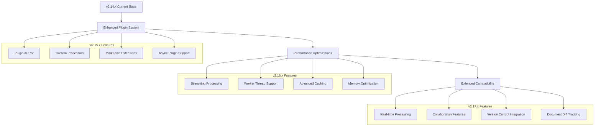
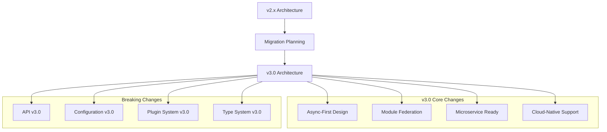
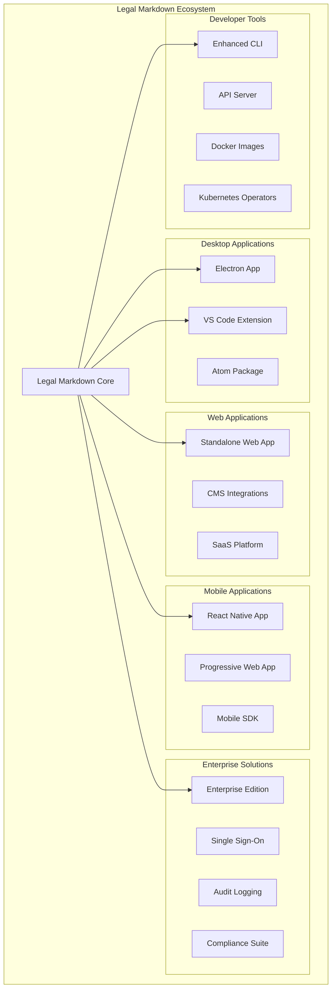
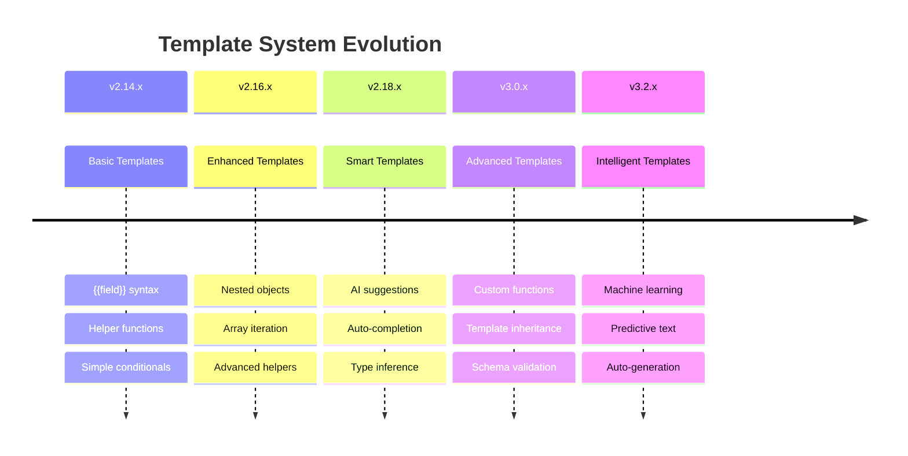
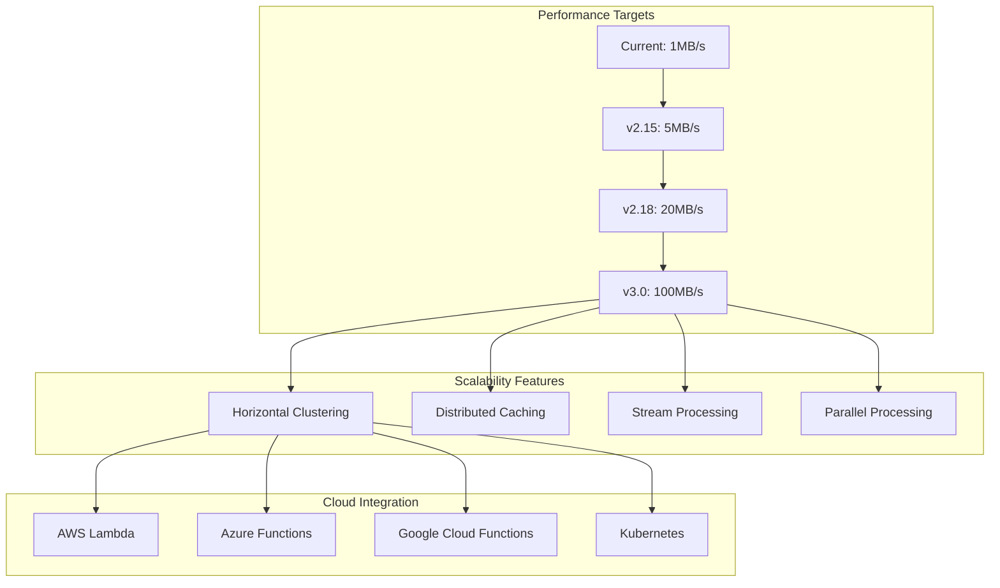
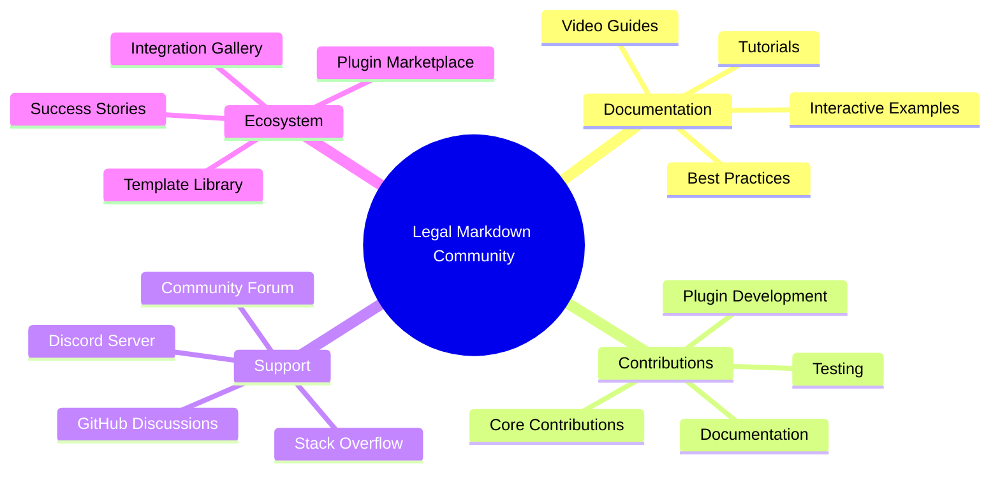

# Future Roadmap <!-- omit in toc -->

- [Overview](#overview)
- [Short-term Goals (v2.15.x - v2.17.x)](#short-term-goals-v215x---v217x)
- [Medium-term Goals (v2.18.x - v3.0.x)](#medium-term-goals-v218x---v30x)
- [Long-term Vision (v3.x and beyond)](#long-term-vision-v3x-and-beyond)
- [Technology Evolution](#technology-evolution)
- [Feature Enhancement Roadmap](#feature-enhancement-roadmap)
- [Performance and Scalability](#performance-and-scalability)
- [Developer Experience Improvements](#developer-experience-improvements)
- [Community and Ecosystem](#community-and-ecosystem)

## Overview

The Legal Markdown JS roadmap outlines the planned evolution of the project,
focusing on enhanced functionality, improved performance, better developer
experience, and expanded ecosystem support. The roadmap is organized into
short-term, medium-term, and long-term goals, each building upon the solid
foundation of the current v2.14.x architecture.

## Short-term Goals (v2.15.x - v2.17.x)

### Enhanced Remark Integration (v2.15.x)



#### Plugin System Enhancement (v2.15.0)

- **Advanced Plugin API**: More flexible plugin registration and lifecycle
  management
- **Custom Processors**: Allow users to create custom processing steps
- **Markdown Extensions**: Support for additional markdown syntax via plugins
- **Plugin Marketplace**: Centralized repository for community plugins

#### Performance Improvements (v2.16.0)

- **Streaming Processing**: Process large documents without loading entirely
  into memory
- **Worker Thread Support**: Parallel processing for CPU-intensive operations
- **Advanced Caching**: Multi-layer caching with intelligent invalidation
- **Memory Optimization**: Reduced memory footprint for large document sets

#### Real-time Features (v2.17.0)

- **Live Processing**: Real-time document processing for web editors
- **Change Detection**: Incremental processing based on document changes
- **Collaboration Support**: Multi-user document editing capabilities
- **Version Control Integration**: Git-style diff tracking for documents

## Medium-term Goals (v2.18.x - v3.0.x)

### Advanced Document Processing (v2.18.x - v2.20.x)

```mermaid
graph TB
    subgraph "Advanced Processing Features"
        AI[AI-Powered Features]
        TEMPLATES[Advanced Templates]
        VALIDATION[Enhanced Validation]
        AUTOMATION[Document Automation]
    end

    subgraph "AI Integration"
        NLP[Natural Language Processing]
        COMPLETION[Smart Completion]
        ANALYSIS[Document Analysis]
        SUGGESTIONS[Intelligent Suggestions]
    end

    subgraph "Template System v2"
        CONDITIONAL[Advanced Conditionals]
        LOOPS[Enhanced Loops]
        FUNCTIONS[Custom Functions]
        INHERITANCE[Template Inheritance]
    end

    subgraph "Validation Engine"
        SCHEMA[Schema Validation]
        BUSINESS_RULES[Business Rule Engine]
        COMPLIANCE[Compliance Checking]
        WORKFLOW[Workflow Validation]
    end

    AI --> NLP
    AI --> COMPLETION
    AI --> ANALYSIS
    AI --> SUGGESTIONS

    TEMPLATES --> CONDITIONAL
    TEMPLATES --> LOOPS
    TEMPLATES --> FUNCTIONS
    TEMPLATES --> INHERITANCE

    VALIDATION --> SCHEMA
    VALIDATION --> BUSINESS_RULES
    VALIDATION --> COMPLIANCE
    VALIDATION --> WORKFLOW
```



#### AI-Powered Features (v2.18.x)

- **Natural Language Processing**: Automatic extraction of document structure
  and entities
- **Smart Completion**: AI-powered field and content suggestions
- **Document Analysis**: Automated quality and completeness assessment
- **Intelligent Templates**: AI-generated template suggestions based on document
  type

#### Advanced Template System (v2.19.x)

- **Complex Conditionals**: Support for advanced boolean logic and nested
  conditions
- **Enhanced Loops**: Improved iteration with filtering, sorting, and grouping
- **Custom Functions**: User-defined functions for complex calculations
- **Template Inheritance**: Base templates with extension and override
  capabilities

#### Enhanced Validation Engine (v2.20.x)

- **Schema Validation**: JSON Schema-based document structure validation
- **Business Rule Engine**: Configurable business logic validation
- **Compliance Checking**: Built-in legal and regulatory compliance rules
- **Workflow Validation**: Multi-step document approval and review processes

### Architecture Modernization (v3.0.x)



#### Core Architecture Updates

- **Async-First Design**: Complete redesign around async/await patterns
- **Module Federation**: Support for dynamic module loading and sharing
- **Microservice Architecture**: Decomposable services for large-scale
  deployments
- **Cloud-Native Support**: Built-in support for containerization and
  orchestration

## Long-term Vision (v3.x and beyond)

### Ecosystem Expansion



#### Platform Expansion

- **Desktop Applications**: Native desktop apps for all major platforms
- **Mobile Solutions**: Mobile apps and responsive web interfaces
- **Enterprise Integration**: SSO, audit logging, and enterprise compliance
  features
- **Cloud Services**: Hosted processing services and APIs

#### Advanced Features

- **Blockchain Integration**: Document versioning and authenticity verification
- **Machine Learning**: Predictive text and automated document generation
- **Multi-language Support**: Internationalization and localization features
- **Advanced Analytics**: Document usage analytics and optimization
  recommendations

## Technology Evolution

### Modern JavaScript/TypeScript Features

```typescript
// Future API design concepts
interface FutureLegalMarkdown {
  // Streaming API
  processStream(input: ReadableStream): AsyncGenerator<ProcessingChunk>;

  // AI-powered features
  suggestFields(document: Document): Promise<FieldSuggestion[]>;
  analyzeCompliance(document: Document): Promise<ComplianceReport>;

  // Advanced templating
  createTemplate(schema: TemplateSchema): Promise<Template>;
  inheritTemplate(base: Template, overrides: TemplateOverrides): Template;

  // Collaboration features
  enableCollaboration(options: CollaborationOptions): CollaborationSession;
  trackChanges(document: Document): ChangeTracker;

  // Performance optimization
  precompile(template: string): Promise<CompiledTemplate>;
  cache(strategy: CacheStrategy): CacheManager;
}

// Advanced plugin system
interface PluginSystemV3 {
  // Dynamic plugin loading
  loadPlugin(source: PluginSource): Promise<Plugin>;
  unloadPlugin(pluginId: string): Promise<void>;

  // Plugin dependency management
  installDependencies(plugin: Plugin): Promise<void>;
  resolveDependencies(plugins: Plugin[]): DependencyGraph;

  // Hot reloading
  enableHotReload(options: HotReloadOptions): void;
  reloadPlugin(pluginId: string): Promise<void>;
}
```

### Cloud-Native Architecture

```yaml
# Future Kubernetes deployment
apiVersion: apps/v1
kind: Deployment
metadata:
  name: legal-markdown-processor
spec:
  replicas: 3
  selector:
    matchLabels:
      app: legal-markdown
  template:
    metadata:
      labels:
        app: legal-markdown
    spec:
      containers:
        - name: processor
          image: legal-markdown/processor:v3.0
          ports:
            - containerPort: 8080
          env:
            - name: REDIS_URL
              value: 'redis://legal-markdown-redis:6379'
            - name: MONGODB_URL
              value: 'mongodb://legal-markdown-mongo:27017/legal-markdown'
          resources:
            requests:
              memory: '256Mi'
              cpu: '250m'
            limits:
              memory: '512Mi'
              cpu: '500m'
```

## Feature Enhancement Roadmap

### Template System Evolution



### Output Format Expansion

- **Microsoft Word (.docx)**: Native Word document generation
- **PowerPoint (.pptx)**: Presentation slide generation
- **Excel (.xlsx)**: Spreadsheet report generation
- **InDesign**: Professional layout and typography
- **LaTeX**: Academic and scientific document formatting
- **EPUB**: E-book publication format
- **Interactive HTML**: Rich interactive documents

## Performance and Scalability

### Scalability Targets



### Performance Optimization Strategy

- **Memory Efficiency**: Reduce memory usage by 50% through streaming and
  optimization
- **Processing Speed**: Achieve 10x performance improvement through
  parallelization
- **Startup Time**: Sub-second initialization for CLI and web applications
- **Bundle Size**: Reduce browser bundle size while adding features

## Developer Experience Improvements

### Enhanced Tooling

```mermaid
graph TB
    subgraph "Developer Tools Roadmap"
        IDE[IDE Integration]
        DEBUG[Advanced Debugging]
        TESTING[Testing Framework]
        DOCS[Documentation Tools]
    end

    subgraph "IDE Support"
        VSCODE[VS Code Extension]
        INTELLIJ[IntelliJ Plugin]
        VIM[Vim Plugin]
        EMACS[Emacs Mode]
    end

    subgraph "Debugging Tools"
        INSPECTOR[Template Inspector]
        PROFILER[Performance Profiler]
        TRACER[Execution Tracer]
        VISUALIZER[Process Visualizer]
    end

    subgraph "Testing Support"
        UNIT[Unit Testing Framework]
        INTEGRATION[Integration Testing]
        SNAPSHOT[Snapshot Testing]
        COVERAGE[Coverage Reporting]
    end

    IDE --> VSCODE
    IDE --> INTELLIJ
    IDE --> VIM
    IDE --> EMACS

    DEBUG --> INSPECTOR
    DEBUG --> PROFILER
    DEBUG --> TRACER
    DEBUG --> VISUALIZER

    TESTING --> UNIT
    TESTING --> INTEGRATION
    TESTING --> SNAPSHOT
    TESTING --> COVERAGE
```



### API Evolution

- **GraphQL API**: More flexible querying and real-time updates
- **WebSocket Support**: Real-time document processing and collaboration
- **Webhook Integration**: Event-driven processing and notifications
- **REST API v2**: Enhanced REST endpoints with better performance

## Community and Ecosystem

### Community Growth Strategy



### Open Source Initiatives

- **Plugin Marketplace**: Centralized hub for community-developed plugins
- **Template Library**: Curated collection of legal document templates
- **Integration Gallery**: Examples and guides for popular integrations
- **Contributor Program**: Recognition and rewards for community contributors

### Educational Resources

- **Comprehensive Documentation**: Interactive guides and tutorials
- **Video Course Series**: Step-by-step learning materials
- **Workshop Materials**: Training resources for teams and organizations
- **Certification Program**: Professional certification for Legal Markdown
  expertise

The roadmap represents an ambitious but achievable vision for Legal Markdown JS,
focusing on maintaining the project's core strengths while expanding
capabilities and improving user experience across all use cases.
