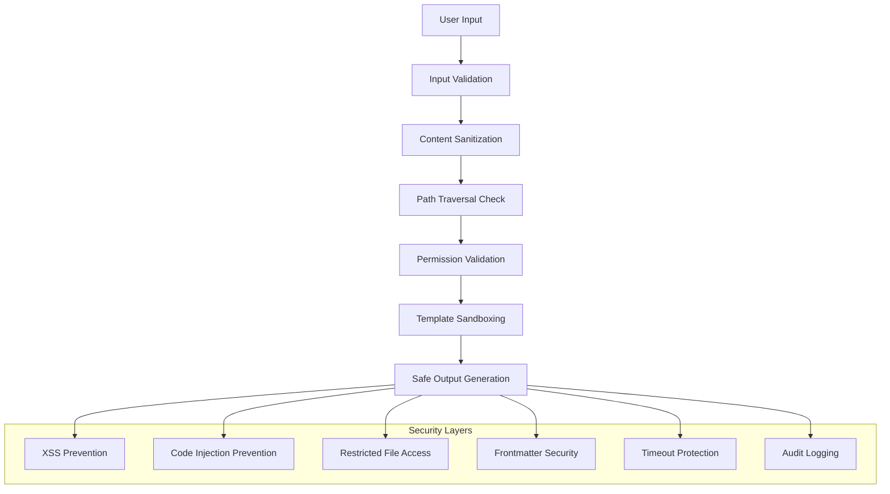

# Security Reference

Comprehensive security guidelines, threat mitigation strategies, and best
practices for safe deployment and operation of Legal Markdown JS in production
environments.

## Table of Contents

- [Overview](#overview)
- [Threat Model](#threat-model)
- [Input Validation](#input-validation)
- [Frontmatter Security](#frontmatter-security)
- [File System Security](#file-system-security)
- [Template Sandboxing](#template-sandboxing)
- [XSS Prevention](#xss-prevention)
- [Deployment Security](#deployment-security)
- [Audit and Monitoring](#audit-and-monitoring)
- [Security Configuration](#security-configuration)
- [Emergency Response](#emergency-response)

## Overview

Legal Markdown JS implements a defense-in-depth security strategy with multiple
layers of protection against common attack vectors. Security measures are built
into every component of the processing pipeline.

### Security Principles

1. **Least Privilege** - Minimal permissions and access rights
2. **Input Validation** - Comprehensive validation of all inputs
3. **Output Encoding** - Safe encoding of all outputs
4. **Sandboxing** - Isolated execution of user content
5. **Audit Logging** - Complete activity tracking
6. **Fail Secure** - Secure failure modes

### Security Architecture



## Threat Model

### Primary Threats

#### 1. Code Injection Attacks

- **Threat**: Malicious code execution through template variables
- **Attack Vector**: `{{eval("malicious_code")}}`
- **Mitigation**: Template sandboxing and helper function restrictions

#### 2. Path Traversal Attacks

- **Threat**: Unauthorized file system access
- **Attack Vector**: `@@include ../../../etc/passwd`
- **Mitigation**: Path validation and allowed directory restrictions

#### 3. Cross-Site Scripting (XSS)

- **Threat**: Script injection in HTML output
- **Attack Vector**: `{{user_input}}` containing `<script>alert('XSS')</script>`
- **Mitigation**: Output encoding and content sanitization

#### 4. Denial of Service (DoS)

- **Threat**: Resource exhaustion through malicious input
- **Attack Vector**: Recursive imports or infinite loops
- **Mitigation**: Timeouts, memory limits, and recursion depth limits

#### 5. Information Disclosure

- **Threat**: Exposure of sensitive data through error messages
- **Attack Vector**: Template errors revealing file paths or configuration
- **Mitigation**: Error message sanitization and secure logging

### Risk Assessment Matrix

| Threat          | Likelihood | Impact   | Risk Level | Mitigation Status |
| --------------- | ---------- | -------- | ---------- | ----------------- |
| Code Injection  | High       | Critical | **High**   | ✅ Implemented    |
| Path Traversal  | Medium     | High     | **Medium** | ✅ Implemented    |
| XSS             | Medium     | Medium   | **Medium** | ✅ Implemented    |
| DoS             | Low        | Medium   | **Low**    | ✅ Implemented    |
| Info Disclosure | Low        | Low      | **Low**    | ✅ Implemented    |

## Input Validation

### Validation Strategy

All input undergoes multi-layered validation:

```typescript
// Comprehensive input validation
interface ValidationConfig {
  maxFileSize: number; // Default: 10MB
  maxImportDepth: number; // Default: 10 levels
  allowedExtensions: string[]; // ['.md', '.txt', '.markdown']
  allowedBasePaths: string[]; // Restricted directory access
  timeoutMs: number; // Default: 30 seconds
}

const secureValidation: ValidationConfig = {
  maxFileSize: 10 * 1024 * 1024,
  maxImportDepth: 10,
  allowedExtensions: ['.md', '.txt', '.markdown'],
  allowedBasePaths: ['./templates', './documents'],
  timeoutMs: 30000,
};
```

### Content Validation Rules

#### File Size Limits

```bash
# Reject files larger than 10MB
MAX_FILE_SIZE=10485760  # 10MB in bytes
```

#### Character Validation

```typescript
// Prohibited patterns in content
const DANGEROUS_PATTERNS = [
  /<script\b[^<]*(?:(?!<\/script>)<[^<]*)*<\/script>/gi, // Script tags
  /javascript:/i, // JavaScript URLs
  /data:.*base64/i, // Base64 data URLs
  /vbscript:/i, // VBScript URLs
  /on\w+\s*=/i, // Event handlers
  /eval\s*\(/i, // eval() calls
  /Function\s*\(/i, // Function constructor
];
```

#### YAML Validation

```yaml
# Example of safe YAML frontmatter
---
# ✅ Safe fields
title: 'Contract Agreement'
client_name: 'Acme Corp'
amount: 50000
date: '2025-08-01'

# ❌ Dangerous fields (automatically filtered)
# level-one: "malicious format"
# force_commands: "--exec dangerous-command"
# meta-yaml-output: "/etc/passwd"
# __proto__: { constructor: { prototype: { polluted: true } } }
---
```

## Frontmatter Security

### Reserved Field Protection

Legal Markdown JS automatically filters dangerous frontmatter fields:

#### Blocked Fields

```typescript
const RESERVED_FIELDS = [
  // Header format manipulation
  'level-one',
  'level-two',
  'level-three',
  'level-four',
  'level-five',
  'level-six',

  // Command injection
  'force_commands',
  'commands',
  'pipeline-config',

  // Output redirection
  'meta-yaml-output',
  'meta-json-output',

  // Prototype pollution
  '__proto__',
  'constructor',
  'prototype',
];
```

#### Content Validation

```typescript
// Dangerous content patterns in YAML values
const DANGEROUS_YAML_PATTERNS = [
  /\$\{.*\}/, // Template literals
  /`.*`/, // Backtick templates
  /eval\s*\(/, // eval calls
  /Function\s*\(/, // Function constructor
  /require\s*\(/, // require calls
  /import\s+.*from/, // import statements
];
```

### Secure Frontmatter Processing

```typescript
// Frontmatter security filtering
class FrontmatterSecurity {
  static filterFrontmatter(metadata: Record<string, any>): FilterResult {
    const filtered: Record<string, any> = {};
    const violations: string[] = [];

    for (const [key, value] of Object.entries(metadata)) {
      if (this.isReservedField(key)) {
        violations.push(`Reserved field removed: ${key}`);
        continue;
      }

      if (this.containsDangerousContent(value)) {
        violations.push(`Dangerous content in field: ${key}`);
        continue;
      }

      filtered[key] = this.sanitizeValue(value);
    }

    return { filtered, violations };
  }
}
```

## File System Security

### Path Traversal Prevention

#### Allowed Path Validation

```typescript
// Secure file system access
class SecureFileSystem {
  private readonly allowedBasePaths: Set<string>;

  constructor(allowedBasePaths: string[] = []) {
    this.allowedBasePaths = new Set(
      allowedBasePaths.map(path => Path.resolve(path))
    );
  }

  validatePath(filePath: string, basePath?: string): boolean {
    const resolvedPath = basePath
      ? Path.resolve(basePath, filePath)
      : Path.resolve(filePath);

    // Check for directory traversal
    if (resolvedPath.includes('../') || resolvedPath.includes('..\\')) {
      return false;
    }

    // Verify path is within allowed directories
    if (this.allowedBasePaths.size === 0) {
      return resolvedPath.startsWith(process.cwd());
    }

    return Array.from(this.allowedBasePaths).some(basePath =>
      resolvedPath.startsWith(basePath)
    );
  }
}
```

#### File Access Restrictions

```bash
# CLI security flags
legal-md --restrict-paths ./templates:./documents contract.md output.pdf
legal-md --no-absolute-paths contract.md output.pdf
legal-md --validate-imports contract.md output.pdf
```

### Import Security

#### Safe Import Patterns

```markdown
<!-- ✅ Safe import paths -->

@@include ./sections/terms.md @@include ./common/signatures.md @@include
../shared/definitions.md

<!-- ❌ Dangerous import paths -->

@@include /etc/passwd @@include ../../../etc/shadow @@include
\\windows\\system32\\config\\sam @@include http://malicious.com/payload.md
```

#### Import Validation

```typescript
// Import path validation
class ImportValidator {
  validateImportPath(importPath: string, basePath: string): ValidationResult {
    // Normalize path
    const normalizedPath = Path.normalize(importPath);

    // Check for dangerous patterns
    if (this.containsDangerousPatterns(normalizedPath)) {
      return { valid: false, reason: 'Dangerous path pattern detected' };
    }

    // Validate against allowed paths
    const resolvedPath = Path.resolve(basePath, normalizedPath);
    if (!this.isAllowedPath(resolvedPath)) {
      return { valid: false, reason: 'Path not in allowed directories' };
    }

    return { valid: true };
  }

  private containsDangerousPatterns(path: string): boolean {
    const dangerousPatterns = [
      /\.\.[\/\\]/, // Directory traversal
      /^[\/\\]/, // Absolute paths
      /^[a-zA-Z]:[\/\\]/, // Windows absolute paths
      /^\\\\[^\\]+\\[^\\]+/, // UNC paths
      /^https?:\/\//, // HTTP URLs
      /^ftp:\/\//, // FTP URLs
    ];

    return dangerousPatterns.some(pattern => pattern.test(path));
  }
}
```

## Template Sandboxing

### Helper Function Restrictions

Only whitelisted helper functions are available in templates:

#### Allowed Helpers

```typescript
const ALLOWED_HELPERS = new Set([
  // Date functions
  'formatDate',
  'addDays',
  'subtractDays',
  'today',

  // String functions
  'upper',
  'lower',
  'capitalize',
  'trim',

  // Number functions
  'formatNumber',
  'formatCurrency',
  'round',

  // Array functions
  'join',
  'length',
  'first',
  'last',

  // Conditional functions
  'if',
  'unless',
  'eq',
  'ne',
  'gt',
  'lt',
]);
```

#### Blocked Functions

```typescript
// Dangerous functions automatically blocked
const BLOCKED_FUNCTIONS = [
  'eval',
  'Function',
  'require',
  'import',
  'process',
  'global',
  'Buffer',
  'setTimeout',
  'setInterval',
  'clearTimeout',
  'clearInterval',
];
```

### Template Execution Security

```typescript
// Secure template processing
class SecureTemplateProcessor {
  processTemplate(template: string, context: TemplateContext): string {
    // Create sandboxed context
    const secureContext = this.createSecureContext(context);

    // Execute with timeout protection
    return this.executeWithTimeout(
      () => this.processInSandbox(template, secureContext),
      5000 // 5 second timeout
    );
  }

  private createSecureContext(context: TemplateContext): SecureContext {
    return {
      // Include only safe data
      ...this.sanitizeContext(context),

      // Provide only allowed helpers
      helpers: this.filterHelpers(context.helpers),

      // Block dangerous globals
      global: undefined,
      process: undefined,
      require: undefined,
      module: undefined,
      exports: undefined,
      Buffer: undefined,
      eval: undefined,
      Function: undefined,
    };
  }
}
```

## XSS Prevention

### Output Encoding

All dynamic content is properly encoded based on output format:

#### HTML Output Encoding

```typescript
// XSS prevention for HTML output
class HTMLEncoder {
  static encode(content: string): string {
    return content
      .replace(/&/g, '&amp;')
      .replace(/</g, '&lt;')
      .replace(/>/g, '&gt;')
      .replace(/"/g, '&quot;')
      .replace(/'/g, '&#x27;')
      .replace(/\//g, '&#x2F;');
  }

  static sanitizeHTML(html: string): string {
    // Remove dangerous tags
    return html.replace(
      /<(?:script|object|embed|iframe|frame|frameset|applet|base|meta|link)\b[^>]*>/gi,
      ''
    );
  }
}
```

#### PDF Output Security

```typescript
// PDF-specific encoding
class PDFEncoder {
  static sanitizePDFContent(content: string): string {
    // Remove PDF injection patterns
    return content
      .replace(/\/Launch|\/URI|\/GoTo|\/JavaScript/gi, '')
      .replace(/\x00/g, '') // Remove null bytes
      .trim();
  }
}
```

### Content Security Policy

For web deployment, implement strict CSP:

```html
<!-- Recommended CSP for Legal Markdown web applications -->
<meta
  http-equiv="Content-Security-Policy"
  content="
  default-src 'self';
  script-src 'self' 'unsafe-inline';
  style-src 'self' 'unsafe-inline';
  img-src 'self' data:;
  font-src 'self';
  connect-src 'self';
  frame-ancestors 'none';
  base-uri 'self';
  form-action 'self';
"
/>
```

## Deployment Security

### Production Configuration

#### Environment Variables

```bash
# Security configuration
NODE_ENV=production
LEGAL_MD_SECURITY_STRICT=true
LEGAL_MD_ALLOWED_PATHS=/app/templates:/app/documents
LEGAL_MD_MAX_FILE_SIZE=10485760
LEGAL_MD_TIMEOUT=30000
LEGAL_MD_LOG_LEVEL=info
LEGAL_MD_AUDIT_LOG=/var/log/legal-md/audit.log
```

#### CLI Security Flags

```bash
# Production processing with security restrictions
legal-md --strict-security \
         --restrict-paths ./templates:./documents \
         --no-absolute-paths \
         --validate-imports \
         --timeout 30000 \
         --max-file-size 10MB \
         contract.md output.pdf
```

### Docker Security

#### Secure Dockerfile

```dockerfile
FROM node:18-alpine

# Create non-root user
RUN addgroup -g 1001 -S legalmd && \
    adduser -S legalmd -u 1001 -G legalmd

# Set working directory
WORKDIR /app

# Copy package files
COPY package*.json ./
RUN npm ci --only=production && npm cache clean --force

# Copy application code
COPY . .

# Set permissions
RUN chown -R legalmd:legalmd /app

# Switch to non-root user
USER legalmd

# Expose port
EXPOSE 3000

# Health check
HEALTHCHECK --interval=30s --timeout=3s --start-period=5s --retries=3 \
  CMD node healthcheck.js

# Start application
CMD ["node", "dist/index.js"]
```

#### Container Security

```bash
# Run container with security restrictions
docker run --rm \
  --read-only \
  --tmpfs /tmp \
  --tmpfs /var/tmp \
  --security-opt no-new-privileges \
  --cap-drop ALL \
  --user 1001:1001 \
  legal-markdown-js
```

### Kubernetes Security

#### Security Context

```yaml
apiVersion: apps/v1
kind: Deployment
metadata:
  name: legal-markdown-js
spec:
  template:
    spec:
      securityContext:
        runAsNonRoot: true
        runAsUser: 1001
        runAsGroup: 1001
        fsGroup: 1001
      containers:
        - name: legal-markdown-js
          image: legal-markdown-js:latest
          securityContext:
            allowPrivilegeEscalation: false
            readOnlyRootFilesystem: true
            capabilities:
              drop:
                - ALL
          resources:
            limits:
              memory: '512Mi'
              cpu: '500m'
            requests:
              memory: '256Mi'
              cpu: '100m'
```

## Audit and Monitoring

### Security Logging

#### Audit Events

```typescript
// Security event logging
interface SecurityEvent {
  timestamp: string;
  level: 'info' | 'warn' | 'error' | 'critical';
  type: 'auth' | 'access' | 'validation' | 'processing';
  user?: string;
  ip?: string;
  resource: string;
  action: string;
  result: 'success' | 'failure' | 'blocked';
  details: Record<string, any>;
}

// Example security events
const securityEvents = [
  {
    timestamp: '2025-08-01T10:30:00Z',
    level: 'warn',
    type: 'validation',
    resource: 'contract.md',
    action: 'process',
    result: 'blocked',
    details: { reason: 'Path traversal attempt detected' },
  },
  {
    timestamp: '2025-08-01T10:35:00Z',
    level: 'error',
    type: 'processing',
    resource: 'malicious.md',
    action: 'template_execution',
    result: 'blocked',
    details: { reason: 'Dangerous function call detected' },
  },
];
```

#### Log Analysis

```bash
# Monitor security events
tail -f /var/log/legal-md/audit.log | grep -E "(BLOCKED|ERROR|CRITICAL)"

# Extract security violations
jq '.[] | select(.result == "blocked")' /var/log/legal-md/audit.log

# Monitor resource access patterns
awk '{print $7}' /var/log/legal-md/access.log | sort | uniq -c | sort -nr
```

### Performance Monitoring

Monitor for DoS indicators:

```typescript
// Performance security monitoring
class SecurityMonitor {
  private metrics = {
    processingTimes: [],
    memoryUsage: [],
    fileAccess: [],
    errorRates: [],
  };

  checkSecurityMetrics(): SecurityAlert[] {
    const alerts: SecurityAlert[] = [];

    // Check for processing time anomalies
    const avgProcessingTime = this.calculateAverage(
      this.metrics.processingTimes
    );
    if (avgProcessingTime > 10000) {
      // 10 seconds
      alerts.push({
        type: 'performance',
        severity: 'high',
        message: 'Unusual processing time detected - possible DoS attack',
      });
    }

    // Check for memory usage spikes
    const peakMemory = Math.max(...this.metrics.memoryUsage);
    if (peakMemory > 500 * 1024 * 1024) {
      // 500MB
      alerts.push({
        type: 'memory',
        severity: 'high',
        message: 'Memory usage spike detected',
      });
    }

    return alerts;
  }
}
```

## Security Configuration

### Configuration Template

```yaml
# security-config.yml
security:
  # Input validation
  validation:
    maxFileSize: 10485760 # 10MB
    maxImportDepth: 10
    allowedExtensions: ['.md', '.txt', '.markdown']
    timeoutMs: 30000

  # File system access
  filesystem:
    allowedBasePaths:
      - './templates'
      - './documents'
    blockAbsolutePaths: true
    validateImports: true

  # Template processing
  templates:
    allowedHelpers:
      - 'formatDate'
      - 'formatCurrency'
      - 'upper'
      - 'lower'
    blockDangerousFunctions: true
    sandboxExecution: true

  # Output security
  output:
    encodeHTML: true
    sanitizeContent: true
    preventXSS: true

  # Logging and monitoring
  logging:
    auditLog: '/var/log/legal-md/audit.log'
    logLevel: 'info'
    logSecurityEvents: true

  # Rate limiting
  rateLimit:
    enabled: true
    maxRequests: 100
    windowMs: 60000 # 1 minute
```

### Runtime Security Checks

```typescript
// Runtime security validation
class RuntimeSecurity {
  static validateSecurityConfig(config: SecurityConfig): ValidationResult {
    const errors: string[] = [];

    // Validate file size limits
    if (config.validation.maxFileSize > 100 * 1024 * 1024) {
      errors.push('Maximum file size too large (>100MB)');
    }

    // Validate timeout settings
    if (config.validation.timeoutMs > 300000) {
      // 5 minutes
      errors.push('Timeout too long (>5 minutes)');
    }

    // Validate allowed paths
    if (!config.filesystem.allowedBasePaths.length) {
      errors.push('No allowed base paths configured');
    }

    return {
      valid: errors.length === 0,
      errors,
    };
  }
}
```

## Emergency Response

### Incident Response Plan

#### 1. Detection

- Monitor audit logs for security events
- Set up alerts for anomalous behavior
- Implement real-time threat detection

#### 2. Containment

```bash
# Emergency security lockdown
export LEGAL_MD_SECURITY_LOCKDOWN=true
export LEGAL_MD_BLOCK_ALL_IMPORTS=true
export LEGAL_MD_DISABLE_HELPERS=true
```

#### 3. Investigation

```bash
# Analyze security logs
grep -E "(BLOCKED|ERROR|SECURITY)" /var/log/legal-md/audit.log

# Check file access patterns
find /var/log/legal-md -name "*.log" -exec grep -l "UNAUTHORIZED_ACCESS" {} \;

# Memory and CPU analysis
ps aux | grep legal-md
lsof -p $(pgrep legal-md)
```

#### 4. Recovery

```bash
# Restart with security patches
systemctl stop legal-md
# Apply security updates
npm audit fix
# Restart with enhanced security
export LEGAL_MD_SECURITY_STRICT=true
systemctl start legal-md
```

### Security Contacts

#### Internal Team

- **Security Lead**: <security@company.com>
- **DevOps Team**: <devops@company.com>
- **Legal Team**: <legal@company.com>

#### External Resources

- **Node.js Security**: <https://nodejs.org/en/security/>
- **npm Security**:
  <https://docs.npmjs.com/auditing-package-dependencies-for-security-vulnerabilities>
- **OWASP**: <https://owasp.org/>

### Regular Security Maintenance

#### Weekly Tasks

- [ ] Review audit logs for anomalies
- [ ] Update dependencies with security patches
- [ ] Verify file system permissions
- [ ] Check for new vulnerabilities

#### Monthly Tasks

- [ ] Conduct security scan of dependencies
- [ ] Review and update security configuration
- [ ] Test incident response procedures
- [ ] Update security documentation

#### Quarterly Tasks

- [ ] Comprehensive security audit
- [ ] Penetration testing
- [ ] Security training for team
- [ ] Review and update threat model

## Security Best Practices Summary

### Development

1. **Validate All Inputs** - Never trust user-provided data
2. **Sanitize Outputs** - Encode all dynamic content appropriately
3. **Restrict File Access** - Limit file system operations to allowed paths
4. **Sandbox Execution** - Isolate template processing from system resources
5. **Implement Timeouts** - Prevent resource exhaustion attacks

### Deployment

1. **Use HTTPS** - Encrypt all network communications
2. **Minimize Permissions** - Run with least necessary privileges
3. **Enable Audit Logging** - Track all security-relevant events
4. **Regular Updates** - Keep dependencies current with security patches
5. **Monitor Performance** - Detect anomalous resource usage

### Operations

1. **Review Logs Daily** - Monitor for security events
2. **Test Backups** - Ensure disaster recovery capability
3. **Update Incident Response** - Keep response plans current
4. **Security Training** - Educate team on security practices
5. **Regular Audits** - Conduct periodic security assessments

## See Also

- [Configuration](../advanced/configuration.md) - Security-related configuration
  options
- [Error Handling](../advanced/error-handling.md) - Secure error handling
  practices
- [Development Guidelines](../development/development-guidelines.md) - Secure
  development practices
- [Troubleshooting](troubleshooting.md) - Security-related troubleshooting
